# RiboShiny: A Shiny Application for Ribosome Profiling Data Analysis and Visualization

## 0. Introduction
为了便于下游数据的分析和可视化，我们基于 shinyapp 开发了 RiboShiny， 一个用于核糖体测序数据分析和可视化的 shiny 应用程序。RiboShiny 提供了一个交互式的界面，用户可以通过简单的操作完成核糖体测序数据的分析和可视化。RiboShiny 主要包括了 31 个分析和可视化步骤：

-   step1_Database
    -   Options
    -   Annotation
    -   OrgDb
    -   Gson_KEGG
    -   Sequence
-   step2_Mapping
    -   RNAseq
    -   RiboSeq
-   step3_Distribution
    -   RNAseq
    -   RiboSeq
-   step4_Saturation
    -   RNAseq
    -   RiboSeq
-   step5_Digestion
    -   RNAseq
    -   RiboSeq
-   step6_Offset
    -   Frame
    -   TIS
    -   End
-   step7_Period
    -   RNAseq
    -   RiboSeq
-   step8_Metaplot
    -   RNAseq
    -   RiboSeq
-   step9_Coverage
    -   RNAseq
    -   RiboSeq
-   step10_Expression
    -   RNAseq
    -   RiboSeq
    -   TE
-   step11_Heatmap
    -   RNAseq
    -   RiboSeq
    -   TE
-   step12_PCA
    -   RNAseq
    -   RiboSeq
    -   TE
-   step13_deltaTE
    -   edgeR
    -   DESeq2
    -   DeltaTE
-   step14_volcano
    -   Volcano
    -   Quadrant
    -   DeltaTE
-   step15_DEGs
    -   Venn_diagram
    -   DEGs_Venn
    -   DEGs_Merge
    -   DEGs_Bar
-   step16_GO
    -   EnrichGO
    -   CompareCluster
-   step17_GO_GSEA
    -   GSEA
-   step18_KEGG
    -   EnrichKEGG
    -   CompareCluster
-   step19_KEGG_GSEA
    -   GSEA
-   step20_Codon_Enrich
    -   Codon_Usage
    -   GO_Enrich
    -   KEGG_Enrich
-   step21_Gene_plot
    -   Isoforms
-   step22_Pausing
    -   Pausing
    -   Diff_Pausing
-   step23_Occupancy
    -   Occupancy
    -   Diff_Occupancy
-   step24_CDT
    -   CDT
    -   Diff_CDT
-   step25_CST
    -   CST
    -   Diff_CST
    -   Iterative
-   step26_OddRatio
    -   OddRatio
-   step27_CoV
    -   CoV
    -   CoV_eCDF
-   step28_MetaCodon
    -   MetaPlot
    -   SeqLogo
-   step29_SeRP_Enrich
    -   SeRP_Meta
    -   SeRP_Enrich
-   step30_SeRP_Peaks
    -   SeRP_Peaks
-   step31_SeRP_Motif
    -   SeRP_Motif

## 1. Installation

为了降低 Ribo-seq 数据的下游分析和可视化的门槛，基于 shinyapp 和大量公开的优秀 R 包提出了一个完整的 RiboShiny 框架。
该框架可以在本地安装使用，也可以通过网页版来使用。

- 网页版地址

如果不便于安装本地版本，可以直接通过下面的链接来使用。目前临时提供的页面为 IP address，后续将提供完善的域名。

<http://82.157.181.64:3838/RiboShiny/>


- 本地安装过程

使用本地版本的程序可以进行更稳定的分析和可视化。而在本地安装 RiboShiny 需要先安装 R 语言和 RStudio，以及一些必要的 R 包。R 语言和 RStudio 的安装可以参考官方网站：

R 4.3.1 <https://www.r-project.org/>

RStudio RStudio 2024.09.0+375 <https://www.rstudio.com/>。

R 包的安装可以通过下面的代码来安装：

```{r, eval=FALSE}
##################################################
# install the required packages
if (!requireNamespace("BiocManager", quietly = TRUE)) 
  install.packages("BiocManager");
if (!require("devtools")) 
  install.packages("devtools");

##################################################
# packages for shiny and dashboard framework
if (!require("shiny")) 
  install.packages("shiny");
if (!require("shinyFiles")) 
  install.packages("shinyFiles");
if (!require("shinycssloaders"))
  install.packages("shinycssloaders");
if (!require("shinydashboard")) 
  install.packages("shinydashboard");
if (!require("dashboardthemes")) 
  install.packages("dashboardthemes");

##################################################
# packages for import and export data
if (!require("openxlsx")) 
  install.packages("openxlsx");
if (!require("DT")) 
  install.packages("DT");
if (!require("data.table")) 
  install.packages("data.table");
if (!require("showtext")) 
  install.packages("showtext");

##################################################
# packages for data format and analysis
if (!require("tidyverse")) 
  install.packages("tidyverse");
if (!require("zoo"))
  install.packages("zoo");
if (!require("FactoMineR"))
  install.packages("FactoMineR");
if (!require("factoextra"))
  install.packages("factoextra");

##################################################
# packages for data visualization
if (!require("ggplot2")) 
  install.packages("ggplot2");
if (!require("ggpubr")) 
  install.packages("ggpubr");
if (!require("MetBrewer")) 
  install.packages("MetBrewer")
if (!require("RColorBrewer")) 
  install.packages("RColorBrewer");
if (!require("pheatmap"))
  install.packages("pheatmap");
if (!require("minpack.lm")) 
  install.packages("minpack.lm");
if (!require("export"))
  install.packages("export");
if (!require("aplot"))
  install.packages("aplot");
if (!require("cowplot"))
  install.packages("cowplot");
if (!require("ggplotify"))
  install.packages("ggplotify");
if (!require("ggrepel"))
  install.packages("ggrepel");
if (!require("ggnewscale"))
  install.packages("ggnewscale");
if (!require("ggseqlogo"))
  install.packages("ggseqlogo");
if (!require("ggVennDiagram"))
  install.packages("ggVennDiagram");
if (!require("UpSetR"))
  install.packages("UpSetR");

##################################################
# packages from BiocManager
if (!require("Biostrings"))
  BiocManager::install("Biostrings");
if (!require("coRdon")) 
  BiocManager::install("coRdon");
if (!require("ShortRead")) 
  BiocManager::install("ShortRead");
if (!require("DESeq2"))
  BiocManager::install("DESeq2");
if (!require("edgeR"))
  BiocManager::install("edgeR");
if (!require("RUVSeq"))
  BiocManager::install("RUVSeq");
if (!require("GOSE"))
  BiocManager::install("GOSE");
if (!require("ReactomePA"))
  BiocManager::install("ReactomePA");
if (!require("clusterProfiler"))
  BiocManager::install("clusterProfiler");
if (!require("AnnotationDbi"))
  BiocManager::install("AnnotationDbi");
if (!require("AnnotationHub"))
  BiocManager::install("AnnotationHub");
if (!require("AnnotationForge"))
  BiocManager::install("AnnotationForge");

##################################################
# packages for enrichment analysis
# the database of model organisms can be downloaded directly through Bioconductor
# non-model organisms can be create with AnnotationForge package in RiboShiny
if (!require("org.Hs.eg.db"))
  BiocManager::install("org.Hs.eg.db");
if (!require("org.At.tair.db"))
  BiocManager::install("org.At.tair.db");
if (!require("org.Sc.sgd.db"))
  BiocManager::install("org.Sc.sgd.db");

```

安装完成后，下载 RiboShiny 的代码 (windows 或者有图形界面 linux)，通过下面的代码来启动 RiboShiny：

```{r, eval=FALSE}
# download the RiboShiny code from github
https://codeload.github.com/Renscq/RiboShiny/zip/refs/heads/master
# or
git clone https://github.com/Renscq/RiboShiny.git

# set the working directory
set('/path/to/your/software/RiboShiny/')

# run the RiboShiny
runApp()

```


## 2. 分析示例

这里使用 GSE67387 数据集的分析，来展示 RiboShiny 的使用方法。

为了降低操作和使用的门槛，除了 step1_Database 中创建的参考文件之外，其它的 RiboShiny 步骤使用的输入文件即为 RiboParser 的输出文件，而无需更多的操作。

### 2.1 step1_Database

这个步骤的内容主要是创建一些下游分析需要的文件。 包括样本的信息和分组，基因组的注释文件，KEGG 的注释文件，以及 CDS 序列文件。

#### 2.1.1 Options
这里步骤用于设置一个完整的样本信息表格。

必须包含内容为 `Sample`, `SeqType`, `Rank`, `Group` 四列信息。

额外的列信息可以按照实际情况增加，如其它的实验设计或处理等。完成后的表格保存为 ./InputData/sce_design.xlsx。

1. 导入完整的样本信息表

```{r, out.width = "70%", fig.align = "center", echo=FALSE, dpi=200}

knitr::include_graphics("./images/snapshot/step1-options.png")

```


#### 2.1.2 Annotation
这个步骤需要创建一个完整的基因信息文件，保存在 excel 中。
基因注释信息是用于后续分析的重要文件，这里我们使用 NCBI 的数据库收录的基因信息来创建基因注释文件。

- 文件1：<https://ftp.ncbi.nlm.nih.gov/genomes/all/GCF/000/146/045/GCF_000146045.2_R64/GCF_000146045.2_R64_feature_count.txt>

上面的文件中，必要的列是 product_accession, name (description), symbol GeneID (entrezid), locus_tag, 用于后续的 GO 和 KEGG 的富集分析。
提取文件中的必要信息，与文件2合并。

```{sh, eval=FALSE}
awk '($1=="mRNA")||($1=="#")' GCF_000146045.2_R64_feature_table.txt | cut -f 11,13,14,15,16,17 | head -n 5

```

| product_accession | related_accession | name | symbol | GeneID | locus_tag |
|:--------------:|:-----------:|:-----------------------:|:--------:|:---------:|:----------:|
| NM_001180043.1 | NP_009332.1 | seripauperin PAU8 | PAU8 | 851229 | YAL068C |
| NM_001184582.1 | NP_878038.1 | uncharacterized protein |  | 1466426 | YAL067W-A |
| NM_001178208.1 | NP_009333.1 | putative permease SEO1 | SEO1 | 851230 | YAL067C |
| NM_001179897.1 | NP_009335.1 | uncharacterized protein |  | 851232 | YAL065C |
| NM_001180042.1 | NP_009336.1 | uncharacterized protein |  | 851233 | YAL064W-B |
| NM_001180041.1 | NP_058136.1 | Tda8p | TDA8 | 851234 | YAL064C-A |
| NM_001178206.2 | NP_009337.2 | uncharacterized protein |  | 851235 | YAL064W |
| NM_001184642.1 | NP_878039.1 | uncharacterized protein |  | 1466427 | YAL063C-A |
| NM_001178205.1 | NP_009338.1 | flocculin FLO9 | FLO9 | 851236 | YAL063C |

2. 文件2：/mnt/t64/test/sce/1.reference/norm/sce.norm.txt （见 RiboParser 的使用说明）

上面的文件是 RiboParser 格式化的输出结果，根据文件中的 transcript_id 列与文件 1 合并，把上面的基因信息添加到下面表格中的后面。

| chromosome | gene_id | transcript_id | start | end | utr5_length | cds_length | utr3_length | strand | rep_transcript | modified |
|:-----------:|:---------:|:-------------:|:------:|:------:|:-----:|:-----:|:-----:|:-----:|:------:|:------:|
| NC_001133.9 | YAL068C | NM_001180043.1 | 1776 | 2199 | 30 | 363 | 30 | \- | True | True |
| NC_001133.9 | YAL067W-A | NM_001184582.1 | 2449 | 2737 | 30 | 228 | 30 | \+ | True | True |
| NC_001133.9 | YAL067C | NM_001178208.1 | 7204 | 9046 | 30 | 1782 | 30 | \- | True | True |
| NC_001133.9 | YAL065C | NM_001179897.1 | 11534 | 11981 | 30 | 387 | 30 | \- | True | True |

3. 导入基因信息

```{r, out.width = "50%", fig.align = "center", echo = FALSE, dpi=200}

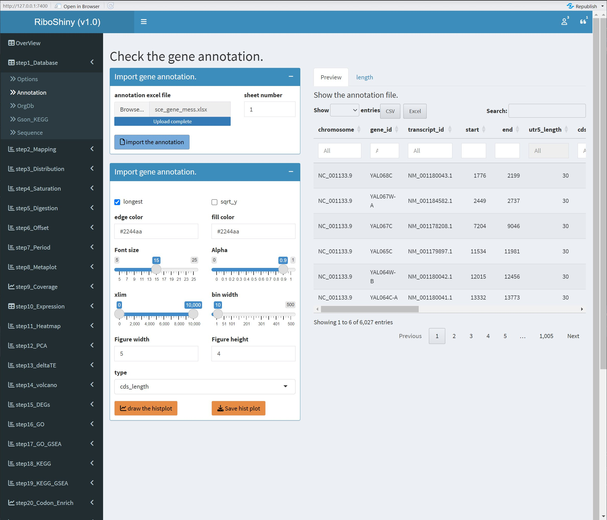

```

4. 可视化基因长度分布

```{r, out.width = "50%", fig.align = "center", echo = FALSE, dpi=200}

knitr::include_graphics("./images/snapshot/step1-annotation-length.jpg")

```


#### 2.1.3 OrgDb

这个步骤用于创建一个 GO/GSEA 富集分析的 OrgDb 文件。

模式生物的 OrgDb 文件可以在 Bioconductor 的数据库中下载，具体语句如下。

```{r, eval=FALSE}
require("BiocManager")
# install the orgdb of scerevisiae from Bioconductor
BiocManager::install("org.Sc.sgd.db")

# install the orgdb of homo sapiens from Bioconductor
BiocManager::install("org.Hs.eg.db")

```

对于非模式生物，我们可以使用 RiboShiny 来构建 OrgDb。该方法基于 R 包 AnnotationHub 中收录的基因信息，并使用 AnnotationForge 来构建自定义的数据库.

1. 填写物种的种属名或者 Taxonomy 数字 ID，并检查 OrgDb 的收录信息

```{r, out.width = "70%", fig.align = "center", echo = FALSE, dpi=200}

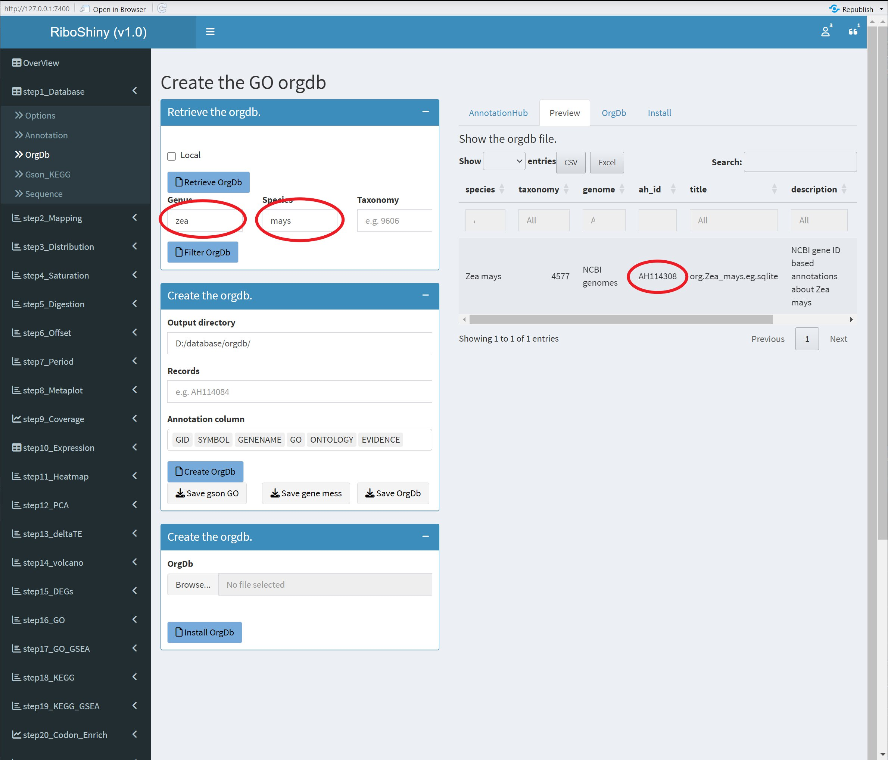

```

2. 根据 ah_id 提取基因信息，并创建 OrgDb，得到结果为 org.Zmays.eg.db_0.1.tar.gz 的文件

```{r, out.width = "70%", fig.align = "center", echo = FALSE, dpi=200}

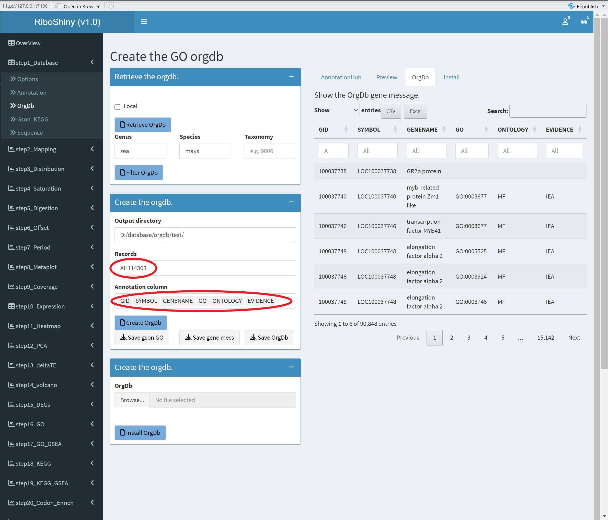

```

3. 根据需求保存 OrgDb 为不同的数据格式

RiboShiny 支持使用 OrgDb 和 gson 的格式，关于 gson 格式的更多信息，见 Yu 老师的主页。<https://guangchuangyu.r-universe.dev/gson>

4. 如果使用 OrgDb 格式，则需要安装 R 包

```{r, out.width = "70%", fig.align = "center", echo = FALSE, dpi=200}

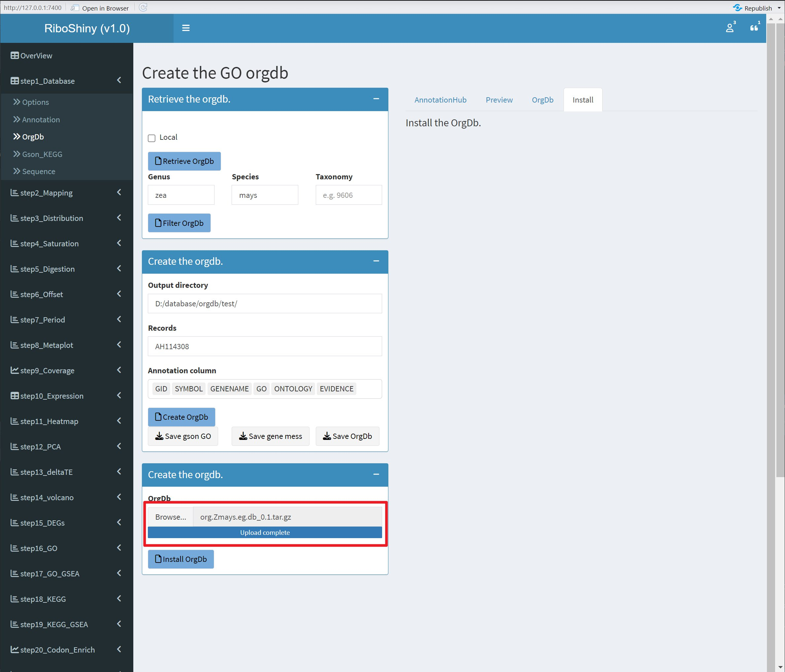

```

#### 2.1.4 Gson_KEGG

这个步骤用于创建一个 KEGG/GSEA 富集分析的 gson 文件。
这个文件的创建不是必要的，在后续的分析中，可以直接指定 KEGG 网站中的物种缩写来完成分析，如 hsa for homo sapiens。

详情见步骤 step18_KEGG。

1. 填写 KEGG 中的物种缩写，注意调整基因的 ID 类型

结果可以保存为 sce_KEGG_2024-10-25.gson

```{r, out.width = "70%", fig.align = "center", echo = FALSE, dpi=200}

knitr::include_graphics("./images/snapshot/step1-gson-kegg.jpg")

```


#### 2.1.5 Sequence

这个步骤用于创建一个 CDS 对应的 codon usage 文件。这个文件主要用于后续密码子富集的分析，如果不需要，则可以跳过此步骤。
详情见步骤 step20_Codon_Enrich。

注：上传的序列需要去掉 UTR 区域，仅保留 CDS，可以直接使用文件 /mnt/t64/test/sce/1.reference/norm/sce.norm.cds.fa （见 RiboParser 的使用说明）。

1. 导入并计算 cds 的 codon usage

这里使用使用 Frequency、RSCU、CAI 来表示 mRNA 序列中 codon usage。

```{r, out.width = "70%", fig.align = "center", echo = FALSE, dpi=200}

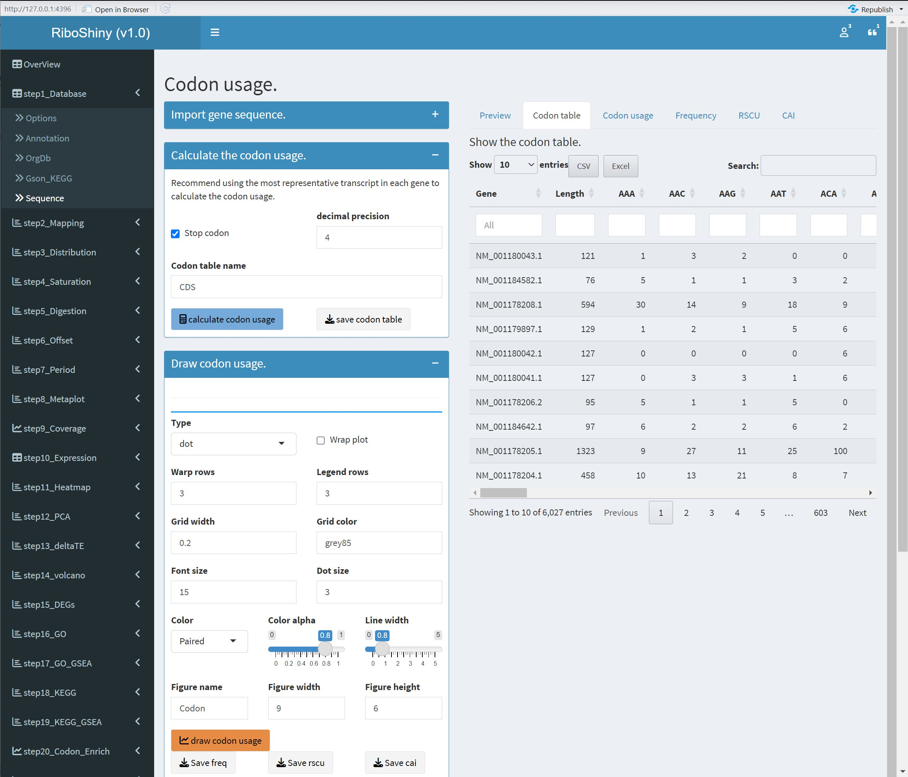

```

2. 保存并可视化 codon usage

这里使用 dot 和 circle 两种方式方法来可视化 codon usage。

```{r, out.width = "70%", fig.align = "center", echo = FALSE, dpi=200}

knitr::include_graphics("./images/snapshot/step1-sequence-draw-codon-usage.jpg")

```


### 2.2 step2_Mapping

#### 2.2.1 RNASeq

与 Ribo-seq 相同

#### 2.2.2 RiboSeq

这个步骤用于可视化测序文库中 reads 的来源。

- 使用文件 /mnt/t64/test/sce/4.ribo-seq/2.bowtie/sce_mapping.txt （见 RiboParser 的使用说明）。

1. 导入并计算 cds 的 codon usage

```{r, out.width = "70%", fig.align = "center", echo = FALSE, dpi=200}

knitr::include_graphics("./images/snapshot/step2-mapping-riboseq.jpg")
```


2. 保存并可视化 codon usage

这里使用 count 和 proportion 两种方式方法来可视化 reads 的来源。

```{r, out.width = "70%", fig.align = "center", echo = FALSE, dpi=200}

knitr::include_graphics("./images/snapshot/step2-mapping-draw-riboseq.jpg")

```


### 2.3 step3_Distribution

#### 2.3.1 RNAseq

与 Ribo-seq 相同

#### 2.3.2 RiboSeq

这个步骤用于可视化 Ribo-seq 测序文库中 reads 的长度分布。

- 使用文件 /mnt/t64/test/sce/4.ribo-seq/5.riboparser/1.qc/sce_length_distribution.txt （见 RiboParser 的使用说明）。

1. 导入合并后的 reads 长度分布

这里默认是使用所有的样本，可以根据 design 文件中的不同分类信息来选择不同的样本。

```{r, out.width = "70%", fig.align = "center", echo = FALSE, dpi=200}

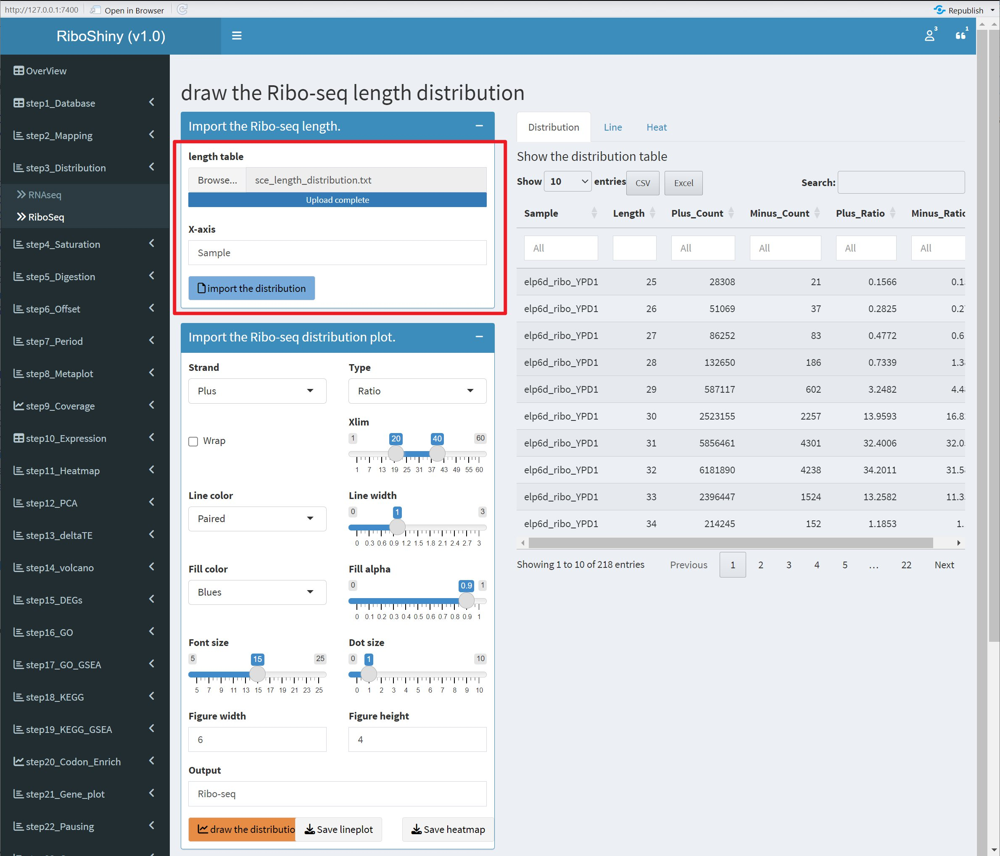
```


2. reads 长度分布可视化

这里使用 line 和 heatmap 两种方式方法来可视化 reads 的长度。

```{r, out.width = "70%", fig.align = "center", echo = FALSE, dpi=200}

knitr::include_graphics("./images/snapshot/step3-ribo-seq-length-plot.jpg")

```

### 2.4 step4_Saturation

#### 2.4.1 RNAseq

与 Ribo-seq 相同

#### 2.4.2 RiboSeq

这个步骤用于可视化 Ribo-seq 测序文库中的 gene 饱和度。

- 使用文件 /mnt/t64/test/sce/4.ribo-seq/5.riboparser/1.qc/sce_length_distribution.txt （见 RiboParser 的使用说明）。

1. 导入合并后的 gene 饱和度表格

这里默认是使用所有的样本，可以根据 design 文件中的不同分类信息来选择不同的样本。

```{r, out.width = "70%", fig.align = "center", echo = FALSE, dpi=200}

knitr::include_graphics("./images/snapshot/step4-saturation-ribo-seq-table.jpg")

```

2. gene 饱和度可视化

这里使用 line 和 heatmap 两种方式方法来可视化 gene 饱和度。

```{r, out.width = "70%", fig.align = "center", echo = FALSE, dpi=200}

knitr::include_graphics("./images/snapshot/step4-saturation-ribo-seq-plot.jpg")

```

### 2.5 step5_Digestion

#### 2.5.1 RiboSeq

这个步骤用于可视化 Ribo-seq 测序文库中的 reads 的消化情况。

在这个步骤中，提取 reads 的 5' 端前后 [-5, 10] 和 3' 端前后 [-10, 5] 的碱基序列。
可以看到 reads 末端存在的碱基统计情况，这个信息可以用于判断建库过程中的酶切和酶连是否存在偏好性。

- 使用文件 /mnt/t64/test/sce/4.ribo-seq/5.riboparser/2.digestion/sce_reads_digestion.txt （见 RiboParser 的使用说明）。

1. 导入合并后的 reads 消化表格

这里默认是使用所有的样本，可以根据 design 文件中的不同分类信息来选择不同的样本。

```{r, out.width = "70%", fig.align = "center", echo = FALSE, dpi=200}

knitr::include_graphics("./images/snapshot/step5-digestion-table.jpg")

```

2. 酶切酶连的可视化

这里使用 seqlogo 来可视化 reads 末端的碱基频率，用于判断建库过程中的酶切和酶连是否存在偏好性。

```{r, out.width = "70%", fig.align = "center", echo = FALSE, dpi=200}

knitr::include_graphics("./images/snapshot/step5-digestion-plot.jpg")

```


### 2.6 step6_Offset

#### 2.6.1 RSBM

这个步骤用于可视化 Ribo-seq 测序文库中 offset 的预测结果。

在这个步骤中，基于核糖体结构的模型（RSBM），预测每个数据中不同长度 RPFs 对应的 offset。

- 使用文件 /mnt/t64/test/sce/4.ribo-seq/5.riboparser/3.offset/sce_rsbm_offset.txt （见 RiboParser 的使用说明）。

1. 导入合并后的 offset 表格

这里默认是使用所有的样本，可以根据 design 文件中的不同分类信息来选择不同的样本。

```{r, out.width = "70%", fig.align = "center", echo = FALSE, dpi=200}

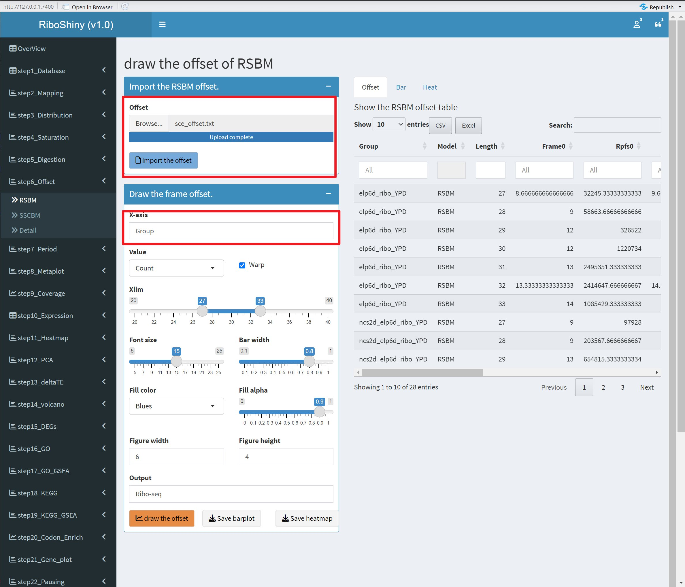

```

2. offset 的可视化

这里使用 barplot 和 heatmap 来可视化 offset 偏移总和，展示不同长度对应的 offset。

```{r, out.width = "70%", fig.align = "center", echo = FALSE, dpi=200}

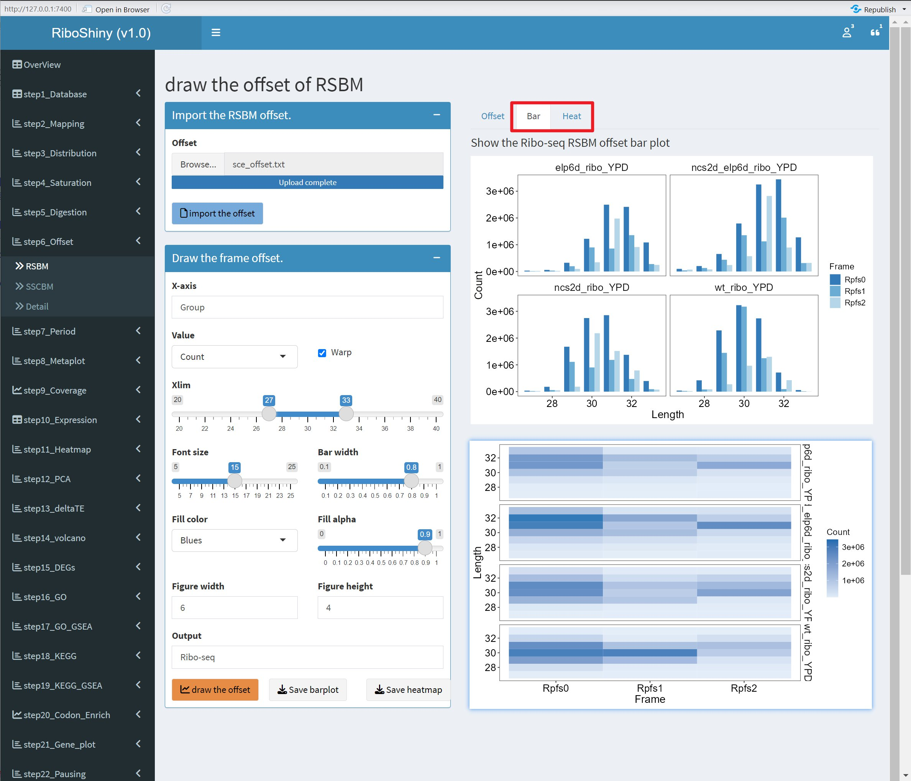

```

#### 2.6.2 SSCBM

这个步骤用于可视化 Ribo-seq 测序文库中 offset 的预测结果。

在这个步骤中，基于起始和终止密码子的模型（SSCBM），预测每个数据中不同长度 RPFs 对应的 offset。

- 使用文件 /mnt/t64/test/sce/4.ribo-seq/5.riboparser/3.offset/sce_rsbm_offset.txt （见 RiboParser 的使用说明）。

1. 导入合并后的 offset 表格

这里默认是使用所有的样本，可以根据 design 文件中的不同分类信息来选择不同的样本。

```{r, out.width = "70%", fig.align = "center", echo = FALSE, dpi=200}

knitr::include_graphics("./images/snapshot/step6-offset-sscbm-table.jpg")

```

2. offset 的可视化

这里使用 barplot 和 heatmap 来可视化 offset 偏移总和，展示不同长度对应的 offset。

```{r, out.width = "70%", fig.align = "center", echo = FALSE, dpi=200}

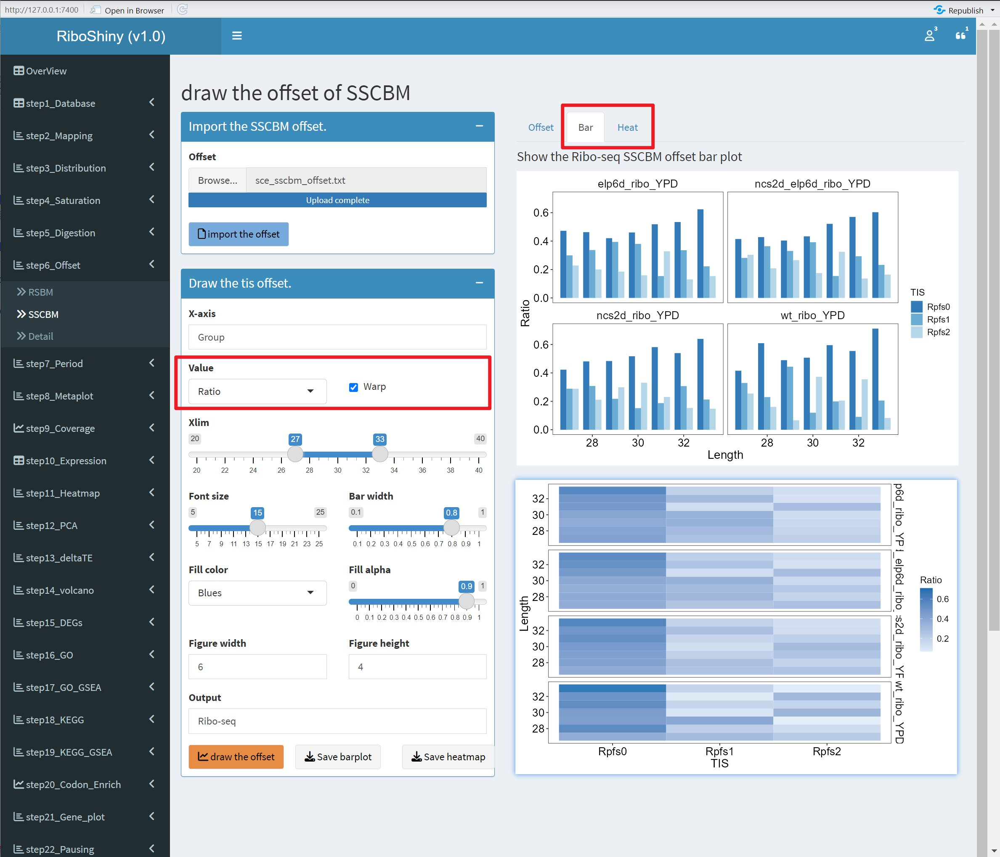

```

#### 2.6.3 Detail

这个步骤用于可视化起始和终止密码子 offset 的热图。

在这个步骤中，统计所有 reads 末端到起始和终止密码子的偏移量。
因为不同的物种和建库测序方法的差异，数据的预测结果不一定百分百正确，因此仍然需要通过原始数据的检查，来确认分析结果的可靠性。
并且通过一些手动的修正，来提高预测结果的准确性。

- 使用文件 /mnt/t64/test/sce/4.ribo-seq/5.riboparser/3.offset/sce_offset_end.txt （见 RiboParser 的使用说明）。

1. 导入合并后的 offset 表格

这里默认是使用所有的样本，可以根据 design 文件中的不同分类信息来选择不同的样本。

```{r, out.width = "70%", fig.align = "center", echo = FALSE, dpi=200}

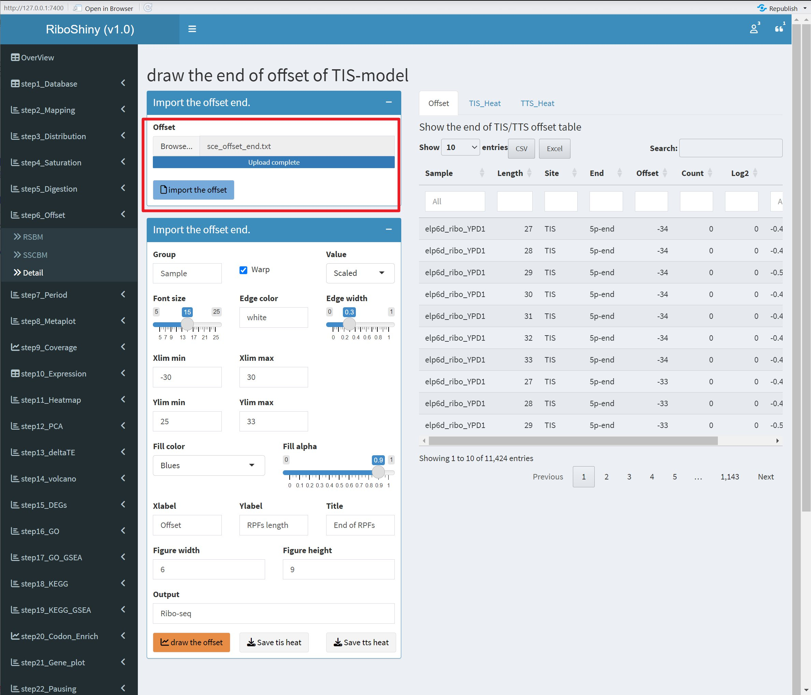

```

2. 起始和终止密码子处 offset 的可视化

这里使用 heatmap 来可视化 offset 偏移总和，展示不同长度对应的 offset 的稳定性，用于手动修正错误的预测结果。

```{r, out.width = "70%", fig.align = "center", echo = FALSE, dpi=200}

knitr::include_graphics("./images/snapshot/step6-offset-end-plot.jpg")

```


### 2.7 step7_Period

#### 2.7.1 RNAseq

与 Ribo-seq 相同

#### 2.7.2 RiboSeq

这个步骤用于可视化 Ribo-seq 测序文库的三核苷酸周期性。

- 使用文件 /mnt/t64/test/sce/4.ribo-seq/5.riboparser/6.periodicity/sce_periodicity.txt （见 RiboParser 的使用说明）。

1. 导入合并后的三核苷酸周期性表格

这里默认是使用所有的样本，可以根据 design 文件中的不同分类信息来选择不同的样本。

```{r, out.width = "70%", fig.align = "center", echo = FALSE, dpi=200}

knitr::include_graphics("./images/snapshot/step7-periodicity-riboseq-table.jpg")

```

2. 三核苷酸周期性可视化

这里使用 barplot 方式来可视化三核苷酸周期性，分别为 count 和 proportion 两个类别。

```{r, out.width = "70%", fig.align = "center", echo = FALSE, dpi=200}

knitr::include_graphics("./images/snapshot/step7-periodicity-riboseq-plot.jpg")

```

### 2.8 step8_Metaplot

#### 2.8.1 RNAseq

与 Ribo-seq 相同

#### 2.8.1 RiboSeq

这个步骤用于可视化起始和终止密码子附近的 meta-gene density。

- 使用文件 /mnt/t64/test/sce/4.ribo-seq/5.riboparser/7.metaplot/sce_tis_tts_metaplot.txt （见 RiboParser 的使用说明）。

1. 导入合并后的 mege-gene density 表格

这里默认是使用所有的样本，可以根据 design 文件中的不同分类信息来选择不同的样本。

```{r, out.width = "70%", fig.align = "center", echo = FALSE, dpi=200}

knitr::include_graphics("./images/snapshot/step8-metagene-riboseq-table.jpg")

```

2. meta-gene 可视化

这里使用 barplot、lineplot、heatmap 三种方法来可视化 meta-gene density。
横坐标可以设置为 codon 或者 nucleotide。

```{r, out.width = "70%", fig.align = "center", echo = FALSE, dpi=200}

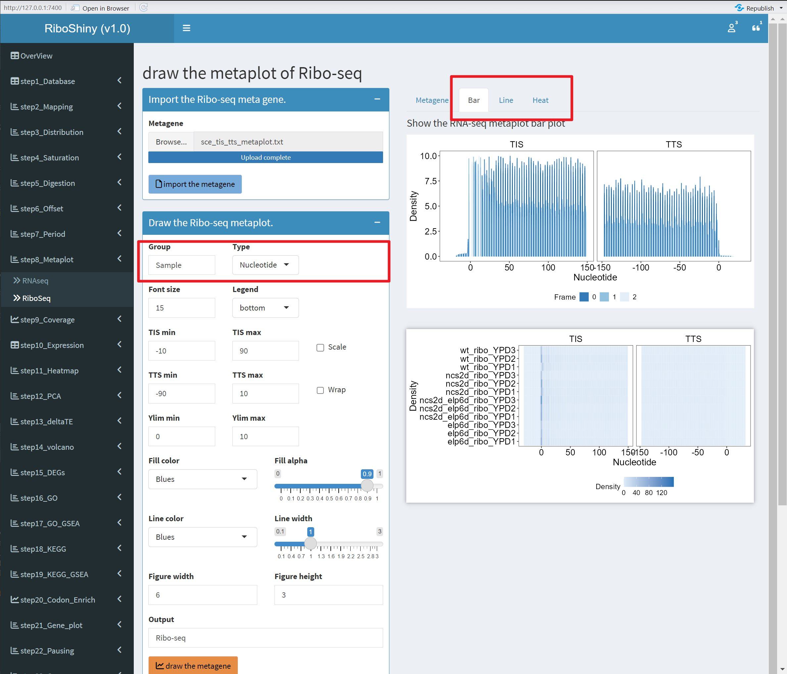

```


### 2.9 step9_Coverage

#### 2.9.1 RNAseq

与 Ribo-seq 相同

#### 2.9.2 RiboSeq

这个步骤用于可视化整个基因的 RPFs 覆盖情况。

- 使用文件 /mnt/t64/test/sce/4.ribo-seq/5.riboparser/7.coverage/sce_utr5_cds_utr3_mean_coverage.txt （见 RiboParser 的使用说明）。

1. 导入合并后的 RPFs coverage 表格

这里默认是使用所有的样本，可以根据 design 文件中的不同分类信息来选择不同的样本。

```{r, out.width = "70%", fig.align = "center", echo = FALSE, dpi=200}

knitr::include_graphics("./images/snapshot/step9-coverage-riboseq-table.jpg")

```


2. RPFs coverage 不对称得分

这里使用 asymmetry score 来衡量 RPFs coverage 前后的丰度差异，确定建库测序是否存在偏好性。

```{r, out.width = "70%", fig.align = "center", echo = FALSE, dpi=200}

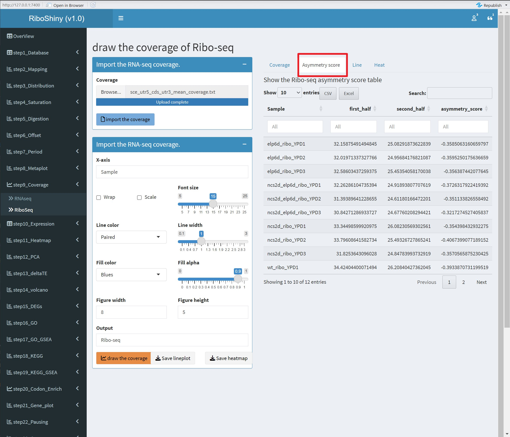

```


3. RPFs coverage 可视化

这里使用 lineplot、heatmap 两种方法来可视化 RPFs coverage。

```{r, out.width = "70%", fig.align = "center", echo = FALSE, dpi=200}

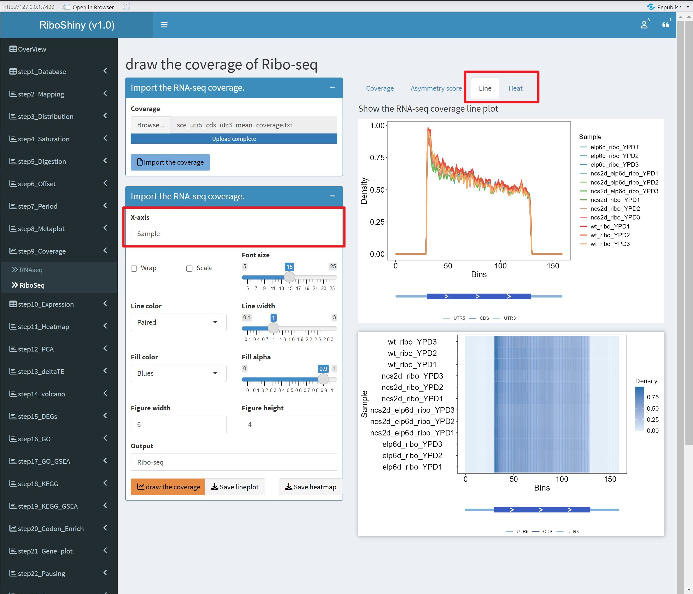

```

### 2.10 step10_Expression

#### 2.10.1 RNAseq

这个步骤用于可视化 RNA-seq 的整体基因表达水平。

- 使用文件 /mnt/t64/test/sce/4.rna-seq/4.quantification/sce_rna_isoforms_expected_count.txt （见 RiboParser 的使用说明）。

1. 导入合并后的 RSEM 的定量表格

这里默认是使用所有的样本，可以根据 design 文件中的不同分类信息来选择不同的样本。

```{r, out.width = "70%", fig.align = "center", echo = FALSE, dpi=200}

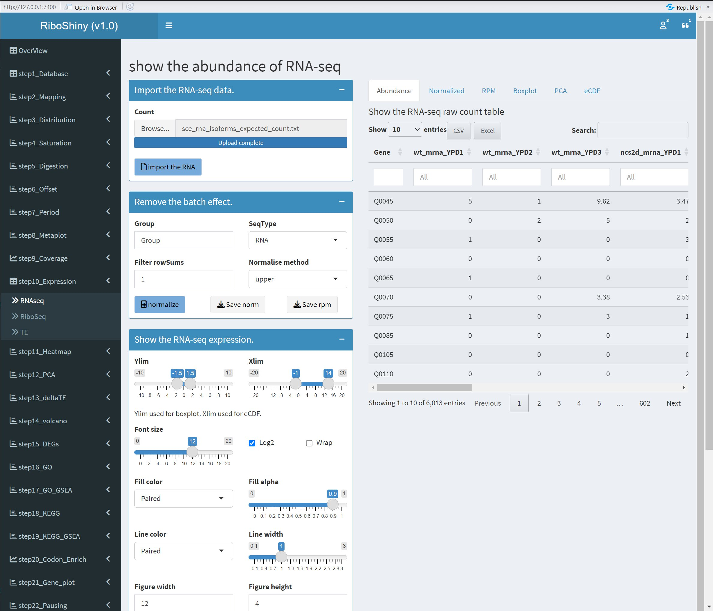

```


2. 使用 RUVseq 进行表达量的标准化

为了降低不同批次的测序数据之间的误差，这里采用 RUVseq 来标准化多个批次的数据，使得多组数据之间可以比较。
标准化之后的结果可以保存为 normalised read count 或者 RPM 两种格式。

同一批次地数据或者误差较小的数据可以跳过此步骤。

```{r, out.width = "70%", fig.align = "center", echo = FALSE, dpi=200}

knitr::include_graphics("./images/snapshot/step10-expression-rnaseq-normal.jpg")

```


3. 使用 RLE 可视化不同样本之间的表达量差异

采用 RUVseq 来标准化多个批次的数据，并使用 RLE 展示标准化前后基因整体表达水平的差异。

同一批次地数据或者误差较小的数据可以跳过此步骤。

```{r, out.width = "70%", fig.align = "center", echo = FALSE, dpi=200}

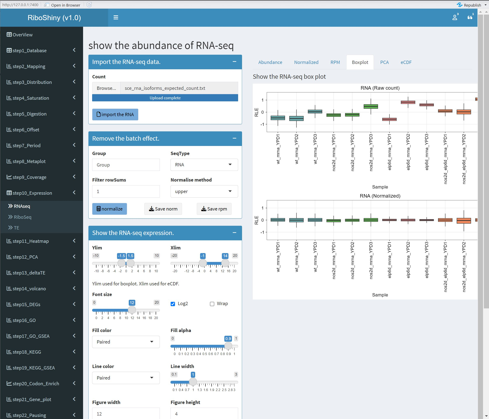

```


4. 使用 PCA 可视化不同样本之间的差异

使用 PCA 展示标准化前后基因整体表达水平的差异。

同一批次地数据或者误差较小的数据可以跳过此步骤。

```{r, out.width = "70%", fig.align = "center", echo = FALSE, dpi=200}

knitr::include_graphics("./images/snapshot/step10-expression-rnaseq-pca.jpg")

```


#### 2.10.2 RiboSeq

这个步骤用于可视化 Ribo-seq 的整体基因表达水平。

一般推荐使用 RiboParser 的结果，并使用每个基因的代表性转录本。
可以通过调整 RiboParser 的参数来对 cds 区域进行定量，包括剔除起始和终止密码子前后稳定性较差的 reads。

- 文件 1 /mnt/t64/test/sce/4.ribo-seq/5.riboparser/10.quantification/sce_cds_rpf_quant.txt （见 RiboParser 的使用说明）。
- 文件 2 /mnt/t64/test/sce/4.ribo-seq/4.quantification/sce_rna_isoforms_expected_count.txt （见 RiboParser 的使用说明）。

1. 导入合并后的 RiboParser 或者 RSEM 的定量表格

这里默认是使用所有的样本，可以根据 design 文件中的不同分类信息来选择不同的样本。

```{r, out.width = "70%", fig.align = "center", echo = FALSE, dpi=200}

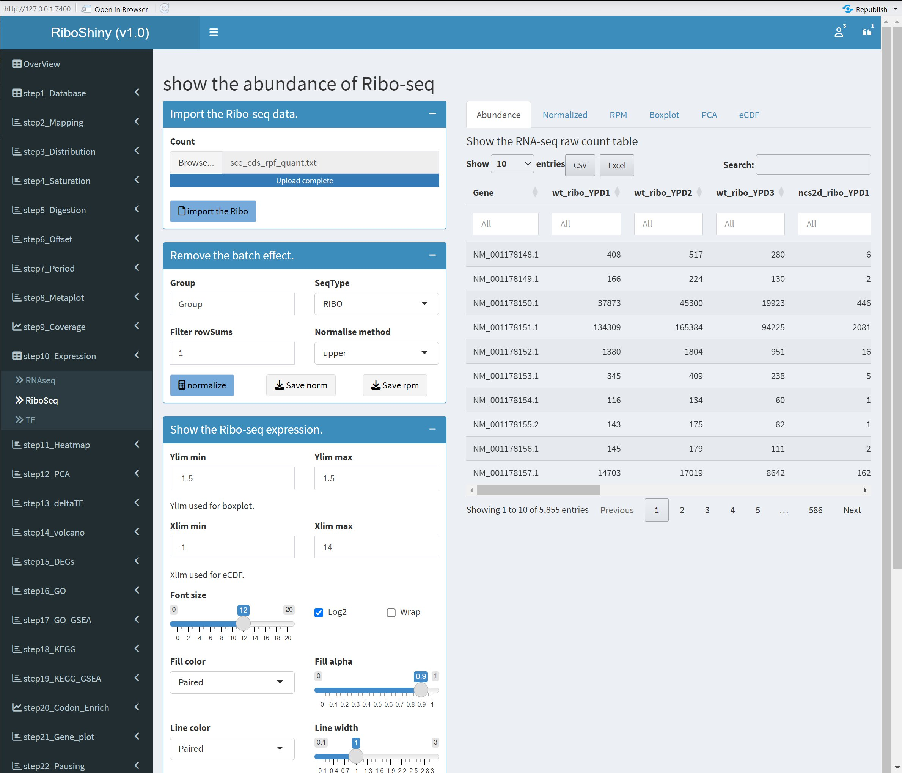

```


2. 使用 RUVseq 进行表达量的标准化

为了降低不同批次的测序数据之间的误差，这里采用 RUVseq 来标准化多个批次的数据，使得多组数据之间可以比较。
标准化之后的结果可以保存为 normalised read count 或者 RPM 两种格式。

同一批次地数据或者误差较小的数据可以跳过此步骤。

```{r, out.width = "70%", fig.align = "center", echo = FALSE, dpi=200}

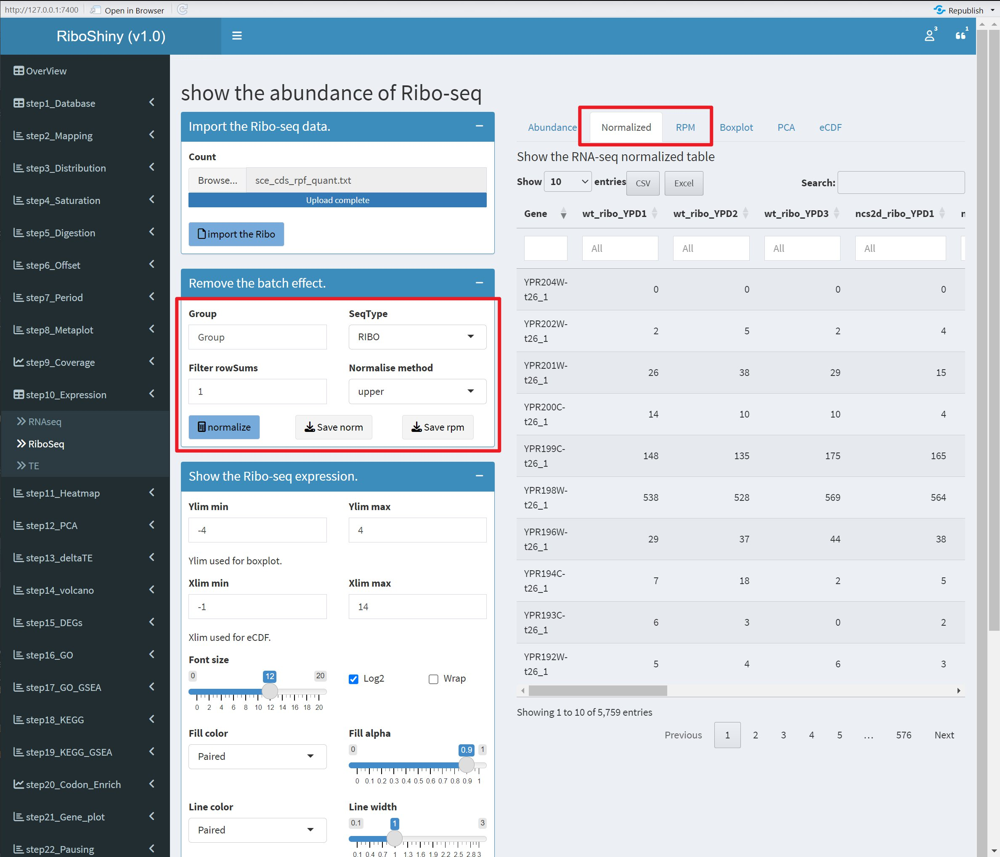

```


3. 使用 RLE 可视化不同样本之间的表达量差异

采用 RUVseq 来标准化多个批次的数据，并使用 RLE 展示标准化前后基因整体表达水平的差异。

同一批次地数据或者误差较小的数据可以跳过此步骤。

```{r, out.width = "70%", fig.align = "center", echo = FALSE, dpi=200}

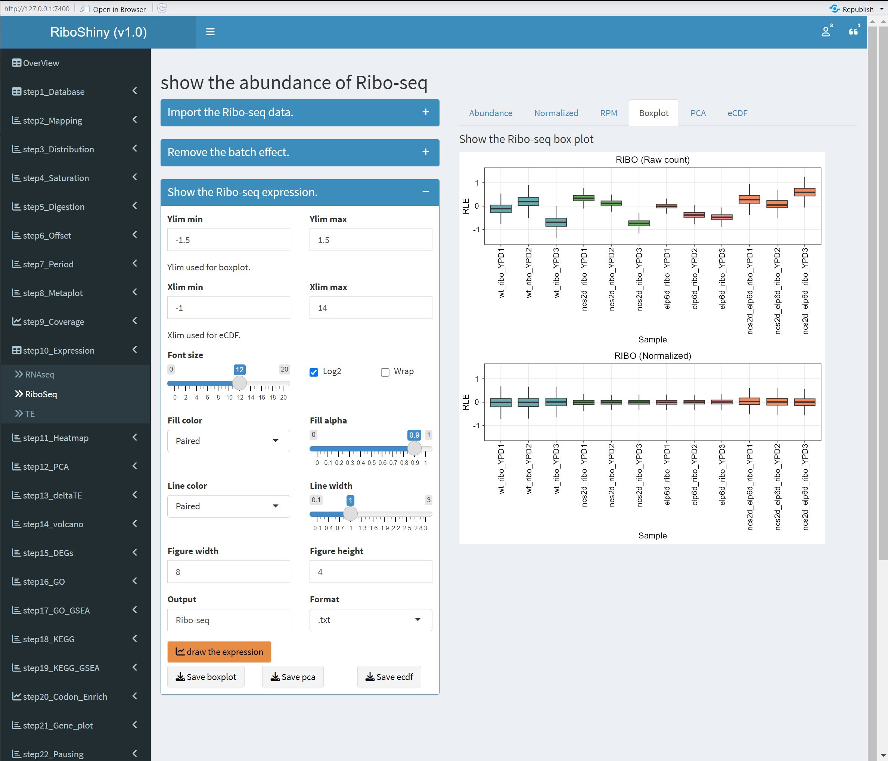

```


4. 使用 PCA 可视化不同样本之间的差异

使用 PCA 展示标准化前后基因整体表达水平的差异。

同一批次地数据或者误差较小的数据可以跳过此步骤。

```{r, out.width = "70%", fig.align = "center", echo = FALSE, dpi=200}

knitr::include_graphics("./images/snapshot/step10-expression-riboseq-pca.jpg")

```


#### 2.10.3 TE

这个步骤用于计算翻译效率。

翻译效率 = （Ribo-seq 的表达量） / （RNA-seq 的表达量）

一般使用标准化之后的数据，如 RPM 或者 TPM 等。

- 文件 1 /mnt/t64/test/sce/4.ribo-seq/5.riboparser/10.quantification/sce_cds_rpf_quant.txt （见 RiboParser 的使用说明）。
- 文件 2 /mnt/t64/test/sce/3.rna-seq/4.quantification/sce_rna_isoforms_expected_count.txt （见 RiboParser 的使用说明）。

1. 导入合并后的 RNA-seq 和 Ribo-seq 的定量表格

这里默认是使用所有的样本，可以根据 design 文件中的不同分类信息来选择不同的样本。

```{r, out.width = "70%", fig.align = "center", echo = FALSE, dpi=200}

knitr::include_graphics("./images/snapshot/step10-expression-te-table.jpg")

```

2. 使用 PCA 和 eCDF 可视化不同样本之间的差异

```{r, out.width = "70%", fig.align = "center", echo = FALSE, dpi=200}

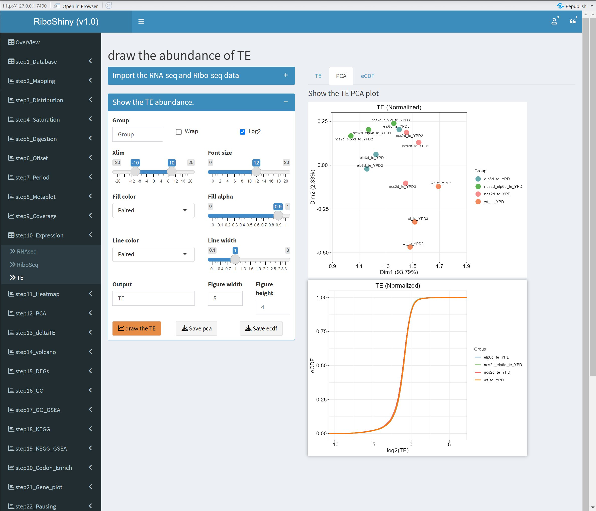

```

### 2.11 step11_Heatmap

#### 2.11.1 RNAseq

这个步骤用于可视化 RNA-seq 的整体重复性。

使用标准化后的数据来绘制热图，这里可以使用 RSEM 的 RPKM 数据，或者 RUVseq 标准化后的数据。

- 文件1 ./RiboShiny/OutputData/RNA-seq-normalized-2024-10-24.txt （RUVseq）。
- 文件2 /mnt/t64/test/sce/3.rna-seq/4.quantification/sce_rna_gene_FPKM.txt （RSEM）。

1. 导入标准化的定量表格

这里默认是使用所有的样本，可以根据 design 文件中的不同分类信息来选择不同的样本。

```{r, out.width = "70%", fig.align = "center", echo = FALSE, dpi=200}


```


2. 计算并可视化样本相关性

计算样本之间的 Pearson coefficient 来表示重复性，并通过热图进行可视化。

```{r, out.width = "70%", fig.align = "center", echo = FALSE, dpi=200}

knitr::include_graphics("./images/snapshot/step11-heatmap-rnaseq-corr.jpg")

```


3. 基因和样本聚类

同时采用不同的距离计算方法和聚类方法来对基因和样本进行聚类。分别 row scale 和 column scale 的热图来可视化。

```{r, out.width = "70%", fig.align = "center", echo = FALSE, dpi=200}

knitr::include_graphics("./images/snapshot/step11-heatmap-rnaseq-cluster.jpg")

```


#### 2.11.2 RiboSeq

这个步骤用于可视化 Ribo-seq 的整体重复性。

使用标准化后的数据来绘制热图，这里可以使用 RiboParser/RSEM 的 RPKM 数据，或者 RUVseq 标准化后的数据。

- 文件1 ./RiboShiny/OutputData/Ribo-seq-normalized-2024-10-24.txt （RUVseq）。
- 文件2 /mnt/t64/test/sce/4.ribo-seq/5.riboparser/sce_cds_rpkm_quant.txt （RiboParser）。

1. 导入标准化的定量表格

这里默认是使用所有的样本，可以根据 design 文件中的不同分类信息来选择不同的样本。

```{r, out.width = "70%", fig.align = "center", echo = FALSE, dpi=200}


```


2. 计算并可视化样本相关性

计算样本之间的 Pearson coefficient 来表示重复性，并通过热图进行可视化。

```{r, out.width = "70%", fig.align = "center", echo = FALSE, dpi=200}

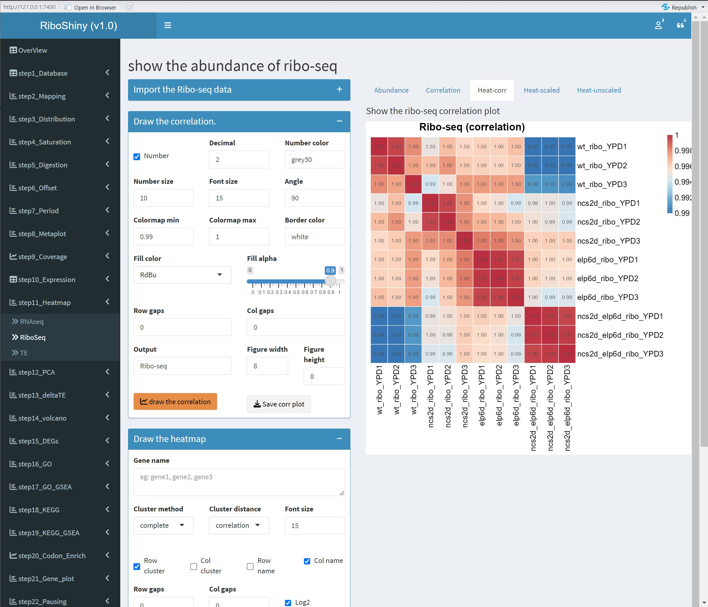

```


3. 基因和样本聚类

同时采用不同的距离计算方法和聚类方法来对基因和样本进行聚类。分别 row scale 和 column scale 的热图来可视化。

```{r, out.width = "70%", fig.align = "center", echo = FALSE, dpi=200}

knitr::include_graphics("./images/snapshot/step11-heatmap-riboseq-cluster.jpg")

```

#### 2.11.3 TE

这个步骤用于可视化 TE 的整体重复性。

使用前面计算的翻译效率数据来计算并可视化样本重复性。

- 文件1 ./RiboShiny/OutputData/TE-normalized-2024-10-24.txt

1. 导入标准化的定量表格

这里默认是使用所有的样本，可以根据 design 文件中的不同分类信息来选择不同的样本。

```{r, out.width = "70%", fig.align = "center", echo = FALSE, dpi=200}

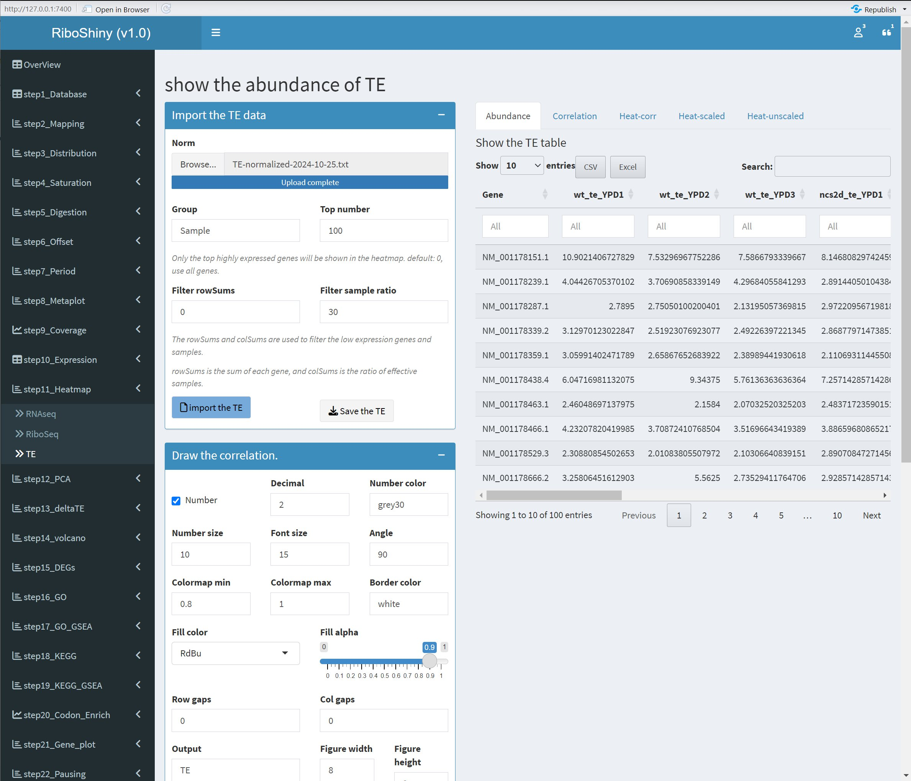

```


2. 计算并可视化样本相关性

计算样本之间的 Pearson coefficient 来表示重复性，并通过热图进行可视化。

```{r, out.width = "70%", fig.align = "center", echo = FALSE, dpi=200}

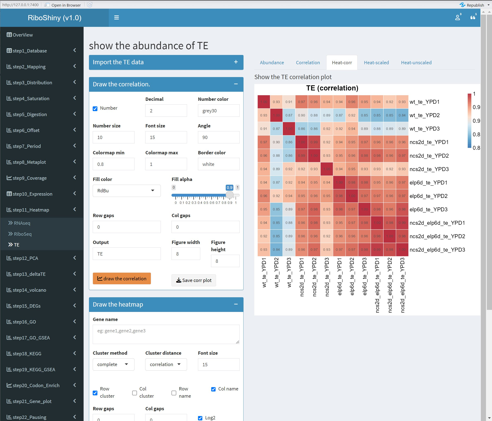

```


3. 基因和样本聚类

同时采用不同的距离计算方法和聚类方法来对基因和样本进行聚类。分别 row scale 和 column scale 的热图来可视化。

```{r, out.width = "70%", fig.align = "center", echo = FALSE, dpi=200}

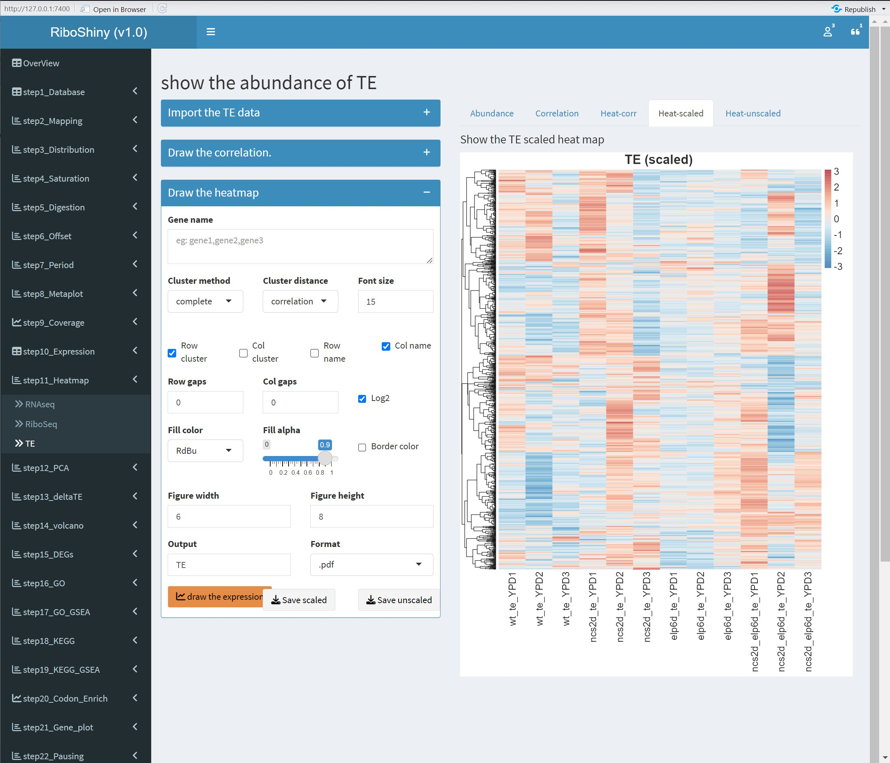

```

### 2.12 step12_PCA

#### 2.12.1 RNAseq

这个步骤用于可视化 RNA-seq 的主成分分析结果。

使用标准化后的数据来可视化 PCA 结果，这里使用 RUVseq 标准化后的数据做示例。

- 文件1 ./RiboShiny/OutputData/RNA-seq-normalized-2024-10-24.txt （RUVseq）。

1. 导入标准化的定量表格

这里默认是使用所有的样本，可以根据 design 文件中的不同分类信息来选择不同的样本。

```{r, out.width = "70%", fig.align = "center", echo = FALSE, dpi=200}

knitr::include_graphics("./images/snapshot/step12-pca-rnaseq-table.jpg")

```


2. PCA 分析结果

展示样本的主成分分析结果。

```{r, out.width = "70%", fig.align = "center", echo = FALSE, dpi=200}

knitr::include_graphics("./images/snapshot/step12-pca-rnaseq-results.jpg")

```


3. PCA 分析结果可视化

使用 barplot 展示不同维度的贡献度，使用 scatter 可视化样本的主成分分析结果。

```{r, out.width = "70%", fig.align = "center", echo = FALSE, dpi=200}

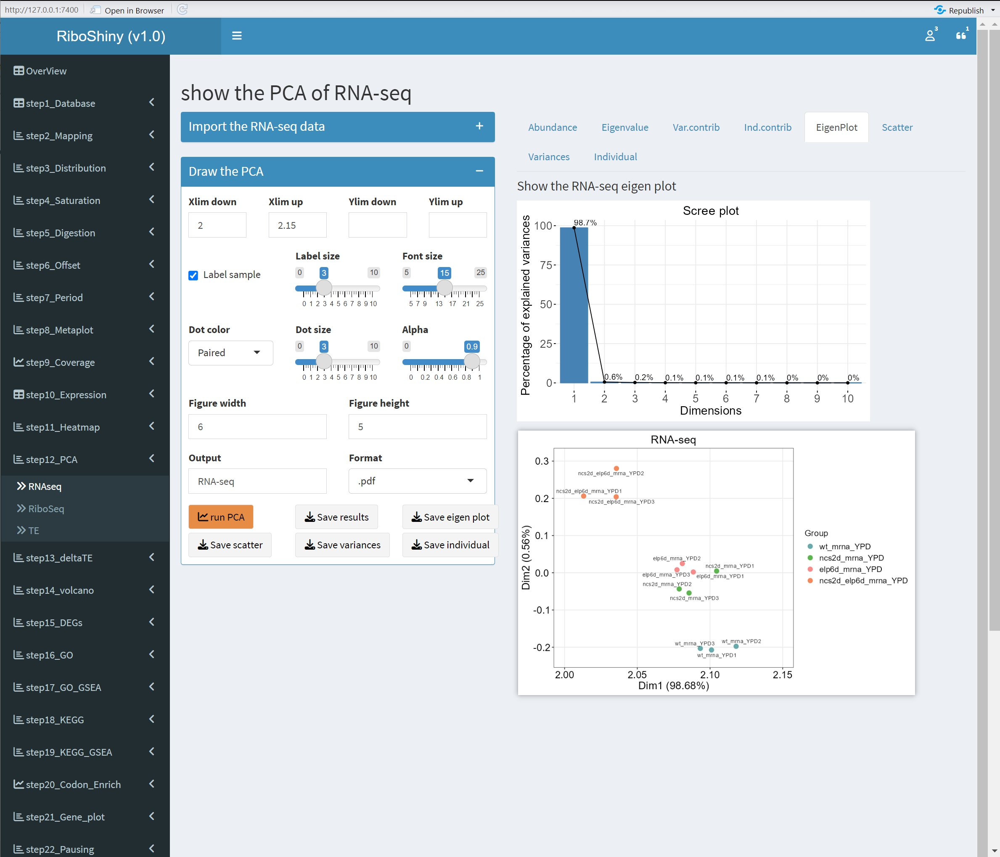

```


#### 2.12.2 RiboSeq

这个步骤用于可视化 Ribo-seq 的主成分分析结果。

使用标准化后的数据来可视化 PCA 结果，这里使用 RUVseq 标准化后的数据做示例。

- 文件1 ./RiboShiny/OutputData/Ribo-seq-normalized-2024-10-24.txt （RUVseq）。

1. 导入标准化的定量表格

这里默认是使用所有的样本，可以根据 design 文件中的不同分类信息来选择不同的样本。

```{r, out.width = "70%", fig.align = "center", echo = FALSE, dpi=200}

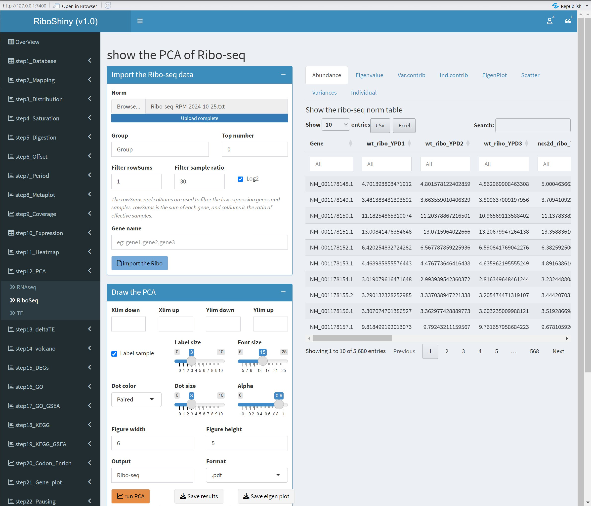

```


2. PCA 分析结果

展示样本的主成分分析结果。

```{r, out.width = "70%", fig.align = "center", echo = FALSE, dpi=200}

knitr::include_graphics("./images/snapshot/step12-pca-riboseq-results.jpg")

```


3. PCA 分析结果可视化

使用 barplot 展示不同维度的贡献度，使用 scatter 可视化样本的主成分分析结果。

```{r, out.width = "70%", fig.align = "center", echo = FALSE, dpi=200}

knitr::include_graphics("./images/snapshot/step12-pca-riboseq-plot.jpg")

```

#### 2.12.3 TE

这个步骤用于可视化 TE 的主成分分析结果。

使用 RNA-seq 和 Ribo-seq 计算的翻译效率来做主成分分析。

- 文件1 ./RiboShiny/OutputData/TE-normalized-2024-10-24.txt。

1. 导入 TE 的定量表格

这里默认是使用所有的样本，可以根据 design 文件中的不同分类信息来选择不同的样本。

```{r, out.width = "70%", fig.align = "center", echo = FALSE, dpi=200}

knitr::include_graphics("./images/snapshot/step12-pca-te-table.jpg")

```


2. PCA 分析结果

展示样本的主成分分析结果。

```{r, out.width = "70%", fig.align = "center", echo = FALSE, dpi=200}

knitr::include_graphics("./images/snapshot/step12-pca-te-results.jpg")

```


3. PCA 分析结果可视化

使用 barplot 展示不同维度的贡献度，使用 scatter 可视化样本的主成分分析结果。

```{r, out.width = "70%", fig.align = "center", echo = FALSE, dpi=200}

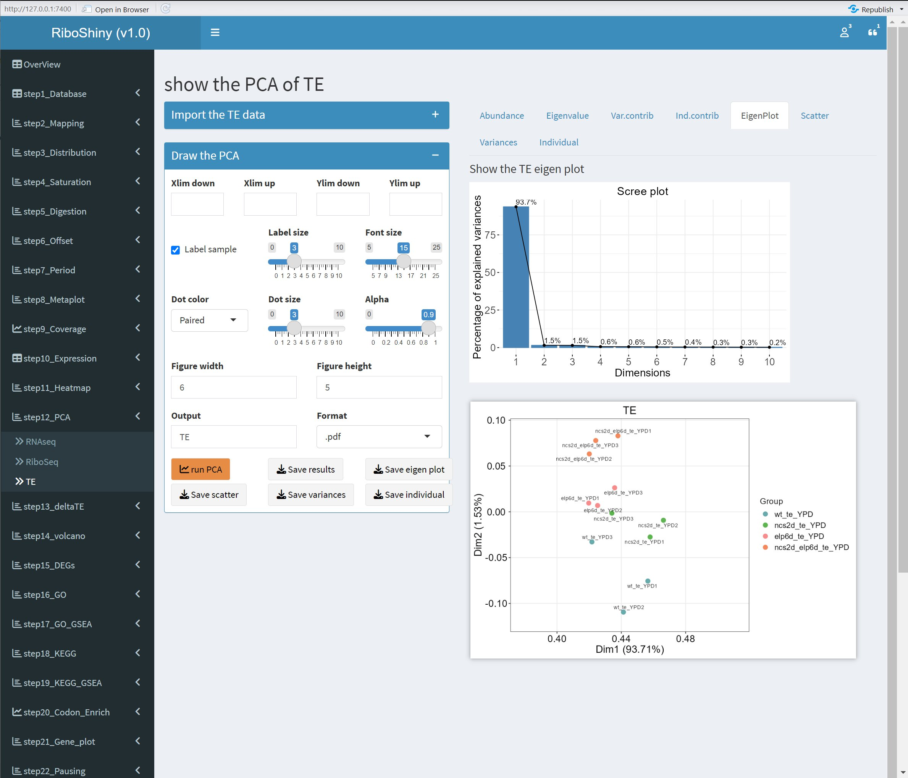

```

### 2.13 step13_deltaTE

#### 2.13.1 edgeR

这个步骤用于 RNA-seq 或 Ribo-seq 的差异分析。

这里使用 edgeR 来做差异分析，使用 raw count 或者标准化后的 count 做输入数据，这里使用 RNA-seq 做示例。

- 文件1 ./RiboShiny/OutputData/RNA-seq-normalized-2024-10-25.txt （RUVseq）。

1. 导入标准化的定量表格

导入前期准备的标准化表格。

```{r, out.width = "70%", fig.align = "center", echo = FALSE, dpi=200}

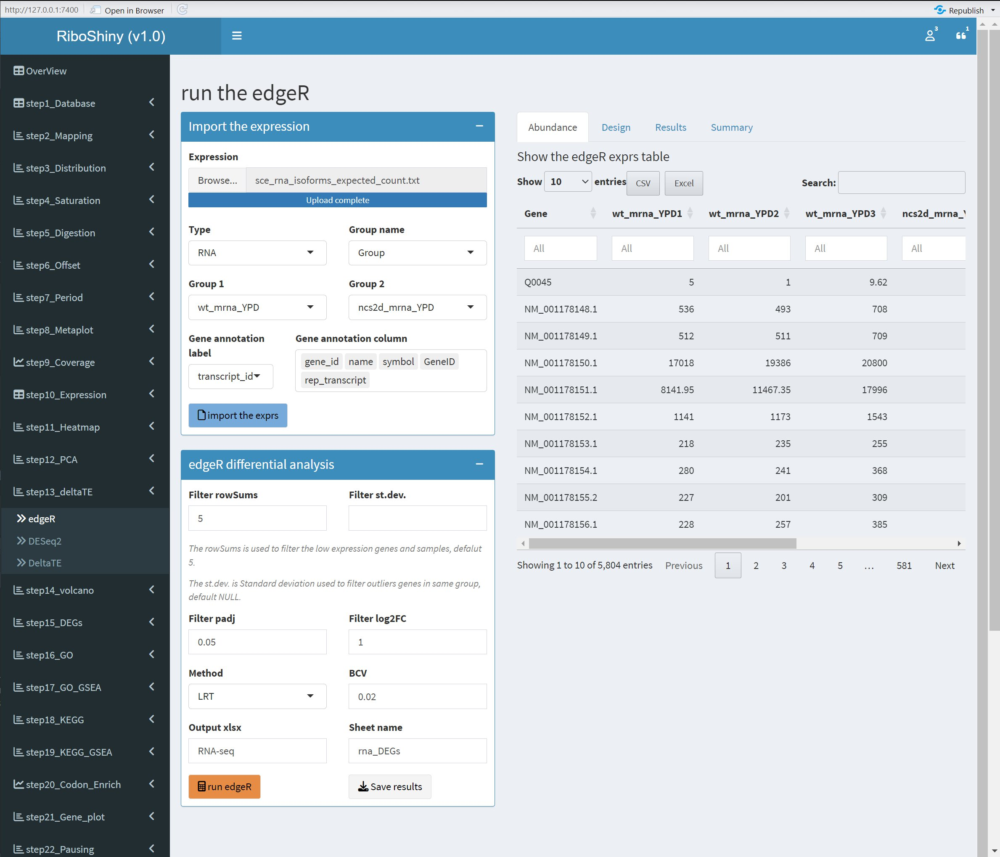

```

2. 设定分组信息

这一步必须要导入 design 文件，根据 design 文件中的不同分类信息来选择不同的样本，设定 Group 1 和 Group 2，计算二者之间的差异基因。

导入 gene message 表格，根据 transcript_id 来连接表达量的表格和基因信息的表格，主要用于后续的基因功能富集分析。

```{r, out.width = "70%", fig.align = "center", echo = FALSE, dpi=200}

knitr::include_graphics("./images/snapshot/step13-edger-rnaseq-design.jpg")

```

3. edgeR 差异分析结果

展示不同分组之间的 edgeR 输出结果。前面几列为差异分析结果，中间几列为表达量，最后几列为基因的注释信息。

```{r, out.width = "70%", fig.align = "center", echo = FALSE, dpi=200}

knitr::include_graphics("./images/snapshot/step13-edger-rnaseq-results.jpg")

```


#### 2.13.2 DESeq2

这个步骤用于 RNA-seq 或 Ribo-seq 的差异分析。

这里使用 DESeq2 来做差异分析，使用 raw count 或者标准化后的 count 做输入数据，这里使用 Ribo-seq 做示例。

- 文件1 ./RiboShiny/OutputData/Ribo-seq-normalized-2024-10-25.txt （RUVseq）。

1. 导入标准化的定量表格

导入前期准备的标准化表格。

```{r, out.width = "70%", fig.align = "center", echo = FALSE, dpi=200}

knitr::include_graphics("./images/snapshot/step13-deseq2-riboseq-table.jpg")

```

2. 设定分组信息

这一步必须要导入 design 文件，根据 design 文件中的不同分类信息来选择不同的样本，设定 Group 1 和 Group 2，计算二者之间的差异基因。

导入 gene message 表格，根据 transcript_id 来连接表达量的表格和基因信息的表格，主要用于后续的基因功能富集分析。

```{r, out.width = "70%", fig.align = "center", echo = FALSE, dpi=200}

knitr::include_graphics("./images/snapshot/step13-deseq2-riboseq-design.jpg")

```

3. DESeq2 差异分析结果

展示不同分组之间的 DESeq2 输出结果。前面几列为差异分析结果，中间几列为表达量，最后几列为基因的注释信息。

```{r, out.width = "70%", fig.align = "center", echo = FALSE, dpi=200}

knitr::include_graphics("./images/snapshot/step13-deseq2-riboseq-results.jpg")

```

#### 2.13.3 DeltaTE

这个步骤用于转录、翻译和翻译效率的差异分析。

这里使用 DeltaTE 来做差异分析。因为做翻译效率的差异分析，需要同时考虑 RNA-seq 和 Ribo-seq 的表达量，所以这里需要同时导入两个文件。

- 文件1 ./RiboShiny/OutputData/RNA-seq-normalized-2024-10-25.txt （RUVseq）。
- 文件2 ./RiboShiny/OutputData/Ribo-seq-normalized-2024-10-25.txt （RUVseq）。

1. 导入标准化的定量表格

导入前期准备的 RNA-seq 和 Ribo-seq 标准化表格。

```{r, out.width = "70%", fig.align = "center", echo = FALSE, dpi=200}

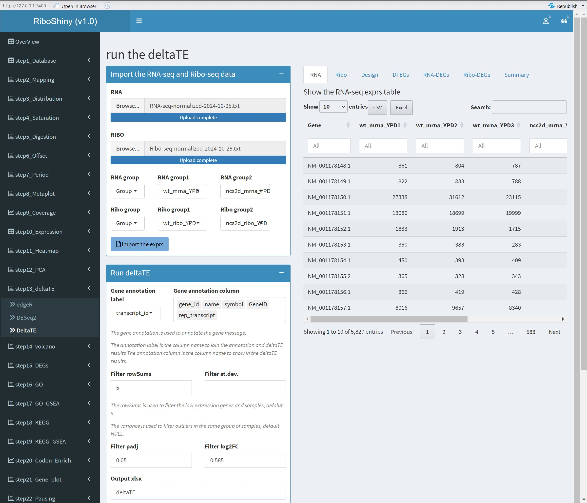

```

2. 设定分组信息

导入 design 文件，根据 design 文件中的不同分类信息来选择不同的样本，分别为 RNA-seq 和 Ribo-seq 设定 Group 1 和 Group 2，计算二者之间的差异基因。

导入 gene message 表格，根据 transcript_id 来连接表达量的表格和基因信息的表格，主要用于后续的基因功能富集分析。

```{r, out.width = "70%", fig.align = "center", echo = FALSE, dpi=200}

knitr::include_graphics("./images/snapshot/step13-deltate-design.jpg")

```

3. DeltaTE 差异分析结果

展示不同分组之间的 DeltaTE 输出结果。前面几列为差异分析结果，中间几列为表达量，最后几列为基因的注释信息。

```{r, out.width = "70%", fig.align = "center", echo = FALSE, dpi=200}

knitr::include_graphics("./images/snapshot/step13-deltate-results.jpg")

```

4. DeltaTE 差异分析结果统计

统计差异分析中转录、翻译和翻译效率的显著差异基因。

```{r, out.width = "70%", fig.align = "center", echo = FALSE, dpi=200}

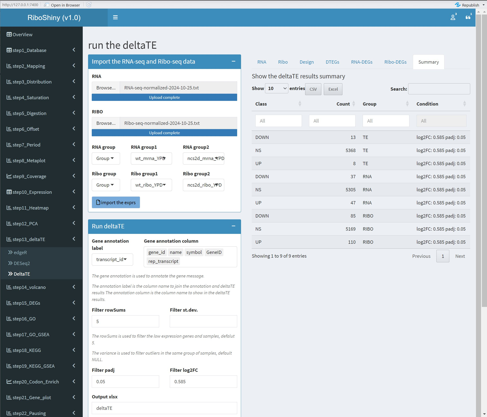

```

### 2.14 step14_volcano

#### 2.14.1 Volcano

这个步骤用于差异分析的火山图可视化。

这里使用 edgeR / DESeq2 / DeltaTE 的输出结果做可视化。
这里使用 DeltaTE 的结果做示例，可以通过 sheet 名称指定输入文件，分别为 TE、RNA-seq、Ribo-seq 的差异分析结果。

- 文件1 ./RiboShiny/OutputData/wt_vs_ncs2d_elp6d-deltaTE-results-2024-10-25.xlsx

1. 导入差异分析的结果

差异分析的表格可以使用 Class 分组不同类别的基因，用于后续基因功能富集分析。

```{r, out.width = "70%", fig.align = "center", echo = FALSE, dpi=200}

knitr::include_graphics("./images/snapshot/step14-volcano-table.jpg")

```

2. 差异分析火山图可视化

使用 volcano plot 可视化不同分组之间的差异分析结果，可以通过调整参数来设定不同的阈值，如 log2FC、FDR 等。

```{r, out.width = "70%", fig.align = "center", echo = FALSE, dpi=200}

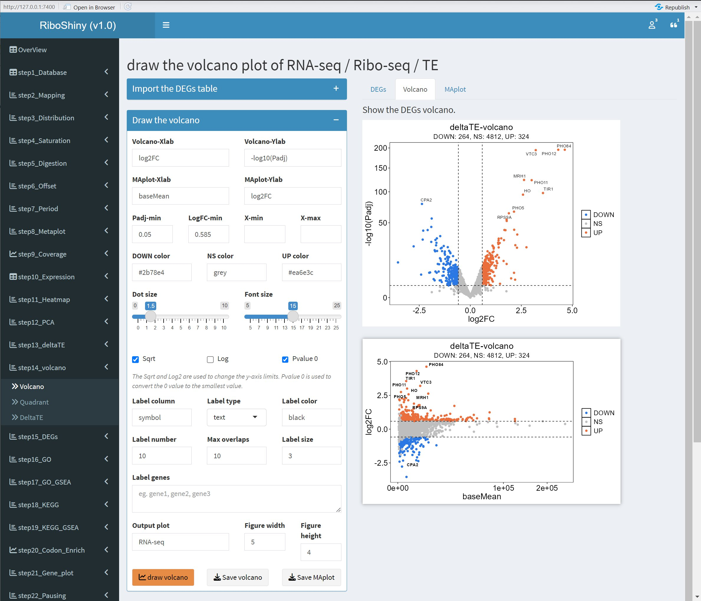

```

#### 2.14.2 Quadrant

这个步骤用于分析 RNA-seq 和 Ribo-seq 之间的协同变化。

这里使用 RNA-seq 和 Ribo-seq 差异分析的结果做可视化，需要同时输入二者的差异分析结果，这里使用 DeltaTE 的结果做示例。

- 文件1 ./RiboShiny/OutputData/wt_vs_ncs2d_elp6d-deltaTE-results-2024-10-25.xlsx

1. 导入差异分析的结果

合并后的表格中基因被标记为不同的类别，保存为 excel 文件，用于后续基因功能富集分析（见后续步骤）。

```{r, out.width = "70%", fig.align = "center", echo = FALSE, dpi=200}

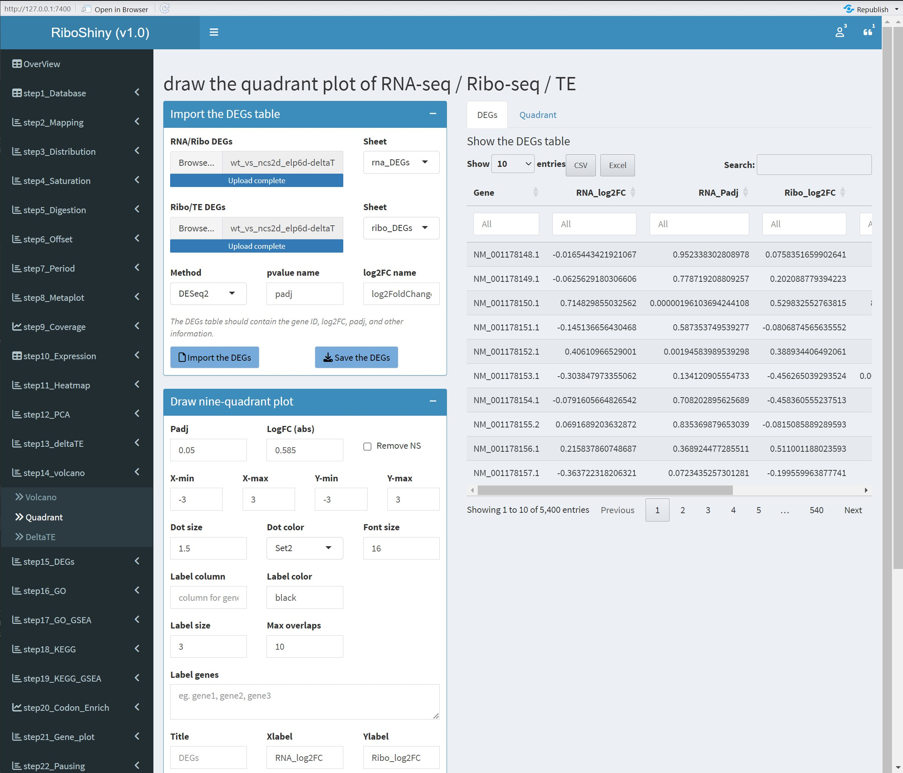

```

2. 差异分析九象限图可视化

使用 quadrant plot 可视化不同分组之间的差异分析结果，可以通过调整参数来设定不同的阈值，如 log2FC、FDR 等。

```{r, out.width = "70%", fig.align = "center", echo = FALSE, dpi=200}

knitr::include_graphics("./images/snapshot/step14-quadrant-plot.jpg")

```

#### 2.14.3 DeltaTE

这个步骤用于分析 RNA-seq 和 Ribo-seq 之间的协同变化。

与上一个步骤不同的是，这里使用 deltaTE 的方法对不同变化趋势的基因进行归类，确定更多翻译水平存在调节的基因。
同样的，这里使用 RNA-seq 和 Ribo-seq 差异分析的结果做可视化，需要同时输入二者的差异分析结果。

- 文件1 ./RiboShiny/OutputData/wt_vs_ncs2d_elp6d-deltaTE-results-2024-10-25.xlsx

1. 导入差异分析的结果

合并后的表格中基因被标记为不同的类别，保存为 excel 文件，用于后续基因功能富集分析（见后续步骤）。

```{r, out.width = "70%", fig.align = "center", echo = FALSE, dpi=200}

knitr::include_graphics("./images/snapshot/step14-deltate-table.jpg")

```

2. 差异分析九象限图可视化

使用 quadrant plot 可视化不同分组之间的差异分析结果，可以通过调整参数来设定不同的阈值，如 log2FC、FDR 等。

```{r, out.width = "70%", fig.align = "center", echo = FALSE, dpi=200}

knitr::include_graphics("./images/snapshot/step14-deltate-plot.jpg")

```

### 2.15 step15_DEGs

#### 2.15.1 Venn_diagram

这个步骤用于分不同分组之间的差异基因。

这是一个独立的小工具，用于在不同分组间比较显著差异基因的区别。

- 文件1 ./RiboShiny/OutputData/wt_vs_ncs2d-deltaTE-results-2024-10-25.xlsx
- 文件2 ./RiboShiny/OutputData/wt_vs_elp6d-deltaTE-results-2024-10-25.xlsx

1. 输入基因列表

输入的基因集用于计算交集和差集，并输出完整的列表。

```{r, out.width = "70%", fig.align = "center", echo = FALSE, dpi=200}

knitr::include_graphics("./images/snapshot/step15-venn-diagram-table.jpg")

```

2. 使用韦恩图可视化差异基因

```{r, out.width = "70%", fig.align = "center", echo = FALSE, dpi=200}

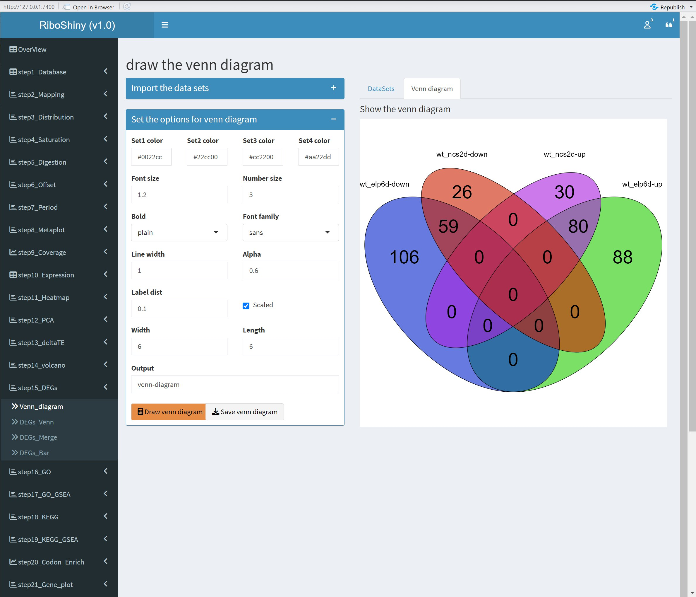

```

#### 2.15.2 DEGs_Venn

这个步骤用于分析 RNA-seq / Ribo-seq / TE 之间的的差异基因变化。

这个步骤对于分析转录和翻译水平显著差异基因的变化，用于确定独属于翻译调节的基因集。一般情况下，转录和翻译调节的差异基因大多是相似的。

- 文件1 ./RiboShiny/OutputData/wt_vs_ncs2d_elp6d-deltaTE-results-2024-10-25.xlsx

1. 导入差异分析的结果

```{r, out.width = "70%", fig.align = "center", echo = FALSE, dpi=200}

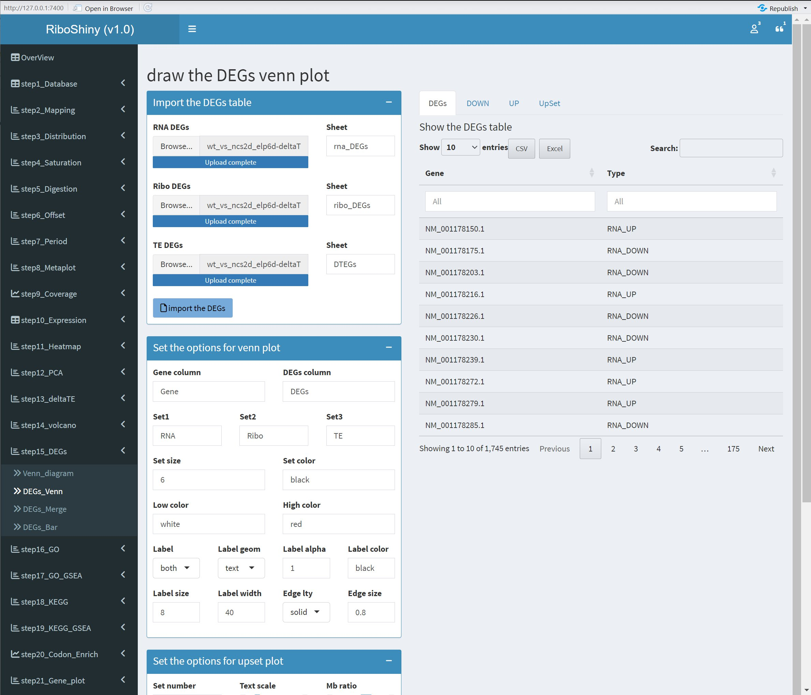

```

2. 使用韦恩图可视化差异基因

```{r, out.width = "70%", fig.align = "center", echo = FALSE, dpi=200}

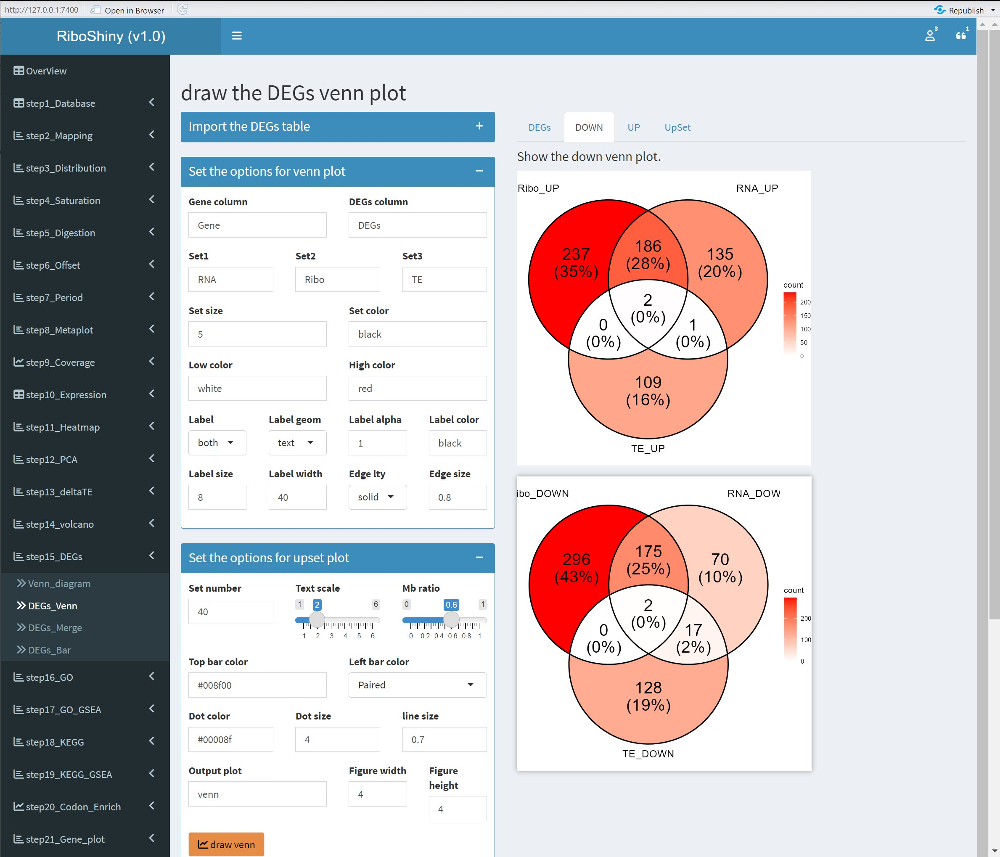

```

3. 使用 upset 可视化差异基因

```{r, out.width = "70%", fig.align = "center", echo = FALSE, dpi=200}

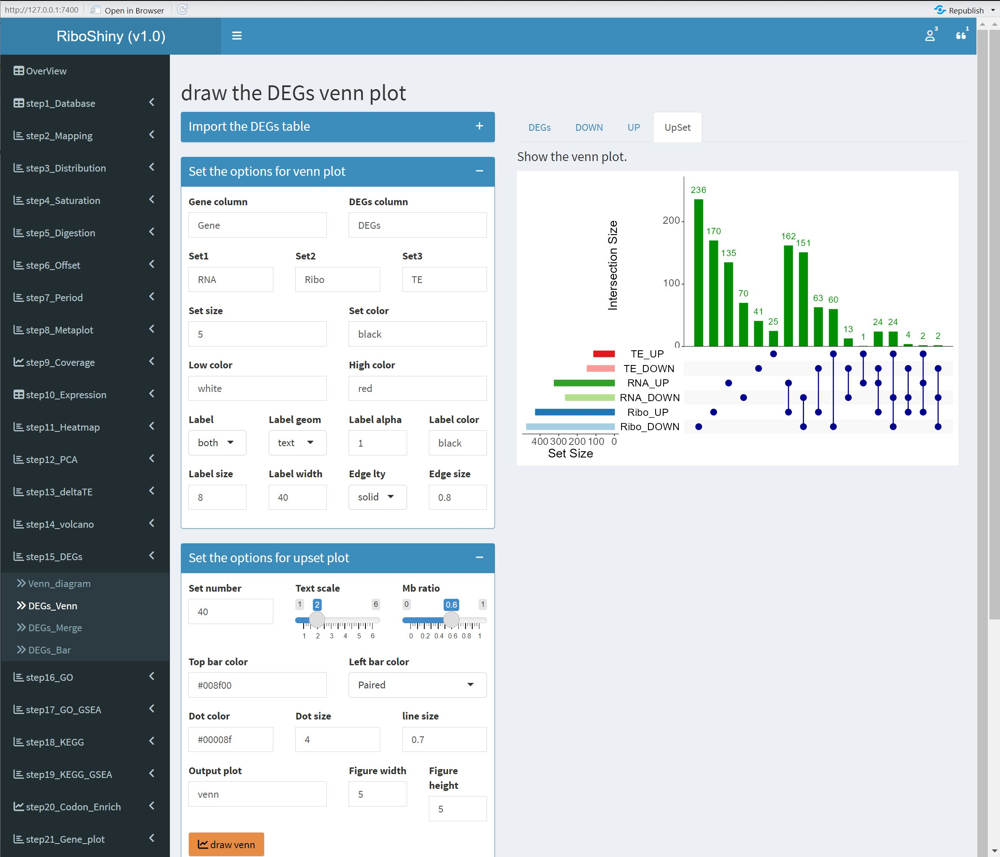

```

#### 2.15.3 DEGs_Merge

这个步骤用于合并所有分组的差异基因。

为了更方便地比较不同分组之间的差异基因，在这里合并所有分组之间的差异基因。

- 文件1 ./RiboShiny/OutputData/wt_vs_ncs2d-deltaTE-results-2024-10-25.xlsx
- 文件2 ./RiboShiny/OutputData/wt_vs_elp6d-deltaTE-results-2024-10-25.xlsx
- 文件3 ./RiboShiny/OutputData/wt_vs_ncs2d_elp6d-deltaTE-results-2024-10-25.xlsx

1. 导入差异分析的结果

可以同时导入多个差异分析的结果文件，合并后的表格中基因被标记为不同的类别，保存为 excel 文件，用于后续数量统计和基因功能富集分析（见后续步骤）。

```{r, out.width = "70%", fig.align = "center", echo = FALSE, dpi=200}

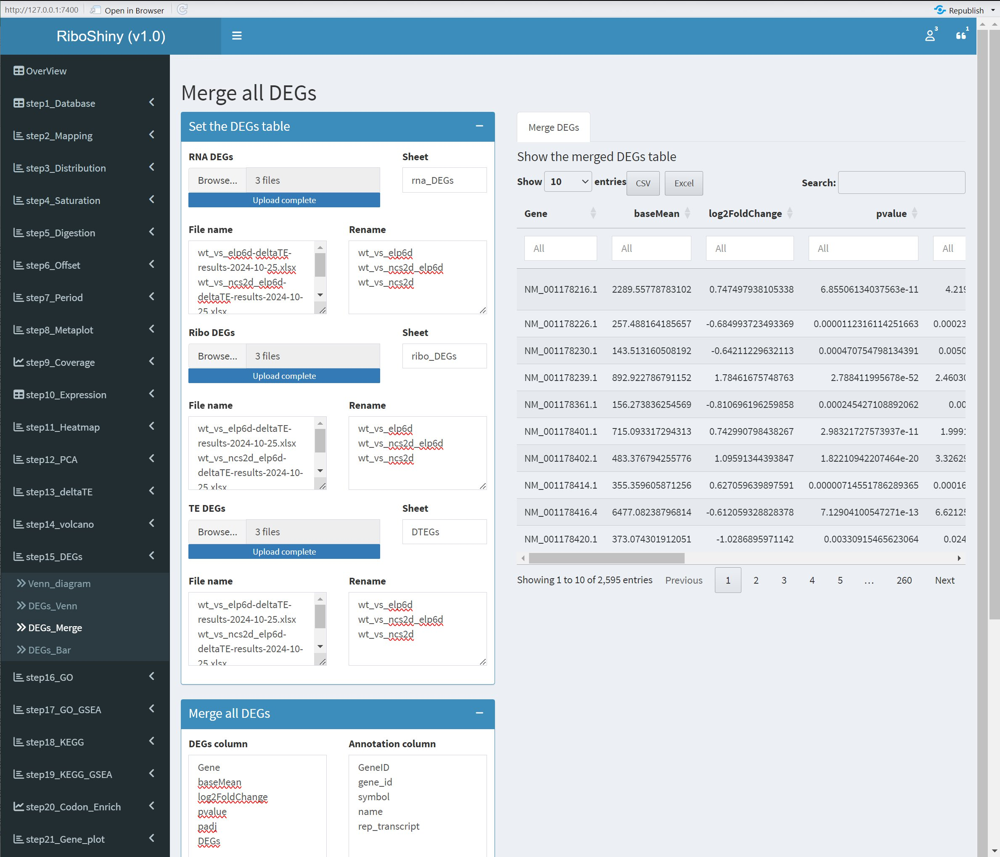

```

#### 2.15.4 DEGs_Bar

这个步骤用于统计和比较不同分组之间的差异基因。

输入文件为合并后的差异基因表格。

- 文件1 ./RiboShiny/OutputData/merge-DEGs-2024-10-25.xlsx

1. 导入合并后的差异基因表格

```{r, out.width = "70%", fig.align = "center", echo = FALSE, dpi=200}

knitr::include_graphics("./images/snapshot/step15-degs-table.jpg")

```

2. 可视化差异基因集

这里使用 bar plot 可视化不同分组之间的差异基因数量。

```{r, out.width = "70%", fig.align = "center", echo = FALSE, dpi=200}

knitr::include_graphics("./images/snapshot/step15-degs-barplot.jpg")

```

### 2.16 step16_GO

#### 2.16.1 EnrichGO

这个步骤用于差异基因的 GO 功能富集分析。

通过 clusterprofiler 对差异基因做富集分析，这里可以使用前面制作的 orgDb。
但是这个步骤只能输入一组差异基因的结果，如果需要对多组差异基因做功能富集分析，可以使用下一个步骤 CompareCluster。
可以通过 sheet 来选择不同的分组。

- 文件1 ./RiboShiny/OutputData/wt_vs_ncs2d_elp6d-deltaTE-results-2024-10-25.xlsx

1. 导入差异分析的结果

首先导入差异基因的表格。

```{r, out.width = "70%", fig.align = "center", echo = FALSE, dpi=200}

knitr::include_graphics("./images/snapshot/step16-go-degs-table.jpg")

```

2. 选择 GO 数据库

选择正确的 orgDb。如果研究的物种没有对应的 orgDb，也可以使用本地的 gson 文件（文件制作方法见 2.1.3 和 2.1.4）

选择正确的 keyType。这个值用于对应差异基因的 ID 和 orgDb 中的 keytype。

对于差异分析的列表，如果是使用前文所述的 NCBI 来源的注释文件，keyType 默认为 ENTREZID。可以使用 "Gene column" 来选择表格中的列。

对于 orgDb，如果是使用 annotationforge 制作的，keyType 一般为 "GID"。如果是模式生物的 orgDb，keyType 一般为 "ENTREZID"。

展示 GO 富集分析的结果，可以根据 pvalueCutoff 和 qvalueCutoff 来筛选结果。

```{r, out.width = "70%", fig.align = "center", echo = FALSE, dpi=200}

knitr::include_graphics("./images/snapshot/step16-go-degs-enrich-results.jpg")

```

3. 去除冗余的信息

GO 富集分析中存在众多的 GO 术语，有些术语之间存在重叠，为了更好地展示结果，可以去除冗余的信息。
但是这个步骤并不是必需的。

```{r, out.width = "70%", fig.align = "center", echo = FALSE, dpi=200}

knitr::include_graphics("./images/snapshot/step16-go-degs-enrich-results.jpg")

```

4. 可视化 GO 富集结果

使用 dotplot 可视化 GO 富集结果，可以根据不同的分组来调整可视化的形式。

```{r, out.width = "70%", fig.align = "center", echo = FALSE, dpi=200}

knitr::include_graphics("./images/snapshot/step16-go-degs-enrich-dotplot.jpg")

```

#### 2.16.2 CompareCluster

这个步骤用于多个分组的差异基因的 GO 功能富集分析。

这里可以使用前面制作的 orgDb，通过 clusterprofiler 对差异基因做富集分析。
与上面的步骤不同的是，这里可以对多组差异基因做功能富集分析。

- 文件1 ./RiboShiny/OutputData/merge-DEGs-2024-10-25.xlsx

1. 导入差异分析的结果

首先导入差异基因的表格。

```{r, out.width = "70%", fig.align = "center", echo = FALSE, dpi=200}

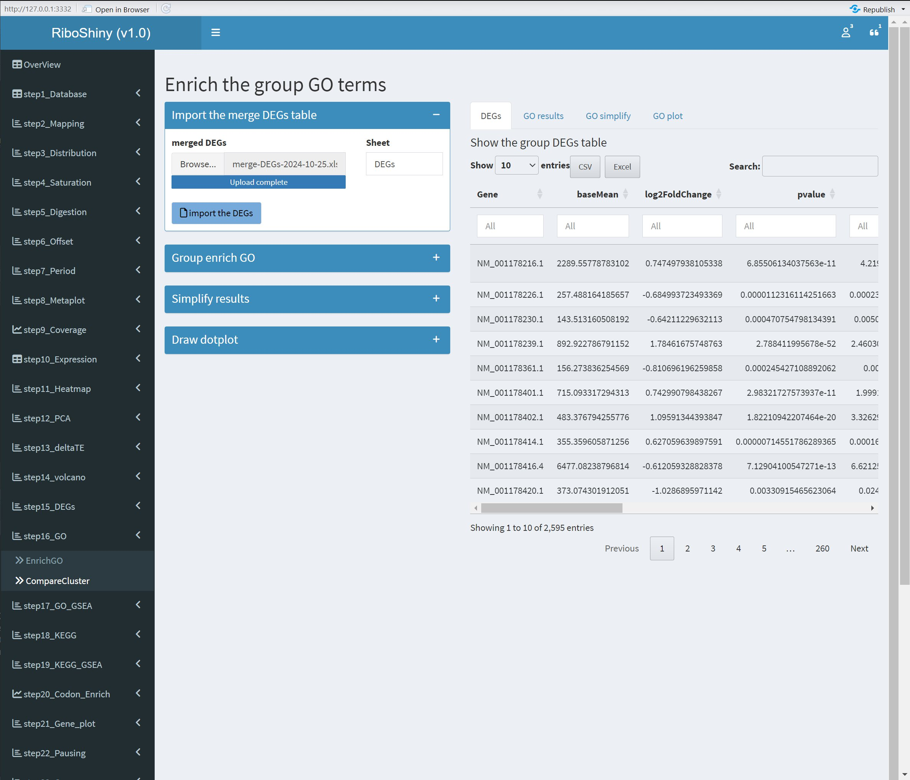

```

2. 选择 GO 数据库

选择正确的 orgDb。如果研究的物种没有对应的 orgDb，也可以使用本地的 gson 文件（文件制作方法见 2.1.3 和 2.1.4）

选择正确的 keyType。这个值用于对应差异基因的 ID 和 orgDb 中的 keytype。

对于差异分析的列表，如果是使用前文所述的 NCBI 来源的注释文件，keyType 默认为 ENTREZID。可以使用 "Gene column" 来选择表格中的列。

对于 orgDb，如果是使用 annotationforge 制作的，keyType 一般为 "GID"。如果是模式生物的 orgDb，keyType 一般为 "ENTREZID"。

展示 GO 富集分析的结果，可以根据 pvalueCutoff 和 qvalueCutoff 来筛选结果。

```{r, out.width = "70%", fig.align = "center", echo = FALSE, dpi=200}

knitr::include_graphics("./images/snapshot/step16-group-go-degs-enrich-results.jpg")

```

3. 去除冗余的信息

GO 富集分析中存在众多的 GO 术语，有些术语之间存在重叠，为了更好地展示结果，可以去除冗余的信息。
但是这个步骤并不是必需的，并且速度较慢，非必要可以跳过这个步骤。

```{r, out.width = "70%", fig.align = "center", echo = FALSE, dpi=200}

knitr::include_graphics("./images/snapshot/step16-group-go-degs-enrich-simplify.jpg")

```

4. 可视化 GO 富集结果

使用 dotplot 可视化 GO 富集结果，可以根据不同的分组来调整可视化的形式。

```{r, out.width = "70%", fig.align = "center", echo = FALSE, dpi=200}

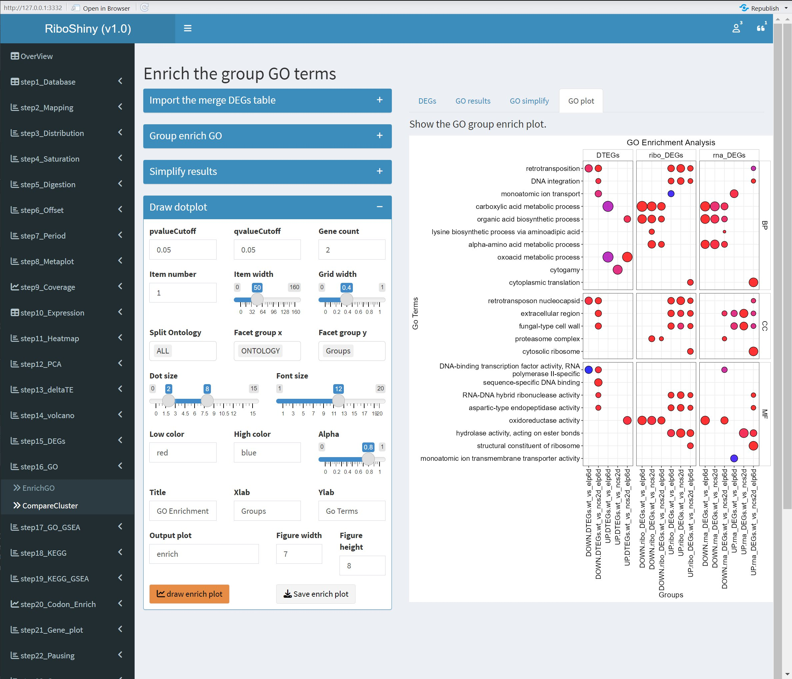

```

### 2.17 step17_GO_GSEA

#### 2.17.1 GSEA

这个步骤用于单个分组做 GO 基因集富集分析。

与前面相同，这里通过 clusterprofiler 做基因富集分析。不同的是这里使用基因表达水平的变化来做富集分析。
可以通过 sheet 来选择不同的分组。

- 文件1 ./RiboShiny/OutputData/wt_vs_ncs2d_elp6d-deltaTE-results-2024-10-25.xlsx

1. 导入差异分析的结果

首先导入差异基因的表格，并标记 GeneID 和 log2FoldChange 对应的列，用于创建 genelist。

```{r, out.width = "70%", fig.align = "center", echo = FALSE, dpi=200}

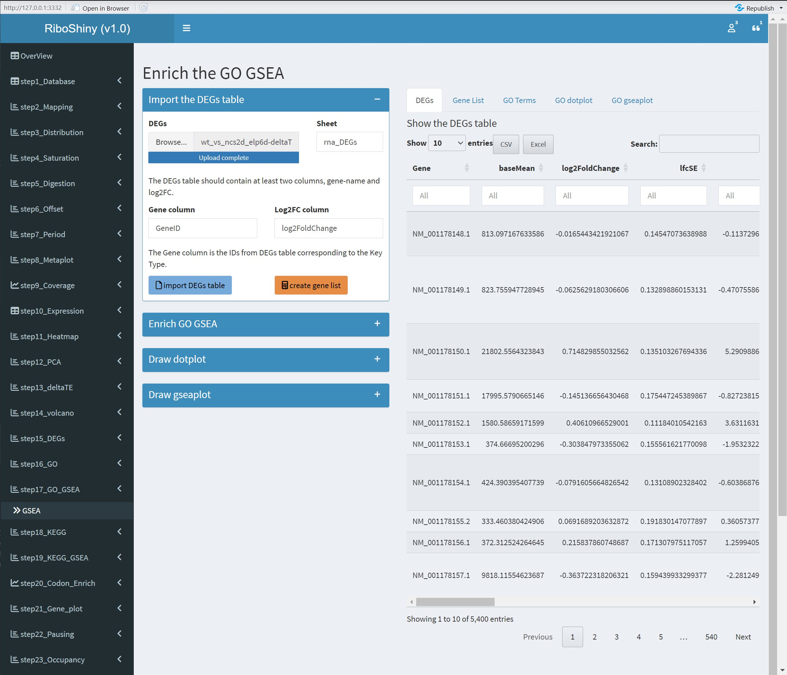

```

2. 选择 GO 数据库

选择正确的 orgDb。如果研究的物种没有对应的 orgDb，也可以使用本地的 gson 文件（文件制作方法见 2.1.3 和 2.1.4）

选择正确的 keyType。这个值用于对应差异基因的 ID 和 orgDb 中的 keytype。

对于差异分析的列表，如果是使用前文所述的 NCBI 来源的注释文件，keyType 默认为 ENTREZID。可以使用 "Gene column" 来选择表格中的列。

对于 orgDb，如果是使用 annotationforge 制作的，keyType 一般为 "GID"。如果是模式生物的 orgDb，keyType 一般为 "ENTREZID"。

展示 GO 富集分析的结果，可以根据 pvalueCutoff 和 qvalueCutoff 来筛选结果。

```{r, out.width = "70%", fig.align = "center", echo = FALSE, dpi=200}

knitr::include_graphics("./images/snapshot/step17-go-gsea-degs-results.jpg")

```

3. 可视化 GO 富集结果

使用 dotplot 可视化 GO 富集结果，可以根据不同的分组来调整可视化的形式。

```{r, out.width = "70%", fig.align = "center", echo = FALSE, dpi=200}

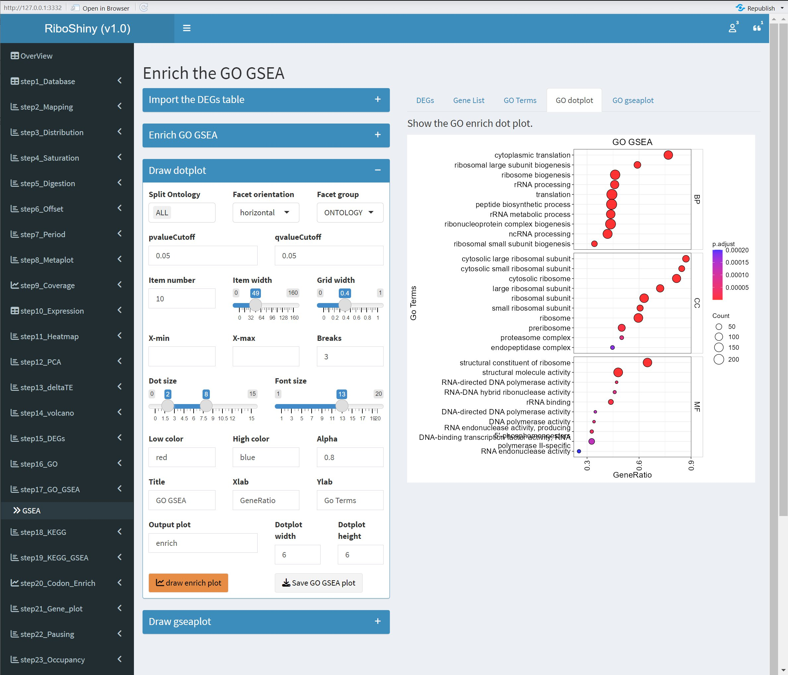

```

4. 可视化 GSEA 富集结果

使用 gseaplot 可视化 GO 富集结果，展示某一条或几条通路中基因的整体变化趋势。

```{r, out.width = "70%", fig.align = "center", echo = FALSE, dpi=200}

knitr::include_graphics("./images/snapshot/step17-go-gsea-degs-gseaplot.jpg")

```

### 2.18 step18_KEGG

#### 2.18.1 EnrichKEGG

这个步骤用于差异基因的 KEGG 功能富集分析。

通过 clusterprofiler 对差异基因做富集分析。
但是这个步骤只能输入一组差异基因的结果，如果需要对多组差异基因做功能富集分析，可以使用下一个步骤 CompareCluster。

- 文件1 ./RiboShiny/OutputData/wt_vs_ncs2d_elp6d-deltaTE-results-2024-10-25.xlsx

1. 导入差异分析的结果

首先导入差异基因的表格。

```{r, out.width = "70%", fig.align = "center", echo = FALSE, dpi=200}

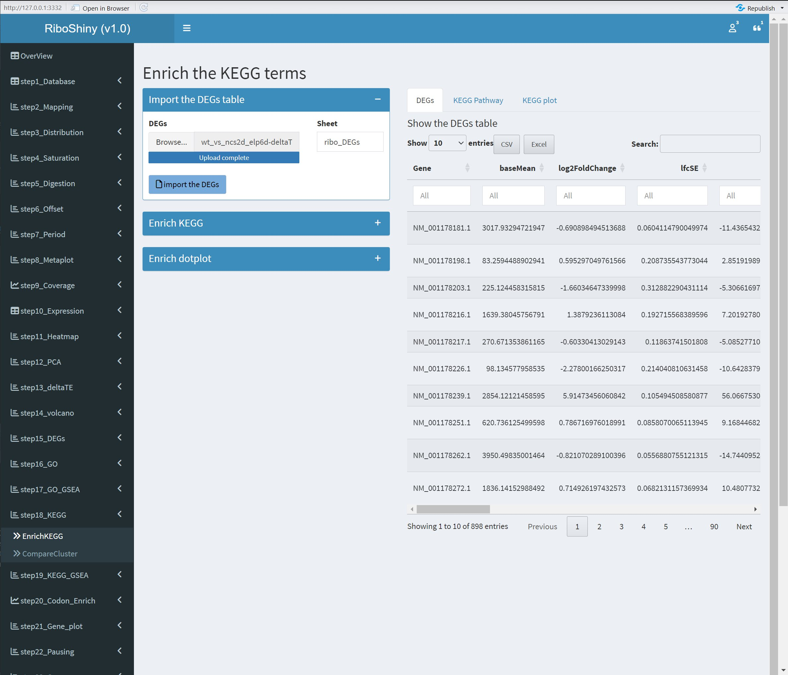

```

2. 选择 KEGG 数据库

这里可以使用前面制作的 gson，也可以通过直接指定物种缩写，来调用 KEGG 数据库。（文件制作方法见 2.1.3 和 2.1.4）

选择正确的 keyType。这个值用于对应差异基因的 ID 和 KEGG 中的 keytype。

对于差异分析的列表，如果是使用前文所述的 NCBI 来源的注释文件，keyType 默认为 ncbi-geneid。可以使用 "Gene column" 来选择表格中的列。

对于 KEGG 数据库，keyType 一般为 "kegg"。

展示 KEGG 富集分析的结果，可以根据 pvalueCutoff 和 qvalueCutoff 来筛选结果。

```{r, out.width = "70%", fig.align = "center", echo = FALSE, dpi=200}

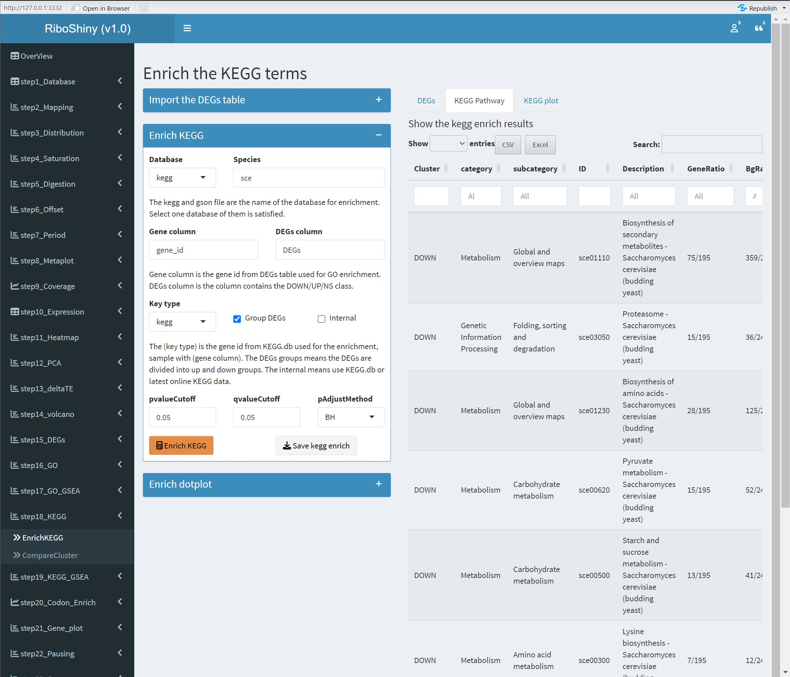

```

4. 可视化 KEGG 富集结果

使用 dotplot 可视化 KEGG 富集结果，可以根据不同的分组来调整可视化的形式。

```{r, out.width = "70%", fig.align = "center", echo = FALSE, dpi=200}

knitr::include_graphics("./images/snapshot/step18-kegg-degs-enrich-dotplot.jpg")

```

#### 2.18.2 CompareCluster

这个步骤用于多个分组差异基因的 KEGG 功能富集分析。

通过 clusterprofiler 对差异基因做富集分析。
这个步骤可以对多组差异基因做功能富集分析，使用的文件为步骤 2.15.3 中合并的文件，也可以手动制作基因集文件。

- 文件1 ./RiboShiny/OutputData/merged-degs-2024-10-25.xlsx

1. 导入差异分析的结果

首先导入差异基因的表格。

```{r, out.width = "70%", fig.align = "center", echo = FALSE, dpi=200}

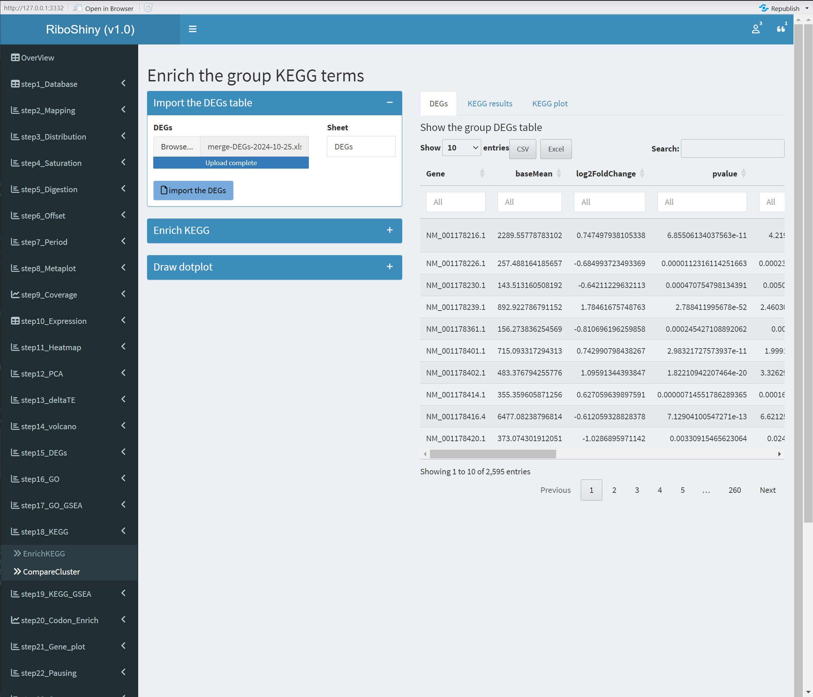

```

2. 选择 KEGG 数据库

这里可以使用前面制作的 gson，也可以通过直接指定物种缩写，来调用 KEGG 数据库。（文件制作方法见 2.1.3 和 2.1.4）

选择正确的 keyType。这个值用于对应差异基因的 ID 和 KEGG 中的 keytype。

对于差异分析的列表，如果是使用前文所述的 NCBI 来源的注释文件，keyType 默认为 ncbi-geneid。可以使用 "Gene column" 来选择表格中的列。

对于 KEGG 数据库，keyType 一般为 "kegg"。

展示 KEGG 富集分析的结果，可以根据 pvalueCutoff 和 qvalueCutoff 来筛选结果。

```{r, out.width = "70%", fig.align = "center", echo = FALSE, dpi=200}

knitr::include_graphics("./images/snapshot/step18-group-kegg-degs-enrich-results.jpg")

```

3. 可视化 KEGG 富集结果

使用 dotplot 可视化 KEGG 富集结果，可以根据不同的分组来调整可视化的形式。

```{r, out.width = "70%", fig.align = "center", echo = FALSE, dpi=200}

knitr::include_graphics("./images/snapshot/step18-group-kegg-degs-enrich-dotplot.jpg")

```

### 2.19 step19_KEGG_GSEA

#### 2.19.1 GSEA

这个步骤用于单个分组做 KEGG 基因集富集分析。

与前面相同，这里通过 clusterprofiler 做基因富集分析。不同的是这里使用基因表达水平的变化来做富集分析。

- 文件1 ./RiboShiny/OutputData/wt_vs_ncs2d_elp6d-deltaTE-results-2024-10-25.xlsx

1. 导入差异分析的结果

首先导入差异基因的表格，并标记 GeneID 和 log2FoldChange 对应的列，用于创建 genelist。

```{r, out.width = "70%", fig.align = "center", echo = FALSE, dpi=200}

knitr::include_graphics("./images/snapshot/step19-kegg-gsea-degs-table.jpg")

```

2. 选择 KEGG 数据库

这里可以使用前面制作的 gson，也可以通过直接指定物种缩写，来调用 KEGG 数据库。（文件制作方法见 2.1.3 和 2.1.4）

选择正确的 keyType。这个值用于对应差异基因的 ID 和 KEGG 中的 keytype。

对于差异分析的列表，如果是使用前文所述的 NCBI 来源的注释文件，keyType 默认为 ncbi-geneid。可以使用 "Gene column" 来选择表格中的列。

对于 KEGG 数据库，keyType 一般为 "kegg"。

展示 KEGG 富集分析的结果，可以根据 pvalueCutoff 和 qvalueCutoff 来筛选结果。

```{r, out.width = "70%", fig.align = "center", echo = FALSE, dpi=200}

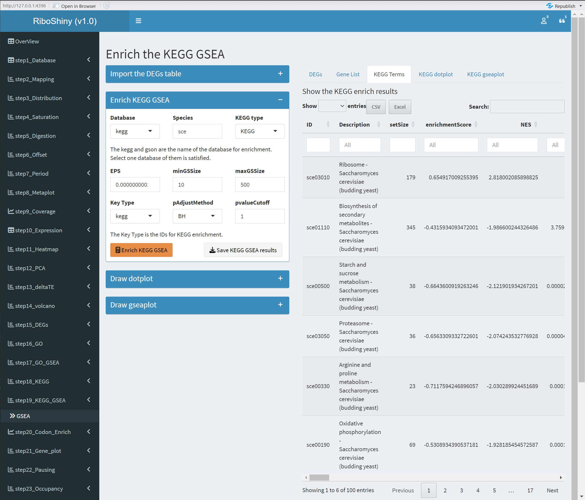

```

3. 可视化 KEGG 富集结果

使用 dotplot 可视化 KEGG 富集结果，可以根据不同的分组来调整可视化的形式。

```{r, out.width = "70%", fig.align = "center", echo = FALSE, dpi=200}

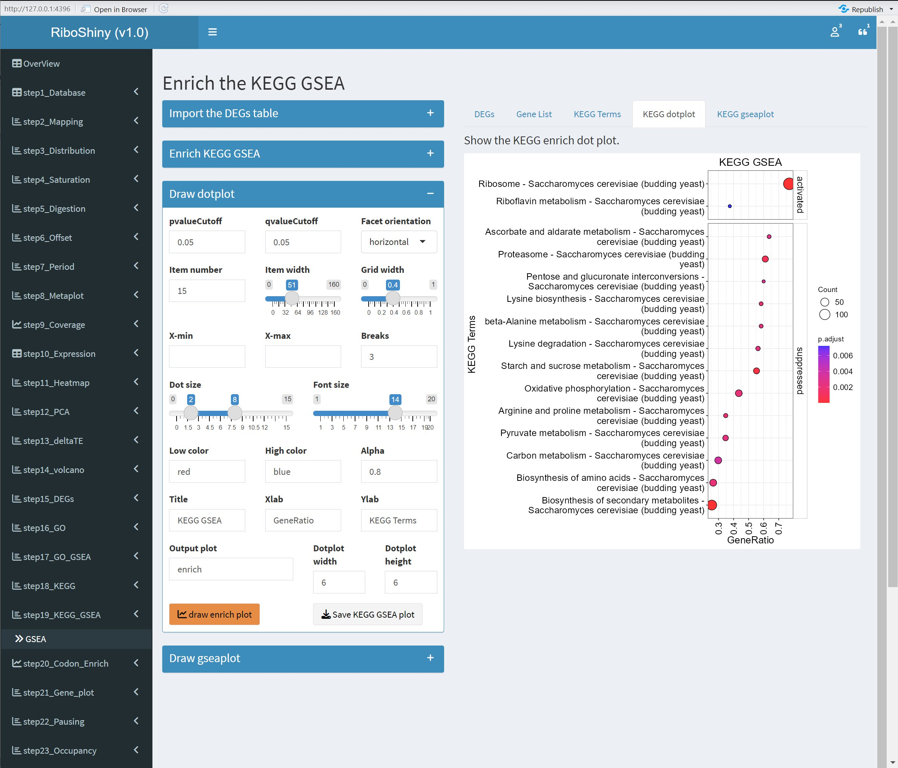

```

4. 可视化 GSEA 富集结果

使用 gseaplot 可视化 KEGG 富集结果，展示某一条或几条通路中基因的整体变化趋势。

```{r, out.width = "70%", fig.align = "center", echo = FALSE, dpi=200}

knitr::include_graphics("./images/snapshot/step19-kegg-gsea-degs-gseaplot.jpg")

```


### 2.20 step20_Codon_Enrich

#### 2.20.1 Codon_Usage

这个步骤用于可视化不同分组基因之间的 codon usage。

codon usage table 使用的是前面输出的文件，这里使用 boxplot 展示不同 密码子之间的差异。

- 文件1 ./RiboShiny/OutputData/CDS-gene-codon-usage-2024-10-25.xlsx

1. 导入codon usage 的结果

```{r, out.width = "70%", fig.align = "center", echo = FALSE, dpi=200}

knitr::include_graphics("./images/snapshot/step20-codon-usage-table.jpg")

```

2. 选择基因列表

这里可以手动对基因做分类处理，也可以直接使用差异分析后的基因类别做 codon usage 的分析，这里使用 2.14.2 步骤的基因集。

- 文件1 ./RiboShiny/OutputData/wt_vs_ncs2d_elp6d-quadrants-class-DEGs-2024-10-25.xlsx

```{r, out.width = "70%", fig.align = "center", echo = FALSE, dpi=200}

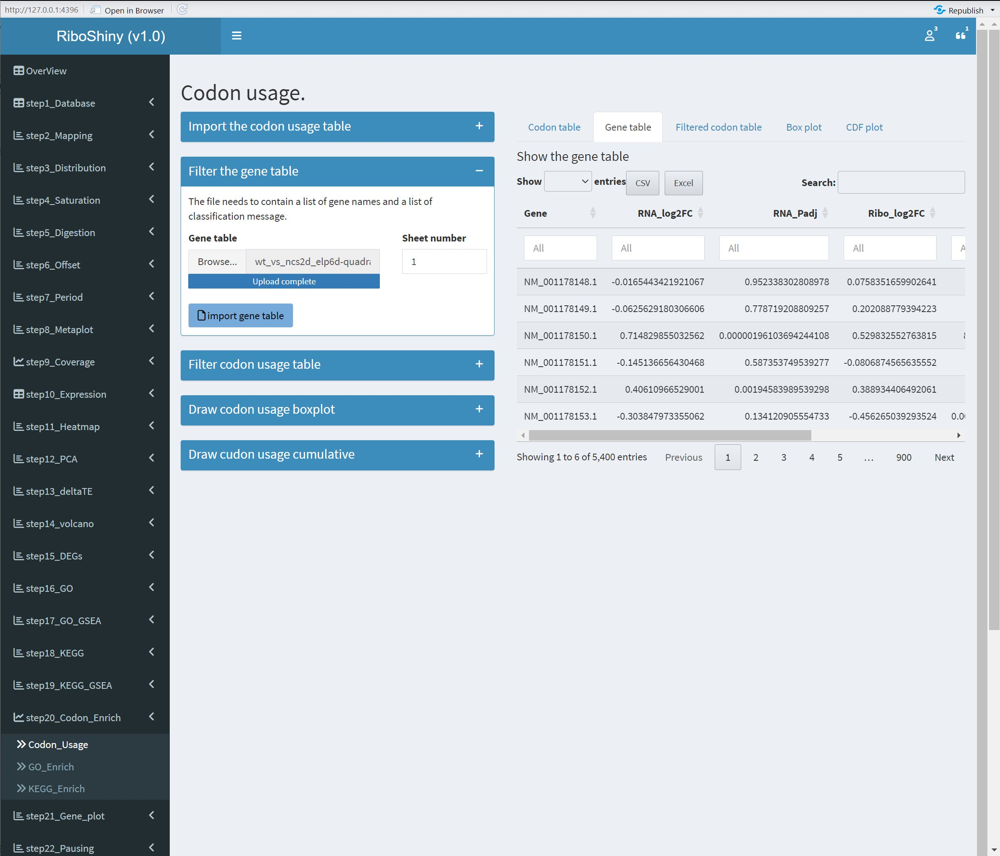

```

3. 筛选指定的密码子

选择不同的密码子，并筛最低阈值。

确定基因的分类信息。

```{r, out.width = "70%", fig.align = "center", echo = FALSE, dpi=200}

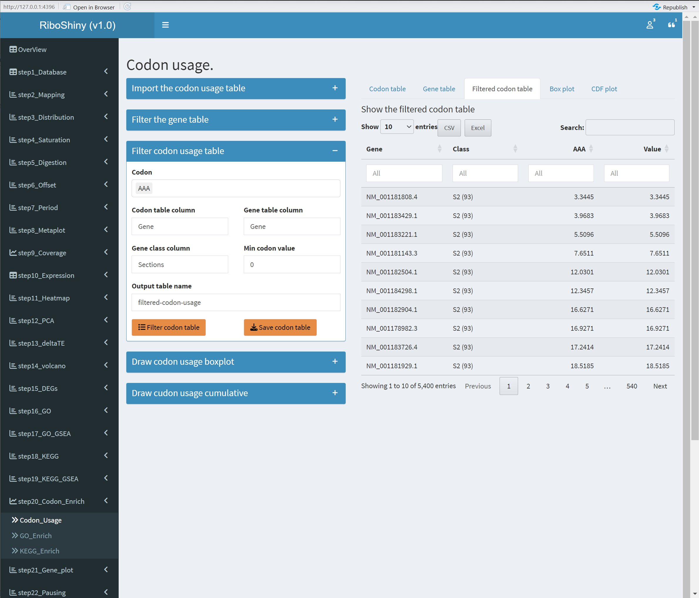

```

4. 可视化 codon usage

使用 boxplot 可视化不同类别基因的 codon usage。

```{r, out.width = "70%", fig.align = "center", echo = FALSE, dpi=200}

knitr::include_graphics("./images/snapshot/step20-codon-usage-boxplot.jpg")

```

5. 可视化 codon usage

使用 ecdf plot 可视化不同类别基因的 codon usage。

```{r, out.width = "70%", fig.align = "center", echo = FALSE, dpi=200}

knitr::include_graphics("./images/snapshot/step20-codon-usage-ecdfplot.jpg")

```

#### 2.20.2 GO_Enrich

这个步骤用于分析基因 codon usage 富集分析。

codon usage table 使用的是前面输出的文件，这里使用 boxplot 展示不同 密码子之间的差异。

- 文件1 ./RiboShiny/OutputData/CDS-gene-codon-usage-2024-10-25.xlsx

1. 导入 codon usage 的结果

```{r, out.width = "70%", fig.align = "center", echo = FALSE, dpi=200}

knitr::include_graphics("./images/snapshot/step20-go-codon-usage-table.jpg")

```

2. 筛选指定的密码子

选择不同的密码子，并筛最低阈值。

确定基因的分类信息。

```{r, out.width = "70%", fig.align = "center", echo = FALSE, dpi=200}

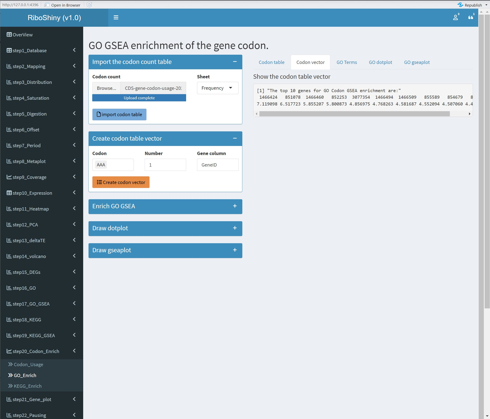

```

3. 选择 GO 数据库

选择正确的 orgDb。如果研究的物种没有对应的 orgDb，也可以使用本地的 gson 文件（文件制作方法见 2.1.3 和 2.1.4）

选择正确的 keyType。这个值用于对应差异基因的 ID 和 orgDb 中的 keytype。

对于差异分析的列表，如果是使用前文所述的 NCBI 来源的注释文件，keyType 默认为 ENTREZID。可以使用 "Gene column" 来选择表格中的列。

对于 orgDb，如果是使用 annotationforge 制作的，keyType 一般为 "GID"。如果是模式生物的 orgDb，keyType 一般为 "ENTREZID"。

展示 GO 富集分析的结果，可以根据 pvalueCutoff 和 qvalueCutoff 来筛选结果。

```{r, out.width = "70%", fig.align = "center", echo = FALSE, dpi=200}

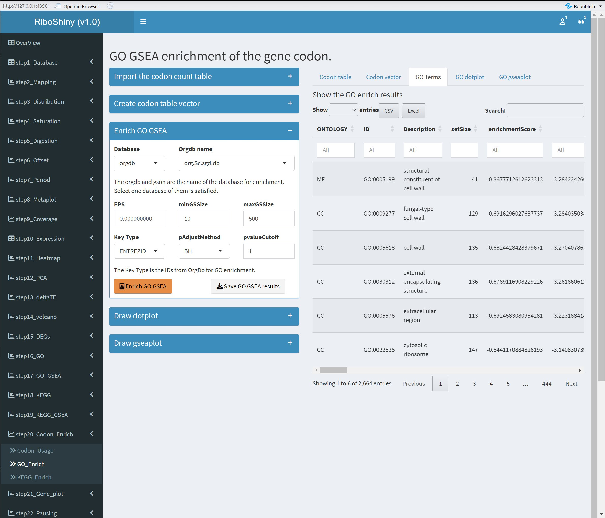

```

4. 可视化 GO 富集结果

使用 dotplot 可视化 GO 富集结果，可以根据不同的分组来调整可视化的形式。

```{r, out.width = "70%", fig.align = "center", echo = FALSE, dpi=200}

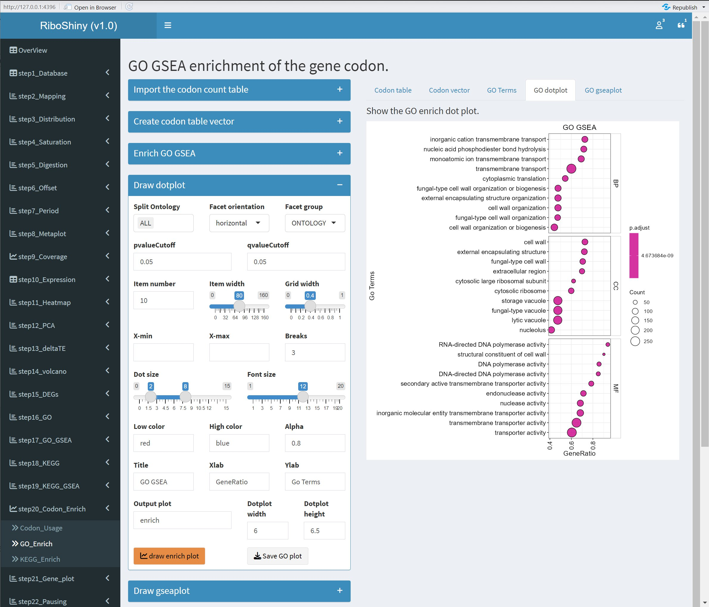

```

5. 可视化 GSEA 富集结果

使用 gseaplot 可视化 GO 富集结果，展示某一条或几条通路中基因的整体变化趋势。

```{r, out.width = "70%", fig.align = "center", echo = FALSE, dpi=200}

knitr::include_graphics("./images/snapshot/step20-go-codon-usage-enrich-gseaplot.jpg")

```

#### 2.20.3 KEGG_Enrich

这个步骤用于分析基因 codon usage 富集分析。

codon usage table 使用的是前面输出的文件，这里使用 boxplot 展示不同 密码子之间的差异。

- 文件1 ./RiboShiny/OutputData/。

1. 导入 codon usage 的结果

```{r, out.width = "70%", fig.align = "center", echo = FALSE, dpi=200}

knitr::include_graphics("./images/snapshot/step20-kegg-codon-usage-table.jpg")

```

2. 筛选指定的密码子

选择不同的密码子，并筛最低阈值。

确定基因的分类信息。

```{r, out.width = "70%", fig.align = "center", echo = FALSE, dpi=200}

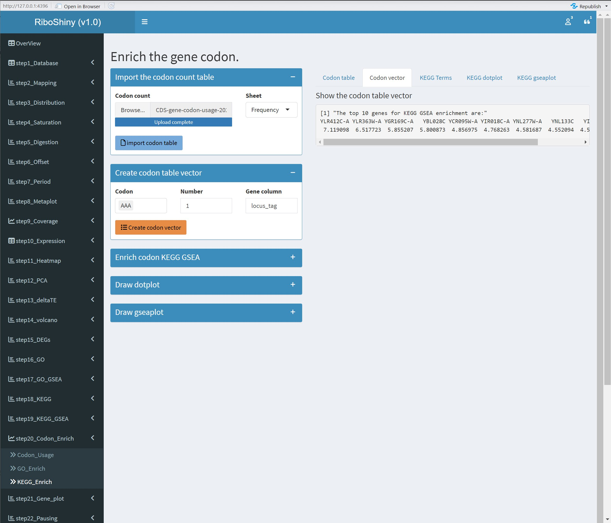

```

3. 选择 KEGG 数据库

这里可以使用前面制作的 gson，也可以通过直接指定物种缩写，来调用 KEGG 数据库。（文件制作方法见 2.1.3 和 2.1.4）

选择正确的 keyType。这个值用于对应差异基因的 ID 和 KEGG 中的 keytype。

对于差异分析的列表，如果是使用前文所述的 NCBI 来源的注释文件，keyType 默认为 ncbi-geneid。可以使用 "Gene column" 来选择表格中的列。

对于 KEGG 数据库，keyType 一般为 "kegg"。

展示 KEGG 富集分析的结果，可以根据 pvalueCutoff 和 qvalueCutoff 来筛选结果。

```{r, out.width = "70%", fig.align = "center", echo = FALSE, dpi=200}

knitr::include_graphics("./images/snapshot/step20-kegg-codon-usage-enrich-results.jpg")

```

4. 可视化 KEGG 富集结果

使用 dotplot 可视化 KEGG 富集结果，可以根据不同的分组来调整可视化的形式。

```{r, out.width = "70%", fig.align = "center", echo = FALSE, dpi=200}

knitr::include_graphics("./images/snapshot/step20-kegg-codon-usage-enrich-dotplot.jpg")

```

5. 可视化 GSEA 富集结果

使用 gseaplot 可视化 KEGG 富集结果，展示某一条或几条通路中基因的整体变化趋势。

```{r, out.width = "70%", fig.align = "center", echo = FALSE, dpi=200}

knitr::include_graphics("./images/snapshot/step20-kegg-codon-usage-enrich-gseaplot.jpg")

```


### 2.21 step21_Gene_plot

#### 2.21.1 Isoforms

这个步骤用于可视化基因上 reads 的密度覆盖信息。

这个步骤类似于 igv 的可视化，在这里需要使用 RiboParser 的输出结果，来展示转录本水平的 reads 的密度覆盖信息。

- 文件1 /mnt/t64/test/sce/3.rna-seq/5.riboparser/11.gene_density/gene_rna_retrieve.txt
- 文件2 /mnt/t64/test/sce/4.ribo-seq/5.riboparser/18.gene_density/gene_ribo_retrieve.txt

1. 导入基因密度文件

```{r, out.width = "70%", fig.align = "center", echo = FALSE, dpi=200}

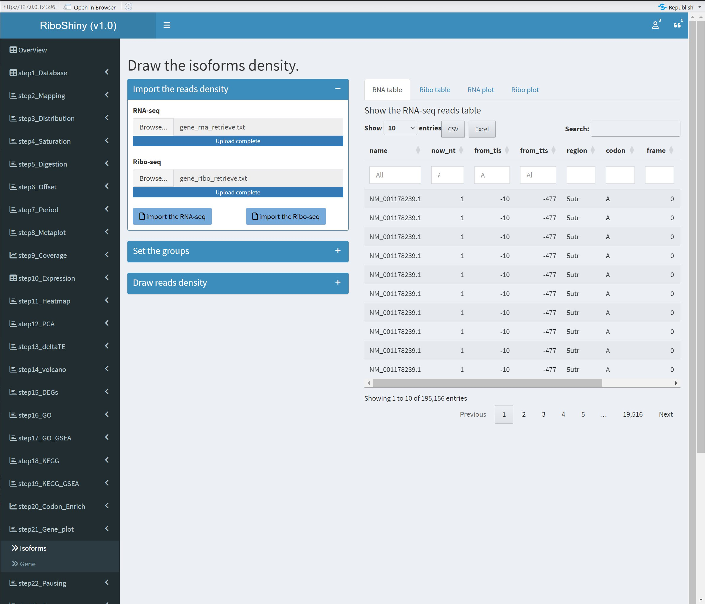

```

2. 设置样本信息

这里需要导入 design 文件，来设置样本信息。

```{r, out.width = "70%", fig.align = "center", echo = FALSE, dpi=200}

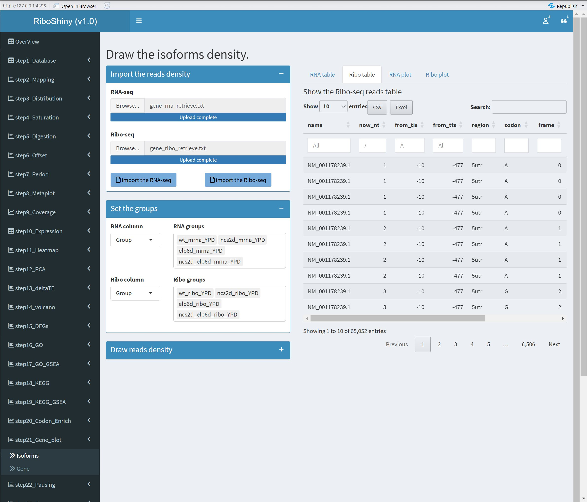

```

3. 可视化基因 RNA-seq 信息

选择不同的基因，使用 lineplot/ barplot / area plot 来展示其 reads 的密度覆盖信息。

```{r, out.width = "70%", fig.align = "center", echo = FALSE, dpi=200}

knitr::include_graphics("./images/snapshot/step21-isoforms-density-rnaseq.jpg")

```

3. 可视化基因 Ribo-seq 信息

选择不同的基因，使用 lineplot/ barplot / area plot 来展示其 reads 的密度覆盖信息。

```{r, out.width = "70%", fig.align = "center", echo = FALSE, dpi=200}

knitr::include_graphics("./images/snapshot/step21-isoforms-density-riboseq.jpg")

```

### 2.22 step22_Pausing

#### 2.22.1 Pausing

这个步骤用于分析密码子水平停滞信号。

使用的文件是 RiboParser 的输出文件，用于展示密码子水平的停滞信号，并且可以根据 design 文件来展示不同分组间的差异。

- 文件1 /mnt/t64/test/sce/4.ribo-seq/5.riboparser/11.pausing_score/A_site_sum_codon_pausing_score.txt

1. 导入密码子停滞信号的文件

```{r, out.width = "70%", fig.align = "center", echo = FALSE, dpi=200}

knitr::include_graphics("./images/snapshot/step22-pausing-score-table.jpg")

```

2. 设置分组信息

```{r, out.width = "70%", fig.align = "center", echo = FALSE, dpi=200}

knitr::include_graphics("./images/snapshot/step22-pausing-score-design.jpg")

```

3. 可视化密码子停滞信号

在计算的时候使用所有密码子（total）做标准化，也可以使用有 RPF 覆盖的密码子（valid）做标准化，一般使用 valid。

计算过程中有两种不同的模式，分别是绝对值和相对值。因为测序样本的处理或者批次效应，密码子水平的分析往往会出现较大的差异，或者出现整体水平的偏差。
因此这里需要考虑到实际情况，选择合适的模式来展示密码子水平的停滞信号。通常情况下选择相对值模式。

```{r, out.width = "70%", fig.align = "center", echo = FALSE, dpi=200}

knitr::include_graphics("./images/snapshot/step22-pausing-score-dotplot.jpg")

```


#### 2.22.2 Diff_Pausing

这个步骤用于密码子水平停滞信号的差异分析。

使用的文件是 RiboParser 的输出文件，用于展示密码子水平的停滞信号，并且可以根据 design 文件来展示不同分组间的差异。

- 文件1 /mnt/t64/test/sce/4.ribo-seq/5.riboparser/11.pausing_score/A_site_sum_codon_pausing_score.txt

1. 导入密码子停滞信号的文件

```{r, out.width = "70%", fig.align = "center", echo = FALSE, dpi=200}

knitr::include_graphics("./images/snapshot/step22-pausing-score-table2.jpg")

```

2. 设置样本信息，并计算差异

这里需要导入 design 文件，来设置样本信息。可以通过两种方法来计算差异，一种是直接计算 delta，另一种是计算 foldchange。

```{r, out.width = "70%", fig.align = "center", echo = FALSE, dpi=200}

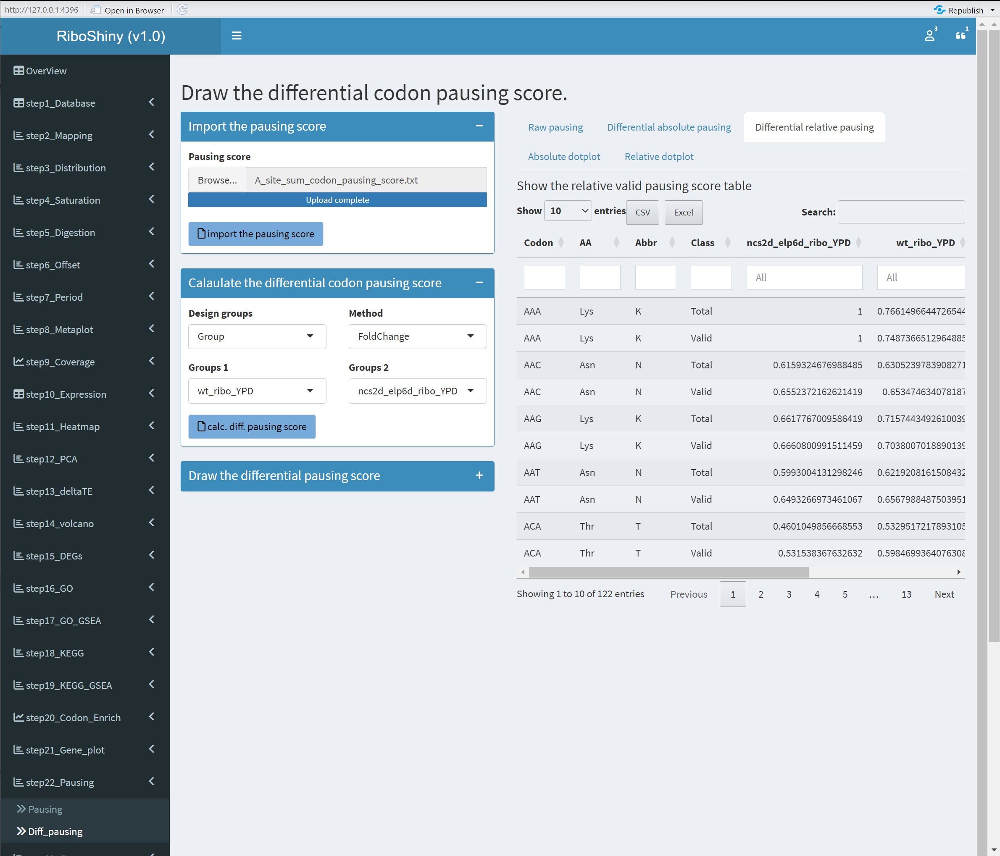

```

3. 可视化密码子停滞信号的差异

在计算的时候使用所有密码子（total）做标准化，也可以使用有 RPF 覆盖的密码子（valid）做标准化，一般使用 valid。

计算过程中有两种不同的模式，分别是绝对值和相对值。因为测序样本的处理或者批次效应，密码子水平的分析往往会出现较大的差异，或者出现整体水平的偏差。
因此这里需要考虑到实际情况，选择合适的模式来展示密码子水平的停滞信号。通常情况下选择相对值模式。

```{r, out.width = "70%", fig.align = "center", echo = FALSE, dpi=200}

knitr::include_graphics("./images/snapshot/step22-pausing-score-diff-dotplot.jpg")

```

### 2.23 step23_Occupancy

#### 2.23.1 Occupancy

这个步骤用于分析密码子占有率。

使用的文件是 RiboParser 的输出文件，用于展示密码子占有率，并且可以根据 design 文件来展示不同分组间的差异。

- 文件1 /mnt/t64/test/sce/4.ribo-seq/5.riboparser/12.codon_occupancy/A_site_codon_occupancy.txt

1. 导入密码子占有率的文件

```{r, out.width = "70%", fig.align = "center", echo = FALSE, dpi=200}

knitr::include_graphics("./images/snapshot/step23-codon-occupancy-table.jpg")

```

2. 可视化密码子占有率

计算过程中有两种不同的模式，分别是绝对值和相对值。因为测序样本的处理或者批次效应，密码子水平的分析往往会出现较大的差异，或者出现整体水平的偏差。
因此这里需要考虑到实际情况，选择合适的模式来展示密码子占有率。通常情况下选择相对值模式。

```{r, out.width = "70%", fig.align = "center", echo = FALSE, dpi=200}

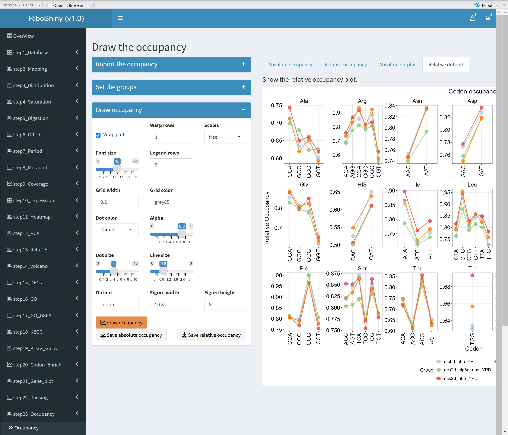

```

#### 2.23.2 Diff_Occupancy

这个步骤用于密码子占有率的差异分析。

使用的文件是 RiboParser 的输出文件，用于展示密码子占有率，并且可以根据 design 文件来展示不同分组间的差异。

- 文件1 /mnt/t64/test/sce/4.ribo-seq/5.riboparser/12.codon_occupancy/A_site_codon_occupancy.txt

1. 导入密码子占有率的文件

```{r, out.width = "70%", fig.align = "center", echo = FALSE, dpi=200}

knitr::include_graphics("./images/snapshot/step23-codon-occupancy-table2.jpg")

```

2. 设置样本信息，并计算差异

这里需要导入 design 文件，来设置样本信息。可以通过两种方法来计算差异，一种是直接计算 delta，另一种是计算 foldchange。

```{r, out.width = "70%", fig.align = "center", echo = FALSE, dpi=200}

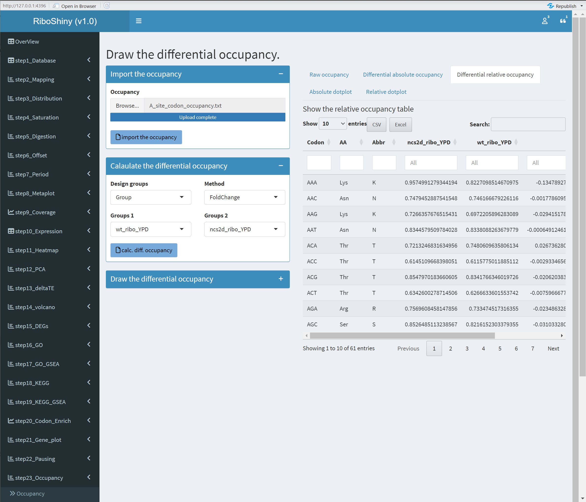

```

3. 可视化密码子占有率的差异

计算过程中有两种不同的模式，分别是绝对值和相对值。因为测序样本的处理或者批次效应，密码子水平的分析往往会出现较大的差异，或者出现整体水平的偏差。
因此这里需要考虑到实际情况，选择合适的模式来展示密码子占有率。通常情况下选择相对值模式。

```{r, out.width = "70%", fig.align = "center", echo = FALSE, dpi=200}

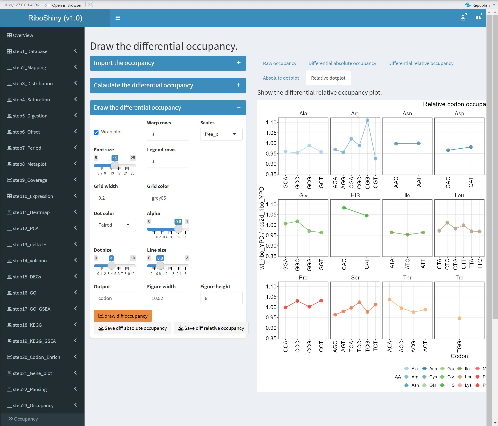

```

### 2.24 step24_CDT

#### 2.24.1 CDT

这个步骤用于分析密码子解码时间。

使用的文件是 RiboParser 的输出文件，用于展示密码子解码时间，并且可以根据 design 文件来展示不同分组间的差异。

- 文件1 /mnt/t64/test/sce/4.ribo-seq/5.riboparser/13.codon_decoding_time/A_ncr_cdt.txt

1. 导入密码子解码时间的文件

```{r, out.width = "70%", fig.align = "center", echo = FALSE, dpi=200}

knitr::include_graphics("./images/snapshot/step24-codon-decoding-time-table.jpg")

```

2. 可视化密码子解码时间

计算过程中有两种不同的模式，分别是绝对值和相对值。因为测序样本的处理或者批次效应，密码子水平的分析往往会出现较大的差异，或者出现整体水平的偏差。
因此这里需要考虑到实际情况，选择合适的模式来展示密码子解码时间率。通常情况下选择相对值模式。

```{r, out.width = "70%", fig.align = "center", echo = FALSE, dpi=200}

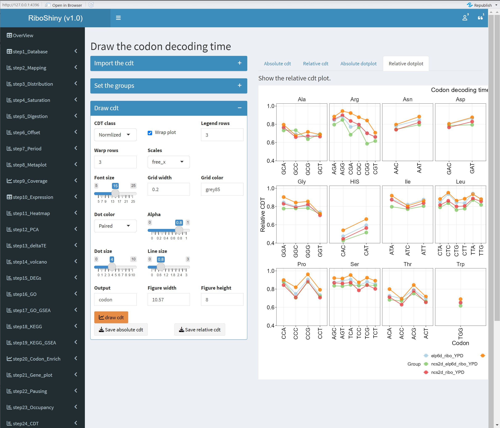

```

#### 2.24.2 Diff_CDT

这个步骤用于密码子解码时间的差异分析。

使用的文件是 RiboParser 的输出文件，用于展示密码子解码时间，并且可以根据 design 文件来展示不同分组间的差异。

- 文件1 /mnt/t64/test/sce/4.ribo-seq/5.riboparser/13.codon_decoding_time/A_ncr_cdt.txt

1. 导入密码子解码时间的文件

```{r, out.width = "70%", fig.align = "center", echo = FALSE, dpi=200}

knitr::include_graphics("./images/snapshot/step24-codon-decoding-time-table2.jpg")

```

2. 设置样本信息

这里需要导入 design 文件，来设置样本信息。可以通过两种方法来计算差异，一种是直接计算 delta，另一种是计算 foldchange。

```{r, out.width = "70%", fig.align = "center", echo = FALSE, dpi=200}

knitr::include_graphics("./images/snapshot/step24-codon-decoding-time-diff.jpg")

```

3. 可视化密码子解码时间

计算过程中有两种不同的模式，分别是绝对值和相对值。因为测序样本的处理或者批次效应，密码子水平的分析往往会出现较大的差异，或者出现整体水平的偏差。
因此这里需要考虑到实际情况，选择合适的模式来展示密码子解码时间。通常情况下选择相对值模式。

```{r, out.width = "70%", fig.align = "center", echo = FALSE, dpi=200}

knitr::include_graphics("./images/snapshot/step24-codon-decoding-time-diff-dotplot.jpg")

```

### 2.25 step25_CST

#### 2.25.1 CST

这个步骤用于分析密码子选择时间。

使用的文件是 RiboParser 的输出文件，用于展示密码子选择时间，并且可以根据 design 文件来展示不同分组间的差异。

- 文件1 /mnt/t64/test/sce/4.ribo-seq/5.riboparser/14.codon_selection_time/A_ncr_codon_selection_time.txt

1. 导入密码子选择时间的文件

```{r, out.width = "70%", fig.align = "center", echo = FALSE, dpi=200}

knitr::include_graphics("./images/snapshot/step25-codon-selection-time-table.jpg")

```

2. 可视化密码子选择时间

计算过程中有两种不同的模式，分别是绝对值和相对值。因为测序样本的处理或者批次效应，密码子水平的分析往往会出现较大的差异，或者出现整体水平的偏差。
因此这里需要考虑到实际情况，选择合适的模式来展示密码子选择时间率。通常情况下选择相对值模式。

```{r, out.width = "70%", fig.align = "center", echo = FALSE, dpi=200}

knitr::include_graphics("./images/snapshot/step25-codon-selection-time-dotplot.jpg")

```

#### 2.25.2 Diff_CST

这个步骤用于密码子选择时间的差异分析。

使用的文件是 RiboParser 的输出文件，用于展示密码子选择时间，并且可以根据 design 文件来展示不同分组间的差异。

- 文件1 /mnt/t64/test/sce/4.ribo-seq/5.riboparser/14.codon_selection_time/A_ncr_codon_selection_time.txt

1. 导入密码子选择时间的文件

```{r, out.width = "70%", fig.align = "center", echo = FALSE, dpi=200}

knitr::include_graphics("./images/snapshot/step25-codon-selection-time-table2.jpg")

```

2. 设置样本信息

这里需要导入 design 文件，来设置样本信息。可以通过两种方法来计算差异，一种是直接计算 delta，另一种是计算 foldchange。

```{r, out.width = "70%", fig.align = "center", echo = FALSE, dpi=200}

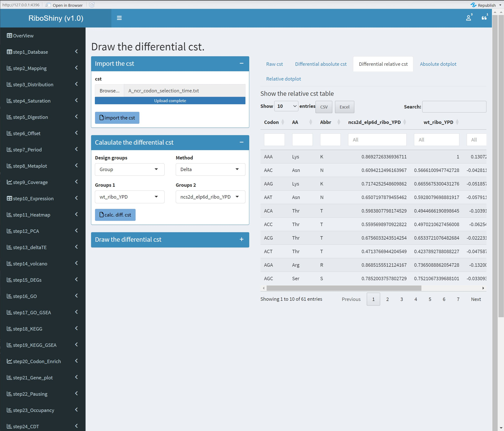

```

3. 可视化密码子选择时间

计算过程中有两种不同的模式，分别是绝对值和相对值。因为测序样本的处理或者批次效应，密码子水平的分析往往会出现较大的差异，或者出现整体水平的偏差。
因此这里需要考虑到实际情况，选择合适的模式来展示密码子选择时间。通常情况下选择相对值模式。

```{r, out.width = "70%", fig.align = "center", echo = FALSE, dpi=200}

knitr::include_graphics("./images/snapshot/step25-codon-selection-time-diff-dotplot.jpg")

```

### 2.26 step26_OddRatio

#### 2.26.1 OddRatio

这个步骤用于不同分组间密码子位点 density 的差异分析。

使用 odd ratio 比较两个样本之间同一密码子位点的 density 差异，用于展示不同分组之间密码子位点 density 的显著差异频率和比例。

- 文件1 /mnt/t64/test/sce/4.ribo-seq/5.riboparser/15.odd_ratio/wt_vs_ncs2d_elp6d_A_site_sum_codon_odd_ratio.txt

1. 导入密码子 odd ratio 的文件

```{r, out.width = "70%", fig.align = "center", echo = FALSE, dpi=200}

knitr::include_graphics("./images/snapshot/step26-codon-odd-ratio-table.jpg")

```

2. 可视化密码子 density 显著差异位点的频率和比例

```{r, out.width = "70%", fig.align = "center", echo = FALSE, dpi=200}

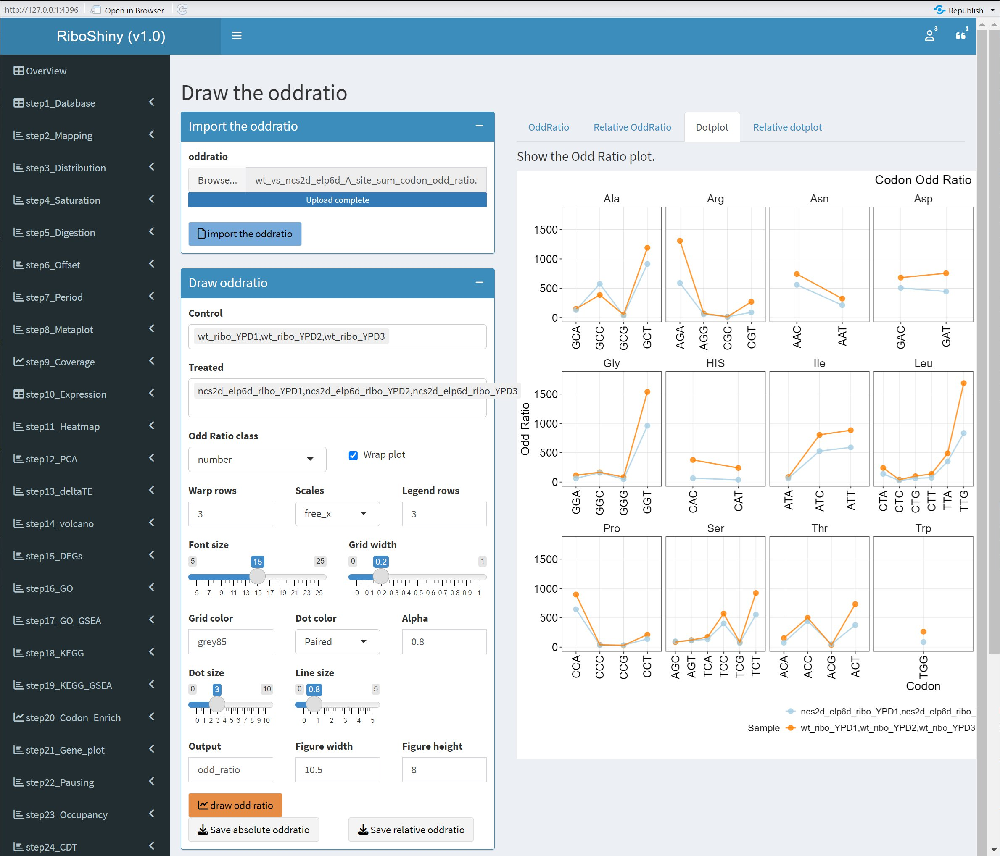

```

### 2.27 step27_CoV

#### 2.27.1 CoV

这个步骤用于分析基因水平变异系数。

区别于单一密码子的停滞信号，这个步骤使用变异系数来衡量基因整体的翻译延伸变化。
这里使用 RiboParser 的输出结果，用于展示基因水平变异系数，并且可以根据 design 文件来展示不同分组间的差异。

- 文件1 /mnt/t64/test/sce/4.ribo-seq/5.riboparser/16.coefficient_of_variation/sce_CoV.txt

1. 导入基因水平变异系数的文件

```{r, out.width = "70%", fig.align = "center", echo = FALSE, dpi=200}

knitr::include_graphics("./images/snapshot/step27-coefficient-of-variation-table.jpg")

```

2. 指定分组信息

```{r, out.width = "70%", fig.align = "center", echo = FALSE, dpi=200}

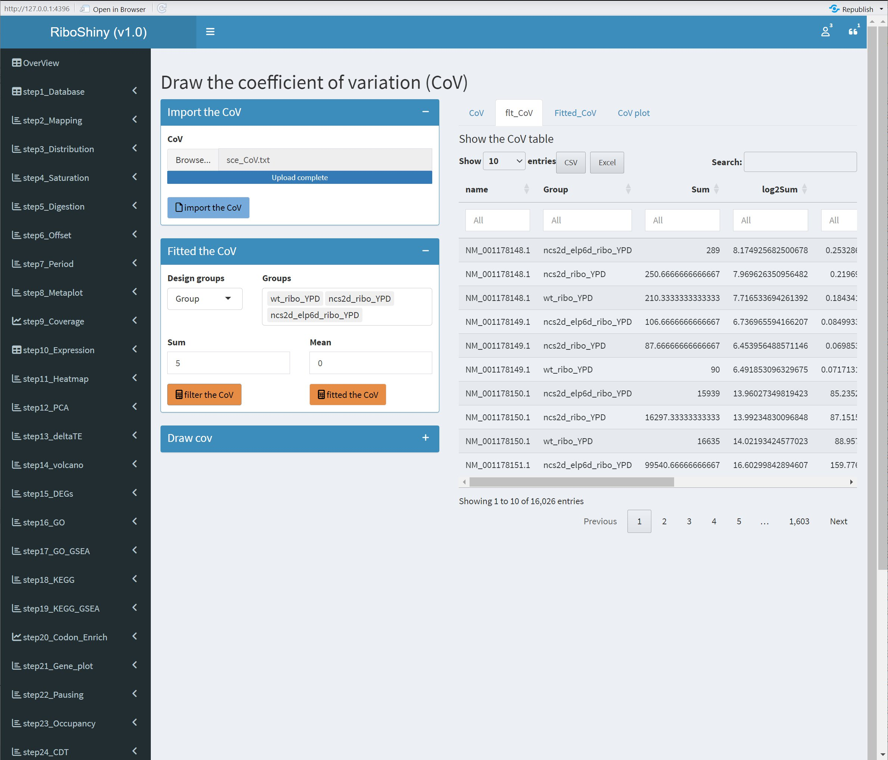

```

3. 拟合基因水平变异系数

```{r, out.width = "70%", fig.align = "center", echo = FALSE, dpi=200}

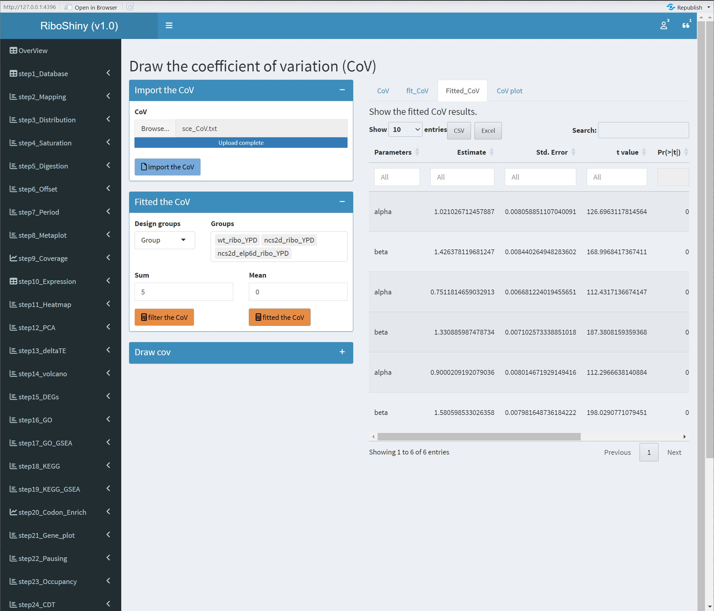

```

4. 可视化基因水平变异系数

可以使用 scatter / fitted / merge 的三种方式展示拟合后的基因水平变异系数，不同分组之间的显著差异分析见 RiboParser 的输出结果。

```{r, out.width = "70%", fig.align = "center", echo = FALSE, dpi=200}

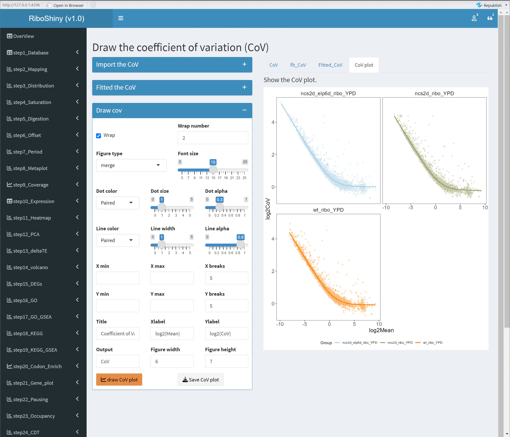

```

#### 2.27.2 CoV_eCDF

这个步骤用于分析基因水平变异系数。

为了分析每个基因的变异系数，这里使用 RiboParser 的结果展示单个基因上的变异系数的累积分布结果。

- 文件1 /mnt/t64/test/sce/4.ribo-seq/5.riboparser/16.coefficient_of_variation/gene_cumulative_CoV.txt

1. 导入基因水平变异系数的文件

```{r, out.width = "70%", fig.align = "center", echo = FALSE, dpi=200}

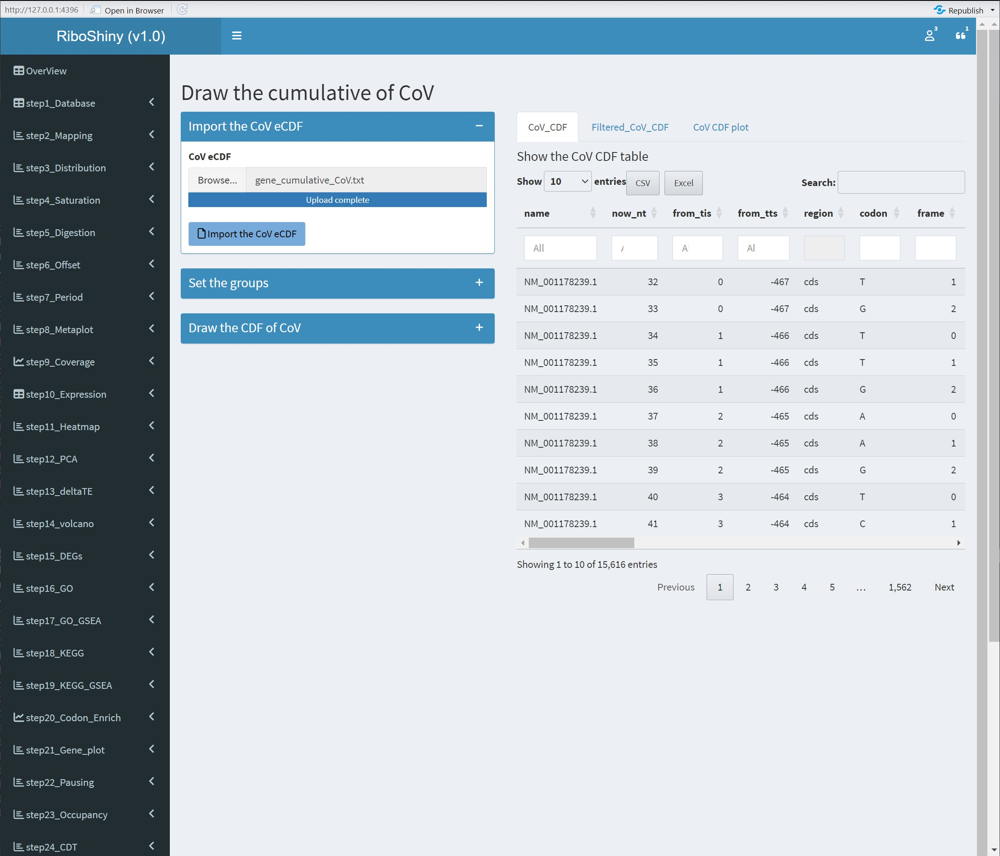

```

2. 指定基因和分组信息

```{r, out.width = "70%", fig.align = "center", echo = FALSE, dpi=200}

knitr::include_graphics("./images/snapshot/step27-coefficient-of-variation-filter-cdf-table.jpg")

```

3. 可视化基因水平变异系数

可以使用 lineplot 展示基因水平变异系数的累积分布结果。

```{r, out.width = "70%", fig.align = "center", echo = FALSE, dpi=200}

knitr::include_graphics("./images/snapshot/step27-coefficient-of-variation-cdf-plot.jpg")

```

### 2.28 step28_MetaCodon

#### 2.28.1 MetaPlot

这个步骤用于可视化密码子水平的 metaplot。

为了确定所有密码子的平均密度，这里使用 RiboParser 的结果展示密码子水平的 metaplot，来直观地比较停滞信号。

- 文件1 /mnt/t64/test/sce/4.ribo-seq/5.riboparser/17.meta_codon/f0_meta_AAA_97999_8211_meta_density.txt

1. 导入 meta codon 文件

```{r, out.width = "70%", fig.align = "center", echo = FALSE, dpi=200}

knitr::include_graphics("./images/snapshot/step28-meta-codon-table.jpg")

```

2. 指定分组信息

```{r, out.width = "70%", fig.align = "center", echo = FALSE, dpi=200}

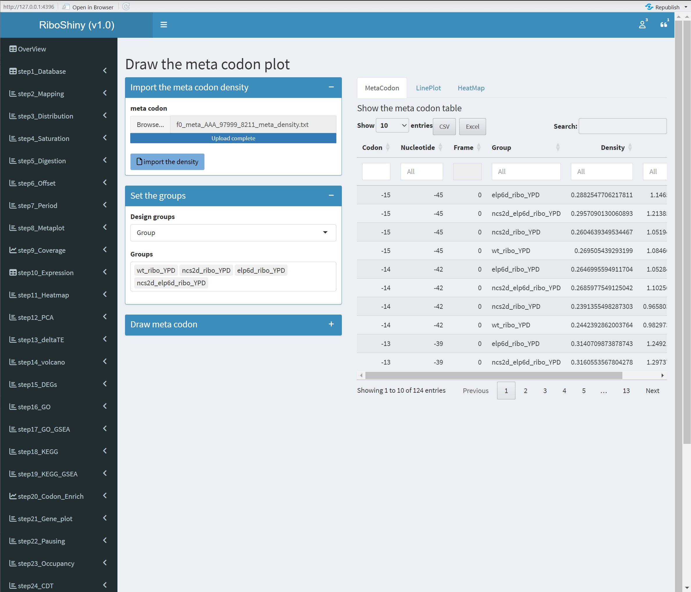

```

3. meta codon density 可视化

可以在 codon / nucleotide 水平展示 codon 的 density。

使用 lineplot 和 heatmap 展示 meta codon 的 density，不同分组之间的显著差异分析见 RiboParser 的输出结果。

```{r, out.width = "70%", fig.align = "center", echo = FALSE, dpi=200}

knitr::include_graphics("./images/snapshot/step28-meta-codon-plot.jpg")

```

#### 2.28.2 SeqLogo

这个步骤用于密码子前后序列的可视化。

为了确定所有密码子前后序列的特征，这里使用 seqlogo 展示不同密码子上下文序列的 motif。

- 文件1 /mnt/t64/test/sce/4.ribo-seq/5.riboparser/17.meta_codon/f0_meta_AAA_97999_8211_meta_sequence.txt

1. 导入 meta codon 文件

```{r, out.width = "70%", fig.align = "center", echo = FALSE, dpi=200}

knitr::include_graphics("./images/snapshot/step28-meta-codon-sequence-table.jpg")

```

2. meta codon 序列可视化

```{r, out.width = "70%", fig.align = "center", echo = FALSE, dpi=200}

knitr::include_graphics("./images/snapshot/step28-meta-codon-sequence-seqlogo.jpg")

```

### 2.29 step29_SeRP_Enrich

#### 2.29.1 SeRP_Enrich

这个步骤用于分析 SeRP 的富集变化。

为了确定 SeRP 数据中核糖体足迹的丰度变化，使用 enrichment 来展示 IP 和 input 分组之间的变化。

- 文件1 /mnt/t64/test/sce/4.ribo-seq/5.riboparser/19.serp_enrich/sce_tis_tts_metaplot.txt

1. 导入 meta gene 文件

```{r, out.width = "70%", fig.align = "center", echo = FALSE, dpi=200}

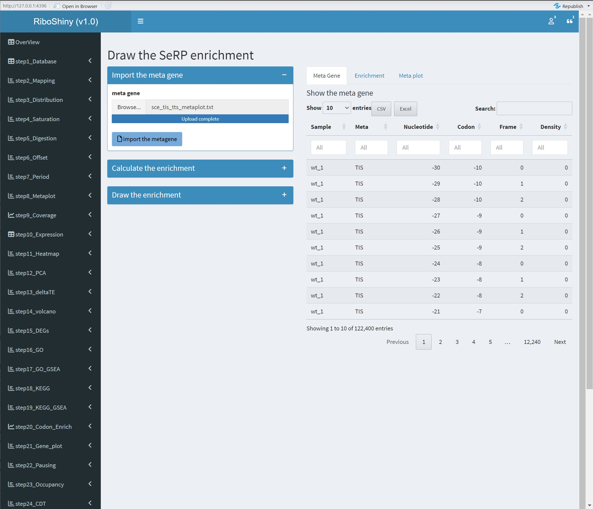

```

2. 指定分组信息

```{r, out.width = "70%", fig.align = "center", echo = FALSE, dpi=200}

knitr::include_graphics("./images/snapshot/step29-serp-enrich-meta-gene-design.jpg")

```

3. meta gene 富集分析可视化

可以在 codon / nucleotide 水平展示 meta gene enrichment。

```{r, out.width = "70%", fig.align = "center", echo = FALSE, dpi=200}

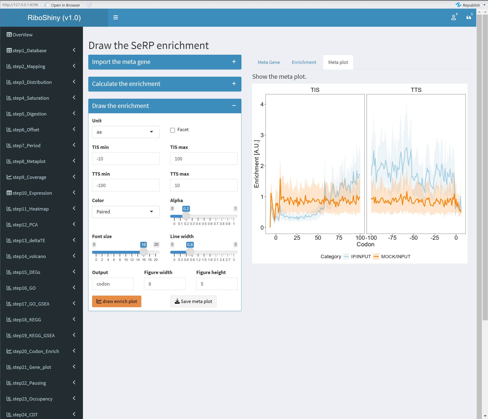

```

### 2.30 step30_SeRP_Peaks

#### 2.30.1 SeRP_Peaks

这个步骤用于可视化基因上的 enrichment peaks 信息。

这个步骤类似于 igv 的可视化，在这里需要使用 RiboParser 的输出结果，来展示沿着转录本水平的 enrichment peaks 信息。

- 文件1 /mnt/t64/test/sce/4.ribo-seq/5.riboparser/20.serp_peaks/ssb1_wt_flag_peaks.txt

1. 导入基因 enrichment peaks 文件

```{r, out.width = "70%", fig.align = "center", echo = FALSE, dpi=200}

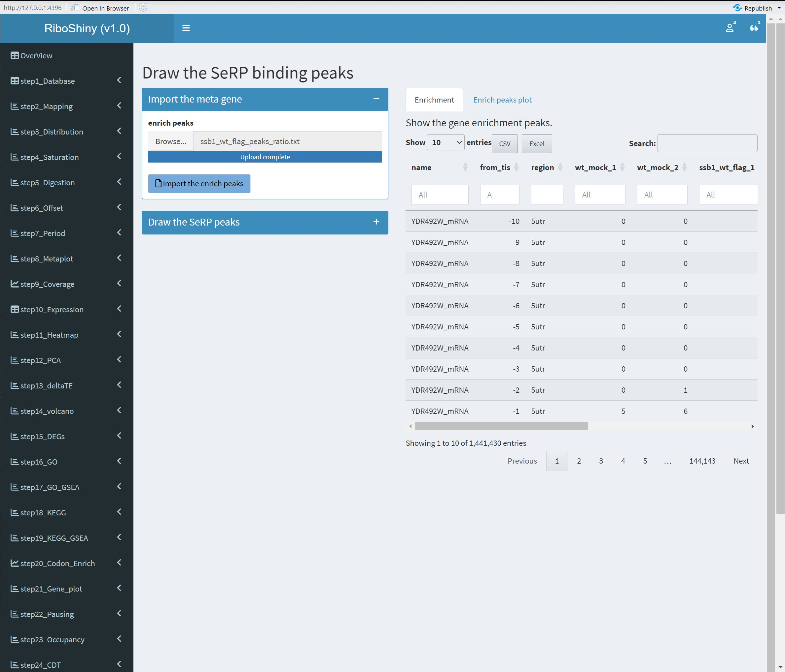

```

2. 可视化基因信息

选择不同的基因，使用 lineplot 来展示 enrichment peaks。

```{r, out.width = "70%", fig.align = "center", echo = FALSE, dpi=200}

knitr::include_graphics("./images/snapshot/step30-serp-peaks-bound-region.jpg")

```

### 2.31 step31_SeRP_Motif

#### 2.31.1 SeRP_Motif

这个步骤用于 peaks 前后序列的可视化。

为了确定所有 peaks 前后序列的特征，这里使用 seqlogo 展示 peaks 上下文序列的 motif。

- 文件1 /mnt/t64/test/sce/4.ribo-seq/5.riboparser/20.serp_peaks/ssb1_wt_flag_peaks_sequence.txt

1. 导入 peaks 前后序列文件

```{r, out.width = "70%", fig.align = "center", echo = FALSE, dpi=200}

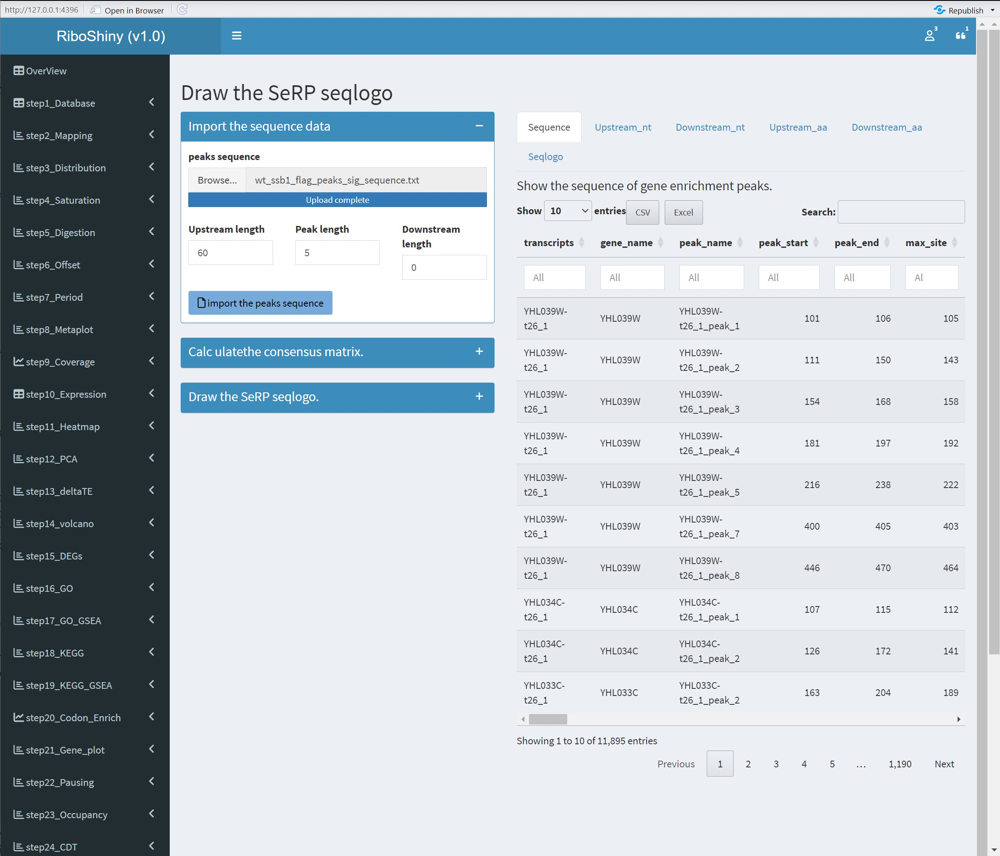

```

2. 筛选 peaks 前后的 nucleotide 序列

选择 peaks 前后序列的范围，分别为 peaks 上游范围，peaks 自身长度，peaks 下游范围。

```{r, out.width = "70%", fig.align = "center", echo = FALSE, dpi=200}

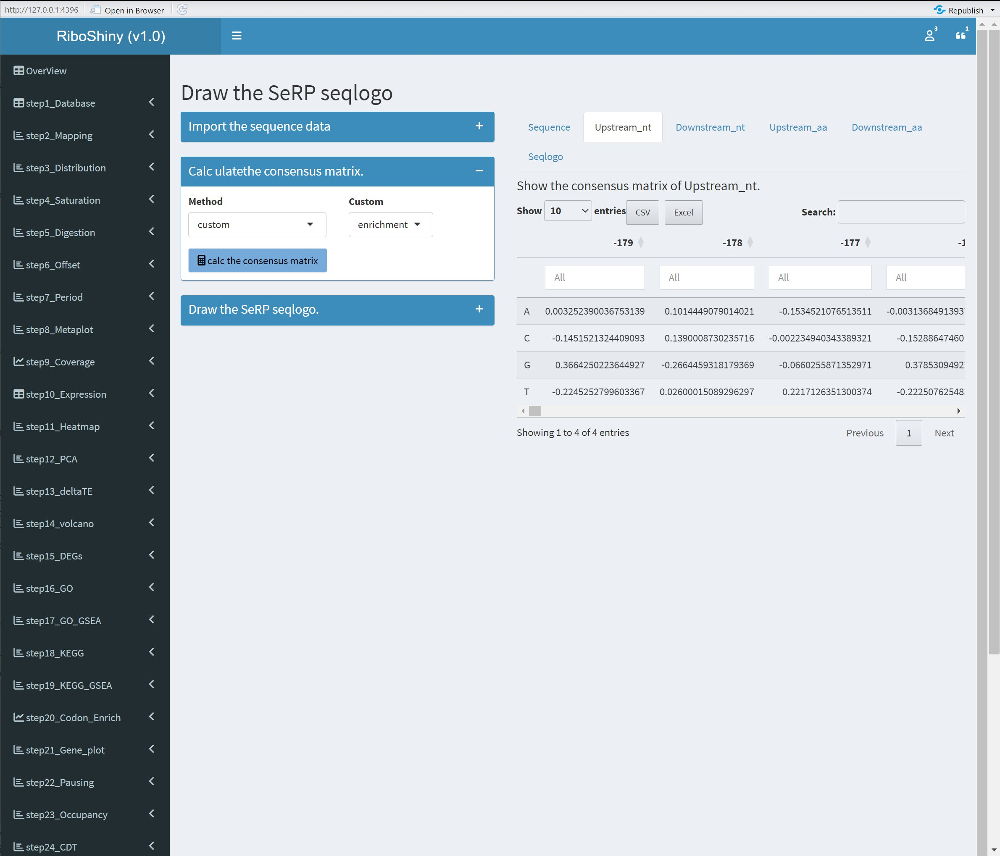

```

3. 筛选 peaks 前后的 amino acide 序列

选择 peaks 前后序列的范围，分别为 peaks 上游范围，peaks 自身长度，peaks 下游范围。

```{r, out.width = "70%", fig.align = "center", echo = FALSE, dpi=200}

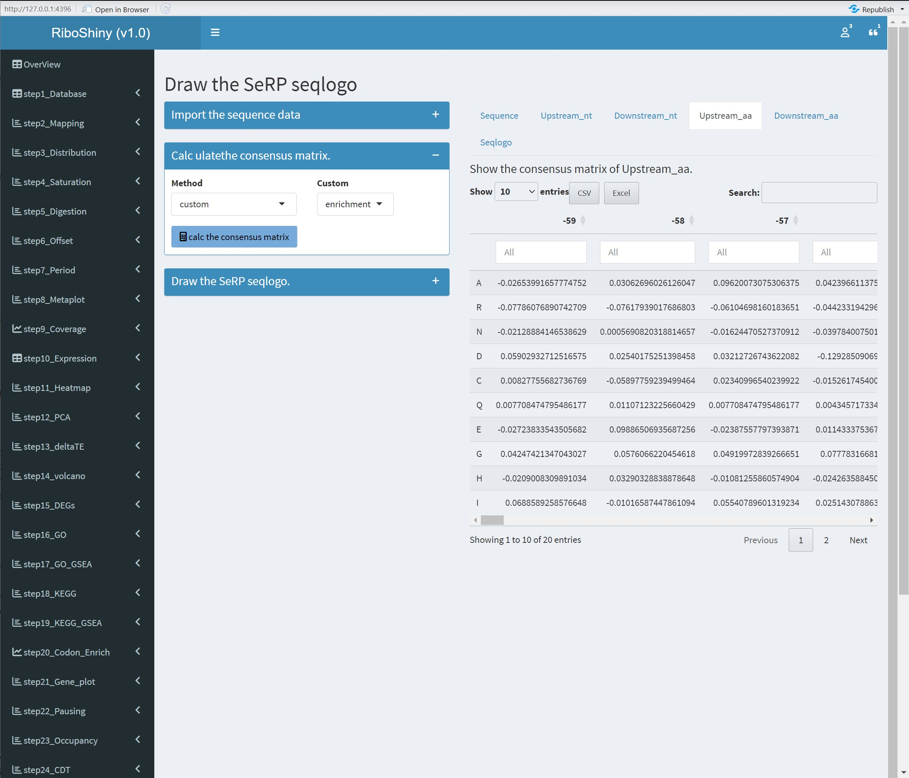

```

3. peaks 序列可视化

用于展示上游、下游和 peaks 自身序列的 motif。

可以在 codon / nucleotide 水平展示 peaks 的 motif。

```{r, out.width = "70%", fig.align = "center", echo = FALSE, dpi=200}

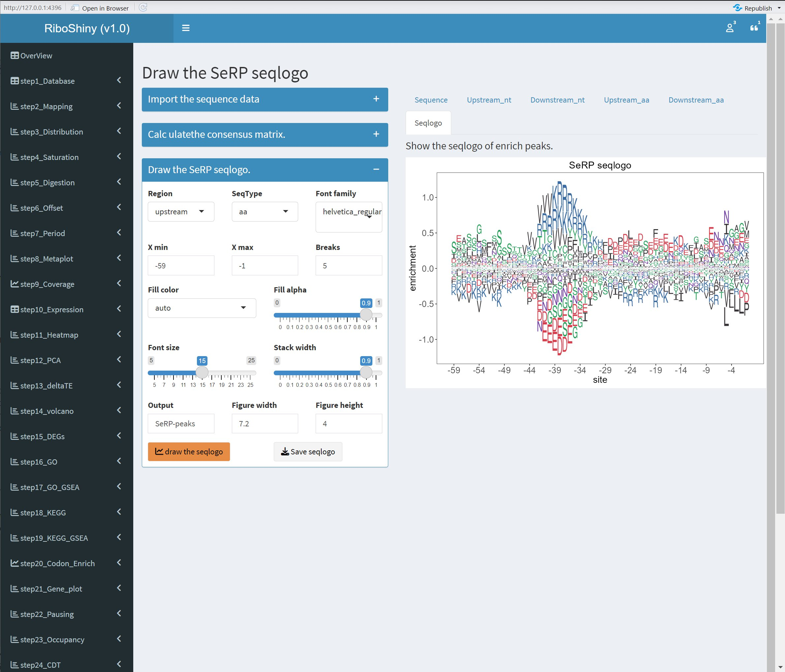

```


## 3. 贡献

感谢本流程中使用的所有开源软件的开发者。

欢迎提交问题和贡献代码。

联系 rensc0718@163.com

## 4. 版权

GPL license


