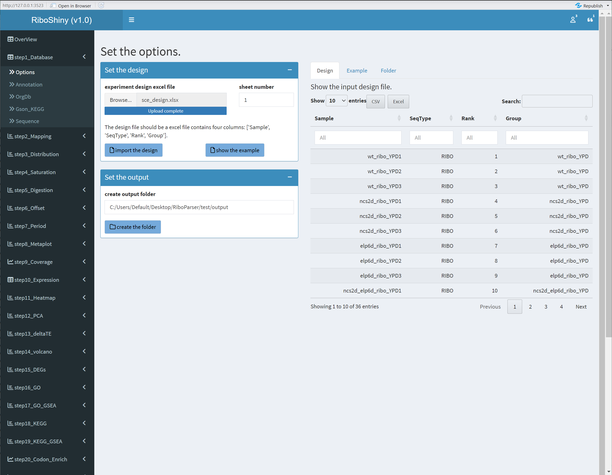
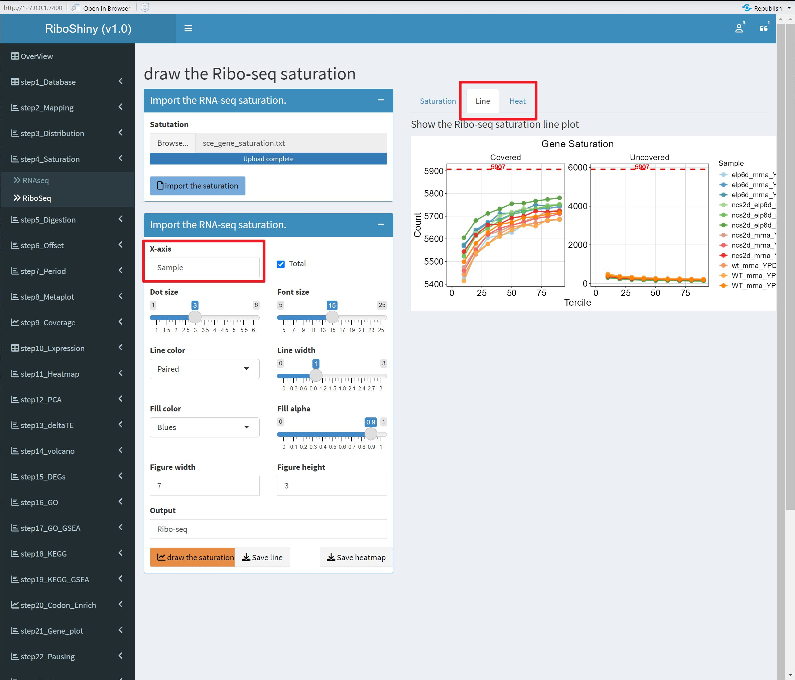
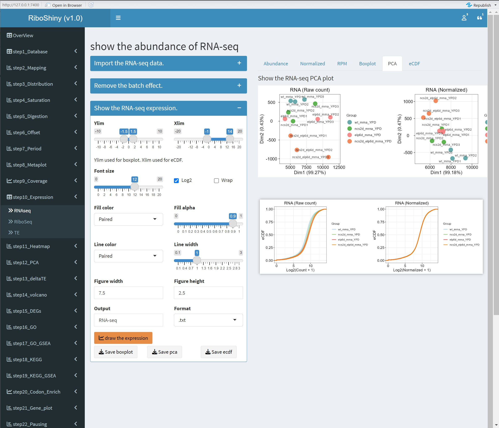
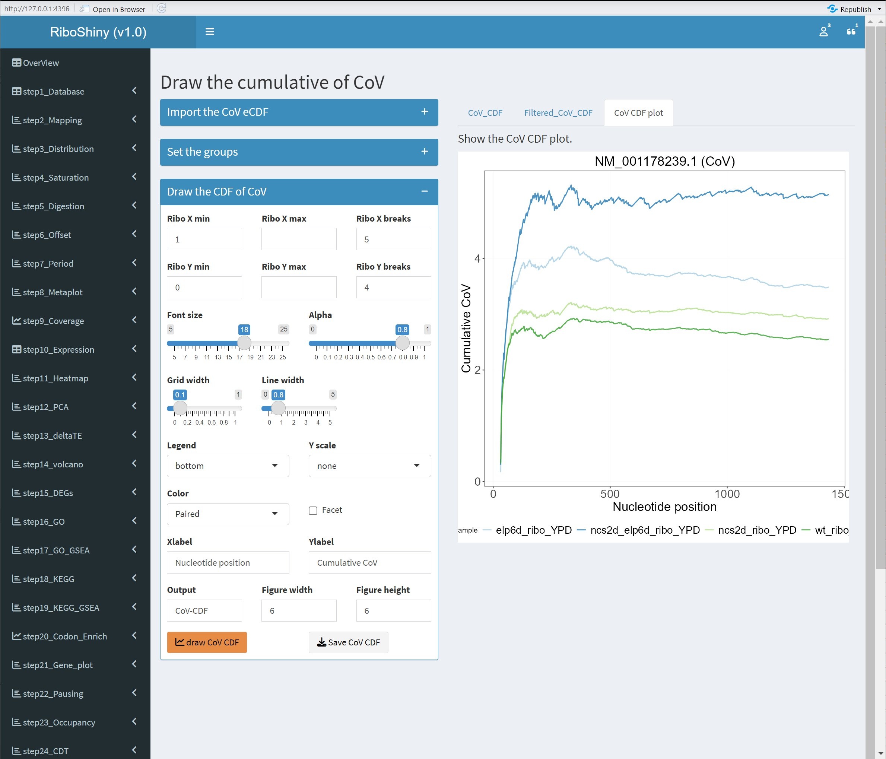

# RiboShiny: A Shiny Application for Ribosome Profiling Data Analysis and Visualization

## 0. Introduction
We present RiboShiny, a shiny application tailored for the analysis and visualization of ribosome sequencing data. This interactive tool offers a streamlined workflow comprising 31 analysis steps, designed to enhance the accessibility and efficiency of downstream data exploration.

-   step1_Database
    -   Options
    -   Annotation
    -   OrgDb
    -   Gson_KEGG
    -   Sequence
-   step2_Mapping
    -   RNAseq
    -   RiboSeq
-   step3_Distribution
    -   RNAseq
    -   RiboSeq
-   step4_Saturation
    -   RNAseq
    -   RiboSeq
-   step5_Digestion
    -   RNAseq
    -   RiboSeq
-   step6_Offset
    -   Frame
    -   TIS
    -   End
-   step7_Period
    -   RNAseq
    -   RiboSeq
-   step8_Metaplot
    -   RNAseq
    -   RiboSeq
-   step9_Coverage
    -   RNAseq
    -   RiboSeq
-   step10_Expression
    -   RNAseq
    -   RiboSeq
    -   TE
-   step11_Heatmap
    -   RNAseq
    -   RiboSeq
    -   TE
-   step12_PCA
    -   RNAseq
    -   RiboSeq
    -   TE
-   step13_deltaTE
    -   edgeR
    -   DESeq2
    -   DeltaTE
-   step14_volcano
    -   Volcano
    -   Quadrant
    -   DeltaTE
-   step15_DEGs
    -   Venn_diagram
    -   DEGs_Venn
    -   DEGs_Merge
    -   DEGs_Bar
-   step16_GO
    -   EnrichGO
    -   CompareCluster
-   step17_GO_GSEA
    -   GSEA
-   step18_KEGG
    -   EnrichKEGG
    -   CompareCluster
-   step19_KEGG_GSEA
    -   GSEA
-   step20_Codon_Enrich
    -   Codon_Usage
    -   GO_Enrich
    -   KEGG_Enrich
-   step21_Gene_plot
    -   Isoforms
-   step22_Pausing
    -   Pausing
    -   Diff_Pausing
-   step23_Occupancy
    -   Occupancy
    -   Diff_Occupancy
-   step24_CDT
    -   CDT
    -   Diff_CDT
-   step25_CST
    -   CST
    -   Diff_CST
    -   Iterative
-   step26_OddRatio
    -   OddRatio
-   step27_CoV
    -   CoV
    -   CoV_eCDF
-   step28_MetaCodon
    -   MetaPlot
    -   SeqLogo
-   step29_SeRP_Enrich
    -   SeRP_Meta
    -   SeRP_Enrich
-   step30_SeRP_Peaks
    -   SeRP_Peaks
-   step31_SeRP_Motif
    -   SeRP_Motif

## 1. Installation

We present RiboShiny, a comprehensive framework designed to streamline the analysis and visualization of Ribo-seq data. Leveraging the powerful shinyapp platform and a rich collection of publicly accessible R packages, RiboShiny offers a user-friendly interface that enables researchers to perform a wide range of analyses with minimal programming expertise. Both local installation and web-based access are supported.

- web-server

For users who prefer not to install the software locally, we provide a web-based version accessible through the link below. Please note that the current address is a temporary IP address, and a dedicated domain name will be assigned in the future.

<http://82.157.181.64:3838/RiboShiny/>


- local install

Using the local version allows for more stable analysis and visualization. To install RiboShiny locally, you'll need to first install R and RStudio, as well as some essential R packages. For instructions on installing R and RStudio, please refer to their official websites:

R 4.3.1 <https://www.r-project.org/>

RStudio RStudio 2024.09.0+375 <https://www.rstudio.com/>。

R packages can be installed using the following code:

```{r, eval=FALSE}
##################################################
# install the required packages
if (!requireNamespace("BiocManager", quietly = TRUE)) 
  install.packages("BiocManager");
if (!require("devtools")) 
  install.packages("devtools");

##################################################
# packages for shiny and dashboard framework
if (!require("shiny")) 
  install.packages("shiny");
if (!require("shinyFiles")) 
  install.packages("shinyFiles");
if (!require("shinycssloaders"))
  install.packages("shinycssloaders");
if (!require("shinydashboard")) 
  install.packages("shinydashboard");
if (!require("dashboardthemes")) 
  install.packages("dashboardthemes");

##################################################
# packages for import and export data
if (!require("openxlsx")) 
  install.packages("openxlsx");
if (!require("DT")) 
  install.packages("DT");
if (!require("data.table")) 
  install.packages("data.table");
if (!require("showtext")) 
  install.packages("showtext");

##################################################
# packages for data format and analysis
if (!require("tidyverse")) 
  install.packages("tidyverse");
if (!require("zoo"))
  install.packages("zoo");
if (!require("FactoMineR"))
  install.packages("FactoMineR");
if (!require("factoextra"))
  install.packages("factoextra");

##################################################
# packages for data visualization
if (!require("ggplot2")) 
  install.packages("ggplot2");
if (!require("ggpubr")) 
  install.packages("ggpubr");
if (!require("MetBrewer")) 
  install.packages("MetBrewer")
if (!require("RColorBrewer")) 
  install.packages("RColorBrewer");
if (!require("pheatmap"))
  install.packages("pheatmap");
if (!require("minpack.lm")) 
  install.packages("minpack.lm");
if (!require("export"))
  install.packages("export");
if (!require("aplot"))
  install.packages("aplot");
if (!require("cowplot"))
  install.packages("cowplot");
if (!require("ggplotify"))
  install.packages("ggplotify");
if (!require("ggrepel"))
  install.packages("ggrepel");
if (!require("ggnewscale"))
  install.packages("ggnewscale");
if (!require("ggseqlogo"))
  install.packages("ggseqlogo");
if (!require("ggVennDiagram"))
  install.packages("ggVennDiagram");
if (!require("UpSetR"))
  install.packages("UpSetR");

##################################################
# packages from BiocManager
if (!require("Biostrings"))
  BiocManager::install("Biostrings");
if (!require("coRdon")) 
  BiocManager::install("coRdon");
if (!require("ShortRead")) 
  BiocManager::install("ShortRead");
if (!require("DESeq2"))
  BiocManager::install("DESeq2");
if (!require("edgeR"))
  BiocManager::install("edgeR");
if (!require("RUVSeq"))
  BiocManager::install("RUVSeq");
if (!require("GOSE"))
  BiocManager::install("GOSE");
if (!require("ReactomePA"))
  BiocManager::install("ReactomePA");
if (!require("clusterProfiler"))
  BiocManager::install("clusterProfiler");
if (!require("AnnotationDbi"))
  BiocManager::install("AnnotationDbi");
if (!require("AnnotationHub"))
  BiocManager::install("AnnotationHub");
if (!require("AnnotationForge"))
  BiocManager::install("AnnotationForge");

##################################################
# packages for enrichment analysis
# the database of model organisms can be downloaded directly through Bioconductor
# non-model organisms can be create with AnnotationForge package in RiboShiny
if (!require("org.Hs.eg.db"))
  BiocManager::install("org.Hs.eg.db");
if (!require("org.At.tair.db"))
  BiocManager::install("org.At.tair.db");
if (!require("org.Sc.sgd.db"))
  BiocManager::install("org.Sc.sgd.db");

```

After installation, download the RiboShiny code (for Windows or graphical Linux), and start RiboShiny with Rstudio or using the following code:

```{r, eval=FALSE}
# download the RiboShiny code from github
https://codeload.github.com/Renscq/RiboShiny/zip/refs/heads/master
# or
git clone https://github.com/Renscq/RiboShiny.git

# set the working directory
set('/path/to/your/software/RiboShiny/')

# run the RiboShiny
runApp()

```


## 2. Example project

The GSE67387 dataset will serve as an example to showcase the capabilities of RiboShiny. To streamline the analysis process, RiboShiny is designed to seamlessly integrate with the output of RiboParser. This means that, with the exception of the initial reference file creation, all subsequent steps in RiboShiny can directly utilize the results from RiboParser, significantly reducing the workload for users.

### 2.1 step1_Database

This step focuses on preparing the necessary input files for downstream analysis. We will create files containing sample information, genome annotations, KEGG pathway annotations, and CDS sequences. These files will be used in subsequent steps to perform various analyses.

#### 2.1.1 Options

In this step, we create a detailed sample information table. This table is a crucial input for subsequent analyses and should include at least four columns: Sample (sample name), SeqType (sequencing type), Rank (experimental group rank), and Group (experimental group). 

Depending on the experimental design, additional columns can be incorporated to capture other relevant variables such as treatment conditions. 

The finalized table is saved as ./InputData/sce_design.xlsx.

1. import the design table

```{r, out.width = "70%", fig.align = "center", echo=FALSE, dpi=200}



```


#### 2.1.2 Annotation

A detailed gene annotation file will be generated in this step. The file will contain gene-related information retrieved from the NCBI database. This file is essential for downstream analyses such as gene expression analysis and functional enrichment analysis.

- file1：<https://ftp.ncbi.nlm.nih.gov/genomes/all/GCF/000/146/045/GCF_000146045.2_R64/GCF_000146045.2_R64_feature_count.txt>

In the above file, the necessary columns are product_accession, name (description), symbol, GeneID (entrezid), and locus_tag, which will be used for subsequent GO and KEGG enrichment analysis.

Extract the necessary information from the file and merge it with File 2.

```{sh, eval=FALSE}
awk '($1=="mRNA")||($1=="#")' GCF_000146045.2_R64_feature_table.txt | cut -f 11,13,14,15,16,17 | head -n 5

```

| product_accession | related_accession | name | symbol | GeneID | locus_tag |
|:--------------:|:-----------:|:-----------------------:|:--------:|:---------:|:----------:|
| NM_001180043.1 | NP_009332.1 | seripauperin PAU8 | PAU8 | 851229 | YAL068C |
| NM_001184582.1 | NP_878038.1 | uncharacterized protein |  | 1466426 | YAL067W-A |
| NM_001178208.1 | NP_009333.1 | putative permease SEO1 | SEO1 | 851230 | YAL067C |
| NM_001179897.1 | NP_009335.1 | uncharacterized protein |  | 851232 | YAL065C |
| NM_001180042.1 | NP_009336.1 | uncharacterized protein |  | 851233 | YAL064W-B |
| NM_001180041.1 | NP_058136.1 | Tda8p | TDA8 | 851234 | YAL064C-A |
| NM_001178206.2 | NP_009337.2 | uncharacterized protein |  | 851235 | YAL064W |
| NM_001184642.1 | NP_878039.1 | uncharacterized protein |  | 1466427 | YAL063C-A |
| NM_001178205.1 | NP_009338.1 | flocculin FLO9 | FLO9 | 851236 | YAL063C |

2. file2：/mnt/t64/test/sce/1.reference/norm/sce.norm.txt (Please refer to the RiboParser user manual for more details.)

The preceding file represents the structured output generated by RiboParser. To combine the data, match the transcript_id column from this file with the corresponding column in File 1. Subsequently, append the gene-related data from the RiboParser output to the existing table.

| chromosome | gene_id | transcript_id | start | end | utr5_length | cds_length | utr3_length | strand | rep_transcript | modified |
|:-----------:|:---------:|:-------------:|:------:|:------:|:-----:|:-----:|:-----:|:-----:|:------:|:------:|
| NC_001133.9 | YAL068C | NM_001180043.1 | 1776 | 2199 | 30 | 363 | 30 | \- | True | True |
| NC_001133.9 | YAL067W-A | NM_001184582.1 | 2449 | 2737 | 30 | 228 | 30 | \+ | True | True |
| NC_001133.9 | YAL067C | NM_001178208.1 | 7204 | 9046 | 30 | 1782 | 30 | \- | True | True |
| NC_001133.9 | YAL065C | NM_001179897.1 | 11534 | 11981 | 30 | 387 | 30 | \- | True | True |

3. Import the gene message

```{r, out.width = "70%", fig.align = "center", echo = FALSE, dpi=200}

knitr::include_graphics("./images/snapshot/step1-annotation-message.jpg")

```

4. Visualizing the distribution of gene lengths

```{r, out.width = "70%", fig.align = "center", echo = FALSE, dpi=200}


```


#### 2.1.3 OrgDb

To facilitate GO/GSEA enrichment analysis, we create an OrgDb file. For model organisms, pre-built OrgDb packages are accessible from the Bioconductor repository.

The exact command for retrieval is provided below.

```{r, eval=FALSE}
require("BiocManager")
# install the orgdb of scerevisiae from Bioconductor
BiocManager::install("org.Sc.sgd.db")

# install the orgdb of homo sapiens from Bioconductor
BiocManager::install("org.Hs.eg.db")

```

RiboShiny offers a convenient solution for creating `OrgDb` for non-model organisms. By leveraging gene annotations from `AnnotationHub` and utilizing AnnotationForge, we can build a custom database.

1. Begin by providing the species name or Taxonomy ID. Subsequently, verify the existence of the corresponding `OrgDb` within the database.

```{r, out.width = "70%", fig.align = "center", echo = FALSE, dpi=200}

knitr::include_graphics("./images/snapshot/step1-orgdb-filter-orgdb.jpg")

```

2. By leveraging the `ah_id`, gene information is extracted and utilized to construct an `OrgDb.` The output file is designated as org.Zmays.eg.db_0.1.tar.gz.

```{r, out.width = "70%", fig.align = "center", echo = FALSE, dpi=200}

knitr::include_graphics("./images/snapshot/step1-orgdb-create-save-orgdb.jpg")

```

3. Save the OrgDb in different data formats as needed.

RiboShiny supports both OrgDb and gson formats, for more information about the gson format, see home page of Prof. Yu。<https://guangchuangyu.r-universe.dev/gson>

4. If the OrgDb format is used, then the R package needs to be installed.

```{r, out.width = "70%", fig.align = "center", echo = FALSE, dpi=200}

knitr::include_graphics("./images/snapshot/step1-orgdb-install-orgdb.jpg")

```

#### 2.1.4 Gson_KEGG

This step is used to create a gson file for KEGG/GSEA enrichment analysis.
The creation of this file is not mandatory; in subsequent analyses, you can directly specify the species abbreviation from the KEGG website to complete the analysis, such as hsa for Homo sapiens.

For more details, see step18_KEGG.

1. Fill in the species abbreviation in KEGG, and pay attention to adjusting the type of gene ID.
The result can be saved as sce_KEGG_2024-10-25.gson.

```{r, out.width = "70%", fig.align = "center", echo = FALSE, dpi=200}


```


#### 2.1.5 Sequence

This step is used to create a codon usage file corresponding to CDS. This file is mainly used for subsequent codon enrichment analysis; if it is not needed, this step can be skipped.
For more details, see step20_Codon_Enrich.

Note: The uploaded sequences need to have the UTR regions removed, leaving only the CDS. You can directly use the file /mnt/t64/test/sce/1.reference/norm/sce.norm.cds.fa (see the RiboParser usage instructions).

1. Import and calculate the codon usage of the CDS
Here, Frequency, RSCU, and CAI are used to represent the codon usage in the mRNA sequence.

```{r, out.width = "70%", fig.align = "center", echo = FALSE, dpi=200}

knitr::include_graphics("./images/snapshot/step1-sequence-calc-codon-usage.jpg")

```

2. Save and visualize the codon usage.

Here, we use two methods—dot and circle—to visualize codon usage.

```{r, out.width = "70%", fig.align = "center", echo = FALSE, dpi=200}


```


### 2.2 step2_Mapping

#### 2.2.1 RNASeq

Same with Ribo-seq.

#### 2.2.2 RiboSeq

This step is used to visualize the origin of reads in the sequencing library.

Use the file /mnt/t64/test/sce/4.ribo-seq/2.bowtie/sce_mapping.txt (see the RiboParser usage instructions).

1. Import and calculate the codon usage of the CDS

```{r, out.width = "70%", fig.align = "center", echo = FALSE, dpi=200}


```


2. Save and visualize the codon usage.

Here, we use two methods-count and proportion-to visualize the origin of reads.

```{r, out.width = "70%", fig.align = "center", echo = FALSE, dpi=200}


```


### 2.3 step3_Distribution

#### 2.3.1 RNAseq

Same with Ribo-seq.

#### 2.3.2 RiboSeq

This step is used to visualize the length distribution of reads in the Ribo-seq sequencing library.

- Use the file /mnt/t64/test/sce/4.ribo-seq/5.riboparser/1.qc/sce_length_distribution.txt (see the RiboParser user guide).

1. Import the combined reads length distribution.

By default, all samples are used, but you can select different samples based on the classification information in the design file.

```{r, out.width = "70%", fig.align = "center", echo = FALSE, dpi=200}

knitr::include_graphics("./images/snapshot/step3-ribo-seq-length-table.jpg")
```


2. Visualization of reads length distribution

Here, we use two methods—line and heatmap—to visualize the length of the reads.

```{r, out.width = "70%", fig.align = "center", echo = FALSE, dpi=200}


```

### 2.4 step4_Saturation

#### 2.4.1 RNAseq

Same with Ribo-seq.

#### 2.4.2 RiboSeq

This step is used to visualize the gene saturation in the Ribo-seq sequencing library.

- Use the file /mnt/t64/test/sce/4.ribo-seq/5.riboparser/1.qc/sce_length_distribution.txt (see the RiboParser user guide).

1. Import the combined gene saturation table.

By default, all samples are used, but you can select different samples based on the classification information in the design file.

```{r, out.width = "70%", fig.align = "center", echo = FALSE, dpi=200}

knitr::include_graphics("./images/snapshot/step4-saturation-ribo-seq-table.jpg")

```

2. gene saturation visualization

Here, we use two methods—line and heatmap—to visualize gene saturation.

```{r, out.width = "70%", fig.align = "center", echo = FALSE, dpi=200}



```

### 2.5 step5_Digestion

#### 2.5.1 RiboSeq

This step is used to visualize the digestion status of reads in the Ribo-seq sequencing library.

In this step, we extract the nucleotide sequences surrounding the 5' end of the reads [-5, 10] and the 3' end [-10, 5]. We can analyze the statistics of the nucleotides present at the ends of the reads, which can help determine whether there is any preference in the enzyme cutting and ligation during the library preparation process.

- Use the file /mnt/t64/test/sce/4.ribo-seq/5.riboparser/2.digestion/sce_reads_digestion.txt (see the RiboParser user guide).

1. Import the combined reads digestion table.

By default, all samples are used, but you can select different samples based on the classification information in the design file.

```{r, out.width = "70%", fig.align = "center", echo = FALSE, dpi=200}


```

2. Visualization of enzyme digestion and ligation

Here, we use a sequence logo to visualize the nucleotide frequency at the ends of the reads, which helps determine whether there is any preference in the enzyme digestion and ligation during the library preparation process.

```{r, out.width = "70%", fig.align = "center", echo = FALSE, dpi=200}


```


### 2.6 step6_Offset

#### 2.6.1 RSBM

This step is used to visualize the predicted offset results in the Ribo-seq sequencing library.

In this step, based on the ribosome structure model (RSBM), we predict the offset corresponding to different lengths of RPFs in each dataset.

- Use the file /mnt/t64/test/sce/4.ribo-seq/5.riboparser/3.offset/sce_rsbm_offset.txt (see the RiboParser user guide).

1. Import the combined offset table.

By default, all samples are used, but you can select different samples based on the classification information in the design file.

```{r, out.width = "70%", fig.align = "center", echo = FALSE, dpi=200}

knitr::include_graphics("./images/snapshot/step6-offset-rsbm-table.jpg")

```

2. Visualization of offsets

Here, we use bar plots and heatmaps to visualize the total offset shifts, showing the offsets corresponding to different lengths.

```{r, out.width = "70%", fig.align = "center", echo = FALSE, dpi=200}

knitr::include_graphics("./images/snapshot/step6-offset-rsbm-plot.jpg")

```

#### 2.6.2 SSCBM

This step is used to visualize the predicted offset results in the Ribo-seq sequencing library.

In this step, based on the start and stop codon model (SSCBM), we predict the offset corresponding to different lengths of RPFs in each dataset.

- Use the file /mnt/t64/test/sce/4.ribo-seq/5.riboparser/3.offset/sce_rsbm_offset.txt (see the RiboParser user guide).

1. Import the combined offset table.

By default, all samples are used, but you can select different samples based on the classification information in the design file.

```{r, out.width = "70%", fig.align = "center", echo = FALSE, dpi=200}


```

2. Visualization of offsets

Here, we use bar plots and heatmaps to visualize the total offset shifts, showcasing the offsets corresponding to different lengths.

```{r, out.width = "70%", fig.align = "center", echo = FALSE, dpi=200}

knitr::include_graphics("./images/snapshot/step6-offset-sscbm-plot.jpg")

```

#### 2.6.3 Detail

This step is used to visualize the heatmap of offsets for start and stop codons.

In this step, we calculate the offsets from the ends of all reads to the start and stop codons. Due to variations among different species and library preparation methods, the predicted results may not be 100% accurate. Therefore, it is essential to verify the reliability of the analysis results by checking the raw data. Additionally, some manual adjustments may be made to improve the accuracy of the predictions.

- Use the file /mnt/t64/test/sce/4.ribo-seq/5.riboparser/3.offset/sce_offset_end.txt (see the RiboParser user guide).

1. Import the combined offset table.

By default, all samples are used, but you can select different samples based on the classification information in the design file.

```{r, out.width = "70%", fig.align = "center", echo = FALSE, dpi=200}

knitr::include_graphics("./images/snapshot/step6-offset-end-table.jpg")

```

2. Visualization of offsets at start and stop codons

Here, we use a heatmap to visualize the total offset shifts, showcasing the stability of offsets corresponding to different lengths. This helps in manually correcting erroneous predictions.

```{r, out.width = "70%", fig.align = "center", echo = FALSE, dpi=200}


```


### 2.7 step7_Period

#### 2.7.1 RNAseq

Same with Ribo-seq.

#### 2.7.2 RiboSeq

This step is used to visualize the nucleotide triplet periodicity in the Ribo-seq sequencing library.

- Use the file /mnt/t64/test/sce/4.ribo-seq/5.riboparser/6.periodicity/sce_periodicity.txt (see the RiboParser user guide).

1. Import the combined nucleotide triplet periodicity table.

By default, all samples are used, but you can select different samples based on the classification information in the design file.

```{r, out.width = "70%", fig.align = "center", echo = FALSE, dpi=200}


```

2. Visualization of nucleotide triplet periodicity

Here, we use bar plots to visualize the nucleotide triplet periodicity, categorized into count and proportion.

```{r, out.width = "70%", fig.align = "center", echo = FALSE, dpi=200}


```

### 2.8 step8_Metaplot

#### 2.8.1 RNAseq

Same with Ribo-seq.

#### 2.8.1 RiboSeq

This step is used to visualize the meta-gene density around start and stop codons.

- Use the file /mnt/t64/test/sce/4.ribo-seq/5.riboparser/7.metaplot/sce_tis_tts_metaplot.txt (see the RiboParser user guide).

1. Import the combined meta-gene density table.

By default, all samples are used, but you can select different samples based on the classification information in the design file.

```{r, out.width = "70%", fig.align = "center", echo = FALSE, dpi=200}


```

2. Visualization of meta-gene density

Here, we use three methods—bar plots, line plots, and heatmaps—to visualize the meta-gene density. The x-axis can be set to either codons or nucleotides.

```{r, out.width = "70%", fig.align = "center", echo = FALSE, dpi=200}

knitr::include_graphics("./images/snapshot/step8-metagene-riboseq-plot.jpg")

```


### 2.9 step9_Coverage

#### 2.9.1 RNAseq

Same with Ribo-seq.

#### 2.9.2 RiboSeq

This step is used to visualize the RPF coverage across the entire gene.

- Use the file /mnt/t64/test/sce/4.ribo-seq/5.riboparser/7.coverage/sce_utr5_cds_utr3_mean_coverage.txt (see the RiboParser user guide).

1. Import the combined RPF coverage table.

By default, all samples are used, but you can select different samples based on the classification information in the design file.

```{r, out.width = "70%", fig.align = "center", echo = FALSE, dpi=200}


```


2. RPFs coverage asymmetry score

Here, we use the asymmetry score to measure the abundance differences before and after RPF coverage, determining whether there is any preference in the library preparation and sequencing process.

```{r, out.width = "70%", fig.align = "center", echo = FALSE, dpi=200}

knitr::include_graphics("./images/snapshot/step9-coverage-riboseq-asymmetry-score.jpg")

```


3. Visualization of RPF coverage

Here, we use two methods—line plots and heatmaps—to visualize RPF coverage.

```{r, out.width = "70%", fig.align = "center", echo = FALSE, dpi=200}

knitr::include_graphics("./images/snapshot/step9-coverage-riboseq-plot.jpg")

```

### 2.10 step10_Expression

#### 2.10.1 RNAseq

This step is used to visualize the overall gene expression levels from RNA-seq.

- Use the file /mnt/t64/test/sce/4.rna-seq/4.quantification/sce_rna_isoforms_expected_count.txt (see the RiboParser user guide).

1. Import the combined RSEM quantification table.

By default, all samples are used, but you can select different samples based on the classification information in the design file.

```{r, out.width = "70%", fig.align = "center", echo = FALSE, dpi=200}

knitr::include_graphics("./images/snapshot/step10-expression-rnaseq-table.jpg")

```


2. Use RUVseq for expression normalization

To reduce errors between sequencing data from different batches, we use RUVseq to normalize data from multiple batches, allowing for comparison between different datasets. The normalized results can be saved in either normalized read count or RPM format.

Data from the same batch or data with minimal variation can skip this step.

```{r, out.width = "70%", fig.align = "center", echo = FALSE, dpi=200}


```


3. Use RLE to visualize expression differences between samples

We use RUVseq to normalize data from multiple batches and employ RLE to display the differences in overall gene expression levels before and after normalization.

Data from the same batch or data with minimal variation can skip this step.
```{r, out.width = "70%", fig.align = "center", echo = FALSE, dpi=200}

knitr::include_graphics("./images/snapshot/step10-expression-rnaseq-rle.jpg")

```


4. Use PCA to visualize differences between samples

We use PCA to illustrate the differences in overall gene expression levels before and after normalization.

Data from the same batch or data with minimal variation can skip this step.

```{r, out.width = "70%", fig.align = "center", echo = FALSE, dpi=200}



```


#### 2.10.2 RiboSeq

This step is used to visualize the overall gene expression levels from Ribo-seq.

It is generally recommended to use the results from RiboParser and the representative transcript for each gene. You can adjust the parameters in RiboParser to quantify the CDS region, including excluding reads that show poor stability around the start and stop codons.

- File 1: /mnt/t64/test/sce/4.ribo-seq/5.riboparser/10.quantification/sce_cds_rpf_quant.txt (see the RiboParser user guide).
- File 2: /mnt/t64/test/sce/4.ribo-seq/4.quantification/sce_rna_isoforms_expected_count.txt (see the RiboParser user guide).

1. Import the combined quantification table from RiboParser or RSEM.

By default, all samples are used, but you can select different samples based on the classification information in the design file.

```{r, out.width = "70%", fig.align = "center", echo = FALSE, dpi=200}

knitr::include_graphics("./images/snapshot/step10-expression-riboseq-table.jpg")

```


2. Use RUVseq for expression normalization

To reduce errors between sequencing data from different batches, we apply RUVseq to normalize data from multiple batches, allowing for comparison between different datasets. The normalized results can be saved in either normalized read count or RPM format.

Data from the same batch or data with minimal variation can skip this step.

```{r, out.width = "70%", fig.align = "center", echo = FALSE, dpi=200}

knitr::include_graphics("./images/snapshot/step10-expression-riboseq-normal.jpg")

```


3. Use RLE to visualize expression differences between samples

We use RUVseq to normalize data from multiple batches and employ RLE to display the differences in overall gene expression levels before and after normalization.

Data from the same batch or data with minimal variation can skip this step.

```{r, out.width = "70%", fig.align = "center", echo = FALSE, dpi=200}

knitr::include_graphics("./images/snapshot/step10-expression-riboseq-rle.jpg")

```


4. Use PCA to visualize differences between samples

We use PCA to illustrate the differences in overall gene expression levels before and after normalization.

Data from the same batch or data with minimal variation can skip this step.

```{r, out.width = "70%", fig.align = "center", echo = FALSE, dpi=200}


```


#### 2.10.3 TE

This step is used to calculate translation efficiency.

Translation efficiency = (Ribo-seq expression level) / (RNA-seq expression level)

It is generally recommended to use normalized data, such as RPM or TPM.

- File 1: /mnt/t64/test/sce/4.ribo-seq/5.riboparser/10.quantification/sce_cds_rpf_quant.txt (see the RiboParser user guide).
- File 2: /mnt/t64/test/sce/3.rna-seq/4.quantification/sce_rna_isoforms_expected_count.txt (see the RiboParser user guide).

1. Import the combined quantification tables for RNA-seq and Ribo-seq.

By default, all samples are used, but you can select different samples based on the classification information in the design file.

```{r, out.width = "70%", fig.align = "center", echo = FALSE, dpi=200}


```

2. Use PCA and eCDF to visualize differences between samples.

```{r, out.width = "70%", fig.align = "center", echo = FALSE, dpi=200}

knitr::include_graphics("./images/snapshot/step10-expression-te-pca-ecdf.jpg")

```

### 2.11 step11_Heatmap

#### 2.11.1 RNAseq

This step is used to visualize the overall reproducibility of RNA-seq.

We use normalized data to create a heatmap, which can be generated from either RSEM's RPKM data or data normalized with RUVseq.

- File 1: ./RiboShiny/OutputData/RNA-seq-normalized-2024-10-24.txt (RUVseq).
- File 2: /mnt/t64/test/sce/3.rna-seq/4.quantification/sce_rna_gene_FPKM.txt (RSEM).

1. Import the normalized quantification table.

By default, all samples are used, but you can select different samples based on the classification information in the design file.

```{r, out.width = "70%", fig.align = "center", echo = FALSE, dpi=200}

knitr::include_graphics("./images/snapshot/step10-expression-rnaseq-table.jpg")

```


2. Calculate and visualize sample correlation

Calculate the Pearson correlation coefficient between samples to represent reproducibility, and visualize the results using a heatmap.

```{r, out.width = "70%", fig.align = "center", echo = FALSE, dpi=200}


```


3. Clustering of genes and samples

We use different distance metrics and clustering methods to cluster genes and samples. Heatmaps are visualized with both row scaling and column scaling.

```{r, out.width = "70%", fig.align = "center", echo = FALSE, dpi=200}


```


#### 2.11.2 RiboSeq

This step is used to visualize the overall reproducibility of Ribo-seq.

We use normalized data to create a heatmap, which can be generated from either RiboParser/RSEM's RPKM data or data normalized with RUVseq.

- File 1: ./RiboShiny/OutputData/Ribo-seq-normalized-2024-10-24.txt (RUVseq).
- File 2: /mnt/t64/test/sce/4.ribo-seq/5.riboparser/sce_cds_rpkm_quant.txt (RiboParser).

1. Import the normalized quantification table.

By default, all samples are used, but you can select different samples based on the classification information in the design file.

```{r, out.width = "70%", fig.align = "center", echo = FALSE, dpi=200}

knitr::include_graphics("./images/snapshot/step10-expression-riboseq-table.jpg")

```


2. Calculate and visualize sample correlation

Calculate the Pearson correlation coefficient between samples to represent reproducibility, and visualize the results using a heatmap.

```{r, out.width = "70%", fig.align = "center", echo = FALSE, dpi=200}

knitr::include_graphics("./images/snapshot/step11-heatmap-riboseq-corr.jpg")

```


3. Clustering of genes and samples

We use various distance metrics and clustering methods to cluster genes and samples. The results are visualized using heatmaps with both row scaling and column scaling.

```{r, out.width = "70%", fig.align = "center", echo = FALSE, dpi=200}


```

#### 2.11.3 TE

This step is used to visualize the overall reproducibility of translation efficiency (TE).

We use the previously calculated translation efficiency data to compute and visualize sample reproducibility.

- File 1: ./RiboShiny/OutputData/TE-normalized-2024-10-24.txt

1. Import the normalized quantification table.

By default, all samples are used, but you can select different samples based on the classification information in the design file.

```{r, out.width = "70%", fig.align = "center", echo = FALSE, dpi=200}

knitr::include_graphics("./images/snapshot/step11-heatmap-te-table.jpg")

```


2. Calculate and visualize sample correlation

Calculate the Pearson correlation coefficient between samples to represent reproducibility, and visualize the results using a heatmap.

```{r, out.width = "70%", fig.align = "center", echo = FALSE, dpi=200}

knitr::include_graphics("./images/snapshot/step11-heatmap-te-corr.jpg")

```


3. Clustering of genes and samples

Use different distance metrics and clustering methods to cluster genes and samples. The results are visualized using heatmaps with both row scaling and column scaling.

```{r, out.width = "70%", fig.align = "center", echo = FALSE, dpi=200}

knitr::include_graphics("./images/snapshot/step11-heatmap-te-cluster.jpg")

```

### 2.12 step12_PCA

#### 2.12.1 RNAseq

This step is used to visualize the results of principal component analysis (PCA) for RNA-seq.

We use normalized data to visualize the PCA results, with RUVseq normalized data as an example.

- File 1: ./RiboShiny/OutputData/RNA-seq-normalized-2024-10-24.txt (RUVseq).

1. Import the normalized quantification table.

By default, all samples are used, but you can select different samples based on the classification information in the design file.

```{r, out.width = "70%", fig.align = "center", echo = FALSE, dpi=200}


```


2. PCA analysis results

Display the results of the principal component analysis for the samples.

```{r, out.width = "70%", fig.align = "center", echo = FALSE, dpi=200}


```


3. Visualization of PCA analysis results

Use bar plots to show the contributions of different dimensions, and scatter plots to visualize the principal component analysis results for the samples.

```{r, out.width = "70%", fig.align = "center", echo = FALSE, dpi=200}

knitr::include_graphics("./images/snapshot/step12-pca-rnaseq-plot.jpg")

```


#### 2.12.2 RiboSeq

This step is used to visualize the results of principal component analysis (PCA) for Ribo-seq.

We use normalized data to visualize the PCA results, with RUVseq normalized data as an example.

- File 1: ./RiboShiny/OutputData/Ribo-seq-normalized-2024-10-24.txt (RUVseq).

1. Import the normalized quantification table.

By default, all samples are used, but you can select different samples based on the classification information in the design file.

```{r, out.width = "70%", fig.align = "center", echo = FALSE, dpi=200}

knitr::include_graphics("./images/snapshot/step12-pca-riboseq-table.jpg")

```


2. PCA analysis results

Display the results of the principal component analysis for the samples.

```{r, out.width = "70%", fig.align = "center", echo = FALSE, dpi=200}


```


2. PCA analysis results

Display the results of the principal component analysis for the samples.

```{r, out.width = "70%", fig.align = "center", echo = FALSE, dpi=200}


```

#### 2.12.3 TE

This step is used to visualize the results of principal component analysis (PCA) for translation efficiency (TE).

We perform PCA using the translation efficiency calculated from RNA-seq and Ribo-seq data.

- File 1: ./RiboShiny/OutputData/TE-normalized-2024-10-24.txt.

1. Import the TE quantification table.

By default, all samples are used, but you can select different samples based on the classification information in the design file.

```{r, out.width = "70%", fig.align = "center", echo = FALSE, dpi=200}


```


2. PCA analysis results

Display the results of the principal component analysis for the samples.

```{r, out.width = "70%", fig.align = "center", echo = FALSE, dpi=200}


```


3. Visualization of PCA analysis results

Use bar plots to show the contributions of different dimensions, and scatter plots to visualize the principal component analysis results for the samples.

```{r, out.width = "70%", fig.align = "center", echo = FALSE, dpi=200}

knitr::include_graphics("./images/snapshot/step12-pca-te-plot.jpg")

```

### 2.13 step13_deltaTE

#### 2.13.1 edgeR

This step is used for differential analysis of RNA-seq or Ribo-seq data.

We use edgeR for differential analysis, with raw counts or normalized counts as input data; here, we use RNA-seq as an example.

- File 1: ./RiboShiny/OutputData/RNA-seq-normalized-2024-10-25.txt (RUVseq).

1. Import the normalized quantification table.

Load the pre-prepared normalized table.

```{r, out.width = "70%", fig.align = "center", echo = FALSE, dpi=200}

knitr::include_graphics("./images/snapshot/step13-edger-rnaseq-table.jpg")

```

2. Set group information

In this step, you must import the design file to select different samples based on the classification information in the design file. Define Group 1 and Group 2 to calculate the differentially expressed genes between the two groups.

Import the gene message table to connect the expression data with gene information based on transcript_id, which will be primarily used for subsequent gene functional enrichment analysis.

```{r, out.width = "70%", fig.align = "center", echo = FALSE, dpi=200}


```

3. edgeR differential analysis results

Display the output results from edgeR for the different groups. The first few columns contain the differential analysis results, the middle columns show the expression levels, and the last few columns provide gene annotation information.

```{r, out.width = "70%", fig.align = "center", echo = FALSE, dpi=200}


```


#### 2.13.2 DESeq2

This step is used for differential analysis of RNA-seq or Ribo-seq data.

We use DESeq2 for differential analysis, with raw counts or normalized counts as input data; here, we use Ribo-seq as an example.

- File 1: ./RiboShiny/OutputData/Ribo-seq-normalized-2024-10-25.txt (RUVseq).

1. Import the normalized quantification table.

Load the pre-prepared normalized table.

```{r, out.width = "70%", fig.align = "center", echo = FALSE, dpi=200}


```

2. Set group information

In this step, you must import the design file to select different samples based on the classification information in the design file. Define Group 1 and Group 2 to calculate the differentially expressed genes between the two groups.

Import the gene message table to connect the expression data with gene information based on transcript_id, which will be primarily used for subsequent gene functional enrichment analysis.

```{r, out.width = "70%", fig.align = "center", echo = FALSE, dpi=200}


```

3. DESeq2 differential analysis results

Display the output results from DESeq2 for the different groups. The first few columns contain the differential analysis results, the middle columns show the expression levels, and the last few columns provide gene annotation information.

```{r, out.width = "70%", fig.align = "center", echo = FALSE, dpi=200}


```

#### 2.13.3 DeltaTE

This step is used for differential analysis of transcription, translation, and translation efficiency.

We use DeltaTE for the differential analysis. Since the analysis of translation efficiency requires consideration of both RNA-seq and Ribo-seq expression levels, you need to import two files simultaneously.

- File 1: ./RiboShiny/OutputData/RNA-seq-normalized-2024-10-25.txt (RUVseq).
- File 2: ./RiboShiny/OutputData/Ribo-seq-normalized-2024-10-25.txt (RUVseq).

1. Import the normalized quantification tables.

Load the pre-prepared normalized tables for both RNA-seq and Ribo-seq.

```{r, out.width = "70%", fig.align = "center", echo = FALSE, dpi=200}

knitr::include_graphics("./images/snapshot/step13-deltate-table.jpg")

```

2. Set group information

Import the design file to select different samples based on the classification information in the design file. Define Group 1 and Group 2 for both RNA-seq and Ribo-seq to calculate the differentially expressed genes between the two groups.

Import the gene message table to connect the expression data with gene information based on transcript_id, which will be primarily used for subsequent gene functional enrichment analysis.

```{r, out.width = "70%", fig.align = "center", echo = FALSE, dpi=200}

knitr::include_graphics("./images/snapshot/step13-deltate-design.jpg")

```

3. DeltaTE differential analysis results

Display the output results from DeltaTE for the different groups. The first few columns contain the differential analysis results, the middle columns show the expression levels, and the last few columns provide gene annotation information.

```{r, out.width = "70%", fig.align = "center", echo = FALSE, dpi=200}


```

4. DeltaTE differential analysis results summary

Summarize the significantly differentially expressed genes related to transcription, translation, and translation efficiency from the differential analysis.

```{r, out.width = "70%", fig.align = "center", echo = FALSE, dpi=200}

knitr::include_graphics("./images/snapshot/step13-deltate-summary.jpg")

```

### 2.14 step14_volcano

#### 2.14.1 Volcano

This step is for visualizing differential analysis results using volcano plots.

We use the output results from edgeR, DESeq2, or DeltaTE for visualization. Here, we will use the results from DeltaTE as an example, and you can specify the input file by sheet name, which includes the differential analysis results for TE, RNA-seq, and Ribo-seq.

- File 1: ./RiboShiny/OutputData/wt_vs_ncs2d_elp6d-deltaTE-results-2024-10-25.xlsx

1. Import the differential analysis results.

The differential analysis table can classify different categories of genes using the Class grouping, which will be used for subsequent gene functional enrichment analysis.

```{r, out.width = "70%", fig.align = "center", echo = FALSE, dpi=200}


```

2. Differential analysis volcano plot visualization

Use a volcano plot to visualize the differential analysis results between different groups. You can adjust parameters to set different thresholds, such as log2FC and FDR.

```{r, out.width = "70%", fig.align = "center", echo = FALSE, dpi=200}

knitr::include_graphics("./images/snapshot/step14-volcano-plot.jpg")

```

#### 2.14.2 Quadrant

This step is for analyzing the coordinated changes between RNA-seq and Ribo-seq.

We will visualize the results from the differential analysis of RNA-seq and Ribo-seq, requiring the simultaneous input of both sets of results. Here, we will use the results from DeltaTE as an example.

- File 1: ./RiboShiny/OutputData/wt_vs_ncs2d_elp6d-deltaTE-results-2024-10-25.xlsx

1. Import the differential analysis results.

In the merged table, genes are categorized into different classes and saved as an Excel file for subsequent gene functional enrichment analysis (see later steps).

```{r, out.width = "70%", fig.align = "center", echo = FALSE, dpi=200}

knitr::include_graphics("./images/snapshot/step14-quadrant-table.jpg")

```

2. Differential analysis quadrant plot visualization

Use a quadrant plot to visualize the differential analysis results between different groups. You can adjust parameters to set different thresholds, such as log2FC and FDR.

```{r, out.width = "70%", fig.align = "center", echo = FALSE, dpi=200}


```

#### 2.14.3 DeltaTE

This step is for analyzing the coordinated changes between RNA-seq and Ribo-seq.

In contrast to the previous step, here we classify genes based on different trends of change using the DeltaTE method to identify genes that are regulated at the translation level. Similarly, we will visualize the results from the differential analysis of RNA-seq and Ribo-seq, requiring the simultaneous input of both sets of results.

- File 1: ./RiboShiny/OutputData/wt_vs_ncs2d_elp6d-deltaTE-results-2024-10-25.xlsx

1. Import the differential analysis results.

In the merged table, genes are categorized into different classes and saved as an Excel file for subsequent gene functional enrichment analysis (see later steps).

```{r, out.width = "70%", fig.align = "center", echo = FALSE, dpi=200}


```

2. Differential analysis quadrant plot visualization

Use a quadrant plot to visualize the differential analysis results between different groups. You can adjust parameters to set different thresholds, such as log2FC and FDR.

```{r, out.width = "70%", fig.align = "center", echo = FALSE, dpi=200}


```

### 2.15 step15_DEGs

#### 2.15.1 Venn_diagram

This step is for identifying differentially expressed genes between different groups.

This is an independent tool designed to compare significant differential genes between groups.

- File 1: ./RiboShiny/OutputData/wt_vs_ncs2d-deltaTE-results-2024-10-25.xlsx
- File 2: ./RiboShiny/OutputData/wt_vs_elp6d-deltaTE-results-2024-10-25.xlsx

1. Input gene list

The input gene sets are used to calculate the intersection and difference, and output a complete list.

```{r, out.width = "70%", fig.align = "center", echo = FALSE, dpi=200}


```

2. Visualize differential genes using a Venn diagram.

```{r, out.width = "70%", fig.align = "center", echo = FALSE, dpi=200}

knitr::include_graphics("./images/snapshot/step15-venn-diagram-plot.jpg")

```

#### 2.15.2 DEGs_Venn

This step is used to analyze the changes in differential genes among RNA-seq, Ribo-seq, and translation efficiency (TE).

This analysis helps identify gene sets that are uniquely regulated at the translation level, focusing on significantly differentially expressed genes at both transcription and translation levels. Generally, the differential genes regulated at these two levels tend to be similar.

- File 1: ./RiboShiny/OutputData/wt_vs_ncs2d_elp6d-deltaTE-results-2024-10-25.xlsx

1. Import the results of the differential analysis.

```{r, out.width = "70%", fig.align = "center", echo = FALSE, dpi=200}

knitr::include_graphics("./images/snapshot/step15-degs-venn-table.jpg")

```

2. Use a Venn diagram to visualize the differential genes.

```{r, out.width = "70%", fig.align = "center", echo = FALSE, dpi=200}

knitr::include_graphics("./images/snapshot/step15-degs-venn-plot.jpg")

```

3. Use a Upset to visualize the differential genes.

```{r, out.width = "70%", fig.align = "center", echo = FALSE, dpi=200}

knitr::include_graphics("./images/snapshot/step15-degs-venn-upset.jpg")

```

#### 2.15.3 DEGs_Merge

This step is for merging differential genes across all groups.

To facilitate the comparison of differential genes between different groups, we will merge the results from all groups.

- File 1: `./RiboShiny/OutputData/wt_vs_ncs2d-deltaTE-results-2024-10-25.xlsx`
- File 2: `./RiboShiny/OutputData/wt_vs_elp6d-deltaTE-results-2024-10-25.xlsx`
- File 3: `./RiboShiny/OutputData/wt_vs_ncs2d_elp6d-deltaTE-results-2024-10-25.xlsx`

1. Import the differential analysis results.

You can import multiple differential analysis result files simultaneously. The merged table will categorize genes and can be saved as an Excel file for subsequent quantification statistics and gene functional enrichment analysis (see following steps).

```{r, out.width = "70%", fig.align = "center", echo = FALSE, dpi=200}

knitr::include_graphics("./images/snapshot/step15-degs-merge-table.jpg")

```

#### 2.15.4 DEGs_Bar

This step is for counting and comparing differential genes between different groups.

The input file is the merged differential gene table.

- File: `./RiboShiny/OutputData/merge-DEGs-2024-10-25.xlsx`

1. Import the merged differential gene table.

You can analyze the data to compare the number and characteristics of differential genes across different groups.

```{r, out.width = "70%", fig.align = "center", echo = FALSE, dpi=200}


```

2. 可视化差异基因集

这里使用 bar plot 可视化不同分组之间的差异基因数量。

```{r, out.width = "70%", fig.align = "center", echo = FALSE, dpi=200}


```

### 2.16 step16_GO

#### 2.16.1 EnrichGO

This step is for performing GO (Gene Ontology) functional enrichment analysis on differential genes.

This step is for performing enrichment analysis on differential genes using `clusterProfiler`. You can use the previously prepared `orgDb` for this purpose. Note that this step only accepts one set of differential gene results at a time; if you need to perform functional enrichment analysis for multiple groups, you can use the next step, `CompareCluster`.

- File: `./RiboShiny/OutputData/wt_vs_ncs2d_elp6d-deltaTE-results-2024-10-25.xlsx`

1. Import the differential gene analysis results.

Start by loading the differential gene table for enrichment analysis.

```{r, out.width = "70%", fig.align = "center", echo = FALSE, dpi=200}


```

2. Selecting the GO Database

Choose the correct orgDb. If there is no corresponding orgDb for the species you are studying, you can also use a local gson file (see sections 2.1.3 and 2.1.4 for instructions on creating the file).

Select the correct keyType. This value is used to match the IDs of the differentially expressed genes with the keytype in the orgDb.

For a list of differentially expressed genes, if you are using the annotation file from NCBI as mentioned earlier, the default keyType is ENTREZID. You can use the "Gene column" to select the column in the table.

For orgDb, if it is created using annotationforge, the keyType is usually "GID". If it is an orgDb for a model organism, the keyType is usually "ENTREZID".

To display the results of the GO enrichment analysis, you can filter the results based on pvalueCutoff and qvalueCutoff.

```{r, out.width = "70%", fig.align = "center", echo = FALSE, dpi=200}


```

3. Removing Redundant Information

GO enrichment analysis often yields a large number of GO terms. Some of these terms may be redundant, meaning they represent overlapping concepts. To present the results more clearly, it is common to remove redundant information.

However, this step is not strictly necessary.

```{r, out.width = "70%", fig.align = "center", echo = FALSE, dpi=200}


```

4. Visualizing GO Enrichment Results

The dotplot is a commonly used visualization method for GO enrichment analysis results. It allows for flexible customization based on different groupings.

```{r, out.width = "70%", fig.align = "center", echo = FALSE, dpi=200}


```

#### 2.16.2 CompareCluster

This step is used for the GO functional enrichment analysis of differential genes across multiple groups.

Here, we can use the orgDb created earlier and perform enrichment analysis on the differential genes using clusterprofiler.
Unlike the previous steps, here we can perform functional enrichment analysis on multiple sets of differential genes.

- File 1: ./RiboShiny/OutputData/merge-DEGs-2024-10-25.xlsx

1. Import the results of differential analysis

First, import the table of differential genes.

```{r, out.width = "70%", fig.align = "center", echo = FALSE, dpi=200}

knitr::include_graphics("./images/snapshot/step16-group-go-degs-table.jpg")

```

2. Select the GO Database

Choose the correct orgDb. If there is no corresponding orgDb for the species being studied, you can also use a local gson file (for file creation methods, see sections 2.1.3 and 2.1.4).

Select the correct keyType. This value corresponds to the ID of the differential genes and the keytype in the orgDb.

For the list of differential analysis, if the annotation file from NCBI mentioned earlier is used, the default keyType is ENTREZID. The "Gene column" can be used to select the column in the table.

For orgDb created using annotationforge, the keyType is generally "GID". For model organisms' orgDb, the keyType is generally "ENTREZID".

Display the results of GO enrichment analysis, which can be filtered based on pvalueCutoff and qvalueCutoff.

```{r, out.width = "70%", fig.align = "center", echo = FALSE, dpi=200}


```

3. Remove Redundant Information

There are numerous GO terms in the GO enrichment analysis, and some of these terms may overlap with each other. To better present the results, redundant information can be removed.
However, this step is not mandatory and can be slow, so it can be skipped if not necessary.

```{r, out.width = "70%", fig.align = "center", echo = FALSE, dpi=200}


```

4. Visualize GO Enrichment Results

Use dotplot to visualize the GO enrichment results, and adjust the visualization format based on different groups.

```{r, out.width = "70%", fig.align = "center", echo = FALSE, dpi=200}

knitr::include_graphics("./images/snapshot/step16-group-go-degs-enrich-dotplot.jpg")

```

### 2.17 step17_GO_GSEA

#### 2.17.1 GSEA

This step is for single-group GO gene set enrichment analysis.

Similar to the previous steps, gene set enrichment analysis is performed using clusterprofiler. The difference here is that the analysis is based on changes in gene expression levels.
You can select different groups through the sheet.

- File 1: ./RiboShiny/OutputData/wt_vs_ncs2d_elp6d-deltaTE-results-2024-10-25.xlsx

1. Import the results of differential analysis

First, import the table of differential genes and mark the columns corresponding to GeneID and log2FoldChange to create a gene list.


```{r, out.width = "70%", fig.align = "center", echo = FALSE, dpi=200}

knitr::include_graphics("./images/snapshot/step17-go-gsea-degs-table.jpg")

```

2. Select the GO Database

Choose the correct orgDb. If there is no corresponding orgDb for the species being studied, you can also use a local gson file (for file creation methods, see sections 2.1.3 and 2.1.4).

Select the correct keyType. This value corresponds to the ID of the differential genes and the keytype in the orgDb.

For the list of differential analysis, if the annotation file from NCBI mentioned earlier is used, the default keyType is ENTREZID. The "Gene column" can be used to select the column in the table.

For orgDb created using annotationforge, the keyType is generally "GID". For model organisms' orgDb, the keyType is generally "ENTREZID".

Display the results of GO enrichment analysis, which can be filtered based on pvalueCutoff and qvalueCutoff.

```{r, out.width = "70%", fig.align = "center", echo = FALSE, dpi=200}

knitr::include_graphics("./images/snapshot/step17-go-gsea-degs-results.jpg")

```

3. Visualize GO Enrichment Results

Use dotplot to visualize the GO enrichment results, and adjust the visualization format based on different groups.

```{r, out.width = "70%", fig.align = "center", echo = FALSE, dpi=200}

knitr::include_graphics("./images/snapshot/step17-go-gsea-degs-dotplot.jpg")

```

4. Visualize GSEA Enrichment Results

Use gseaplot to visualize the GO enrichment results, displaying the overall trend of gene changes in one or several pathways.

```{r, out.width = "70%", fig.align = "center", echo = FALSE, dpi=200}


```

### 2.18 step18_KEGG

#### 2.18.1 EnrichKEGG

This step is for KEGG functional enrichment analysis of differentially expressed genes.

Use `clusterProfiler` for enrichment analysis of the differential genes. However, this step can only accept one set of differential gene results at a time. To perform functional enrichment analysis on multiple sets of differential genes, you can use the next step, `CompareCluster`.

- File 1: `./RiboShiny/OutputData/wt_vs_ncs2d_elp6d-deltaTE-results-2024-10-25.xlsx`

1. Import the results of differential analysis.

First, import the table of differential genes.

```{r, out.width = "70%", fig.align = "center", echo = FALSE, dpi=200}

knitr::include_graphics("./images/snapshot/step18-kegg-degs-table.jpg")

```

2. Select the KEGG database

Here, you can use the previously created JSON file or directly specify the species abbreviation to access the KEGG database (see sections 2.1.3 and 2.1.4 for file creation methods).

Choose the correct `keyType`. This value corresponds the IDs of the differential genes to the keytype in KEGG.

For the list of differential analyses, if you are using the annotation file from NCBI mentioned earlier, the default `keyType` is `ncbi-geneid`. You can use the "Gene column" option to select the appropriate column in the table.

For the KEGG database, the `keyType` is generally "kegg."

Display the results of the KEGG enrichment analysis, and filter the results based on `pvalueCutoff` and `qvalueCutoff`.

```{r, out.width = "70%", fig.align = "center", echo = FALSE, dpi=200}

knitr::include_graphics("./images/snapshot/step18-kegg-degs-enrich-results.jpg")

```

4. Visualize KEGG enrichment results

Use `dotplot` to visualize the KEGG enrichment results, and adjust the visualization format based on different groupings.

```{r, out.width = "70%", fig.align = "center", echo = FALSE, dpi=200}


```

#### 2.18.2 CompareCluster

This step is for KEGG functional enrichment analysis of differentially expressed genes across multiple groups.

Use `clusterProfiler` to perform enrichment analysis on the differential genes. This step allows for functional enrichment analysis on multiple sets of differential genes, using the merged file from step 2.15.3, or you can manually create a gene set file.

- File 1: `./RiboShiny/OutputData/merged-degs-2024-10-25.xlsx`

1. Import the results of differential analysis.

First, import the table of differential genes.

```{r, out.width = "70%", fig.align = "center", echo = FALSE, dpi=200}

knitr::include_graphics("./images/snapshot/step18-group-kegg-degs-table.jpg")

```

2. Select the KEGG database

Here, you can use the previously created JSON file or directly specify the species abbreviation to access the KEGG database (see sections 2.1.3 and 2.1.4 for file creation methods).

Choose the correct `keyType`. This value corresponds the IDs of the differential genes to the keytype in KEGG.

For the list of differential analyses, if you are using the annotation file from NCBI mentioned earlier, the default `keyType` is `ncbi-geneid`. You can use the "Gene column" option to select the appropriate column in the table.

For the KEGG database, the `keyType` is generally "kegg."

Display the results of the KEGG enrichment analysis, and filter the results based on `pvalueCutoff` and `qvalueCutoff`.

```{r, out.width = "70%", fig.align = "center", echo = FALSE, dpi=200}


```

3. Visualize KEGG enrichment results

Use `dotplot` to visualize the KEGG enrichment results, allowing for adjustments in the visualization format based on different groupings. This enables a clearer comparison of enrichment levels across the various groups.

```{r, out.width = "70%", fig.align = "center", echo = FALSE, dpi=200}


```

### 2.19 step19_KEGG_GSEA

#### 2.19.1 GSEA

This step is for performing KEGG gene set enrichment analysis for a single group.

As before, use `clusterProfiler` for gene enrichment analysis. The difference here is that the analysis is based on changes in gene expression levels.

- File 1: `./RiboShiny/OutputData/wt_vs_ncs2d_elp6d-deltaTE-results-2024-10-25.xlsx`

1. Import the results of differential analysis.

First, import the table of differential genes and designate the corresponding columns for `GeneID` and `log2FoldChange` to create the gene list.

```{r, out.width = "70%", fig.align = "center", echo = FALSE, dpi=200}


```

2. Select the KEGG database

Here, you can use the previously created JSON file or directly specify the species abbreviation to access the KEGG database (see sections 2.1.3 and 2.1.4 for file creation methods).

Choose the correct `keyType`. This value corresponds the IDs of the differential genes to the keytype in KEGG.

For the list of differential analyses, if you are using the annotation file from NCBI mentioned earlier, the default `keyType` is `ncbi-geneid`. You can use the "Gene column" option to select the appropriate column in the table.

For the KEGG database, the `keyType` is generally "kegg."

Display the results of the KEGG enrichment analysis, and filter the results based on `pvalueCutoff` and `qvalueCutoff`.

```{r, out.width = "70%", fig.align = "center", echo = FALSE, dpi=200}

knitr::include_graphics("./images/snapshot/step19-kegg-gsea-degs-results.jpg")

```

3. Visualize KEGG enrichment results

Use `dotplot` to visualize the KEGG enrichment results, allowing for adjustments in the visualization format based on different groupings. This facilitates a clearer understanding of the enrichment patterns across the single group being analyzed.

```{r, out.width = "70%", fig.align = "center", echo = FALSE, dpi=200}

knitr::include_graphics("./images/snapshot/step19-kegg-gsea-degs-dotplot.jpg")

```

4. Visualize GSEA enrichment results

Use `gseaplot` to visualize the KEGG enrichment results, highlighting the overall trends in gene expression for one or more specific pathways. This allows for a detailed view of how gene expression changes across the selected pathways during the analysis.

```{r, out.width = "70%", fig.align = "center", echo = FALSE, dpi=200}


```


### 2.20 step20_Codon_Enrich

#### 2.20.1 Codon_Usage

This step is for visualizing codon usage among different groups of genes.

The codon usage table uses the previously generated file, and here we will use a boxplot to display the differences among various codons.

- File 1: `./RiboShiny/OutputData/CDS-gene-codon-usage-2024-10-25.xlsx`

1. Import the codon usage results.

```{r, out.width = "70%", fig.align = "center", echo = FALSE, dpi=200}


```

2. Select the gene list

Here, you can manually classify the genes or directly use the gene categories from the differential analysis for codon usage analysis. We will use the gene set from step 2.14.2.

- File 1: `./RiboShiny/OutputData/wt_vs_ncs2d_elp6d-quadrants-class-DEGs-2024-10-25.xlsx`

```{r, out.width = "70%", fig.align = "center", echo = FALSE, dpi=200}

knitr::include_graphics("./images/snapshot/step20-codon-usage-gene-table.jpg")

```

3. Filter specified codons

Select different codons and set a minimum threshold for analysis.

Determine the classification information for the genes.

```{r, out.width = "70%", fig.align = "center", echo = FALSE, dpi=200}

knitr::include_graphics("./images/snapshot/step20-codon-usage-filter-gene-table.jpg")

```

4. Visualize codon usage

Use a boxplot to visualize the codon usage of different categories of genes. This will help to highlight variations in codon usage patterns among the selected gene groups.

```{r, out.width = "70%", fig.align = "center", echo = FALSE, dpi=200}


```

5. Visualize codon usage

Use an ECDF (Empirical Cumulative Distribution Function) plot to visualize the codon usage of different categories of genes. This type of plot provides insights into the distribution and cumulative frequencies of codon usage across the selected gene groups, allowing for a clearer comparison of their usage patterns.

```{r, out.width = "70%", fig.align = "center", echo = FALSE, dpi=200}


```

#### 2.20.2 GO_Enrich

This step is for analyzing the enrichment of codon usage in genes.

The codon usage table is derived from the previously generated file, and here we will use a boxplot to display the differences among various codons.

- File 1: `./RiboShiny/OutputData/CDS-gene-codon-usage-2024-10-25.xlsx`

1. Import the codon usage results.

```{r, out.width = "70%", fig.align = "center", echo = FALSE, dpi=200}


```

2. Filter specified codons

Select different codons and set a minimum threshold for analysis.

Determine the classification information for the genes. This classification will help in understanding the specific codon usage patterns associated with each category of genes in the analysis.

```{r, out.width = "70%", fig.align = "center", echo = FALSE, dpi=200}

knitr::include_graphics("./images/snapshot/step20-go-codon-usage-vector.jpg")

```

3. Select the GO database

Choose the appropriate `orgDb`. If the species you are studying does not have a corresponding `orgDb`, you can also use a local JSON file (see sections 2.1.3 and 2.1.4 for file creation methods).

Select the correct `keyType`. This value corresponds the IDs of the differential genes to the keytype in the `orgDb`.

For the list of differential analyses, if you are using the annotation file from NCBI mentioned earlier, the default `keyType` is `ENTREZID`. You can use the "Gene column" option to select the appropriate column in the table.

For `orgDb`, if created using `annotationforge`, the `keyType` is generally "GID." If it is a model organism's `orgDb`, the `keyType` is typically "ENTREZID."

Display the results of the GO enrichment analysis, and filter the results based on `pvalueCutoff` and `qvalueCutoff`.

```{r, out.width = "70%", fig.align = "center", echo = FALSE, dpi=200}

knitr::include_graphics("./images/snapshot/step20-go-codon-usage-enrich-results.jpg")

```

4. Visualize GO enrichment results

Use `dotplot` to visualize the GO enrichment results, allowing for adjustments in the visualization format based on different groupings. This provides a clear representation of the enrichment levels for various GO terms across the selected groups, facilitating comparison and interpretation of the data.

```{r, out.width = "70%", fig.align = "center", echo = FALSE, dpi=200}

knitr::include_graphics("./images/snapshot/step20-go-codon-usage-enrich-dotplot.jpg")

```

5. Visualize GSEA enrichment results

Use `gseaplot` to visualize the GO enrichment results, showcasing the overall trends in gene expression for one or more specific pathways. This allows for an in-depth view of how gene expression changes across the selected pathways during the analysis, helping to identify key patterns and insights.

```{r, out.width = "70%", fig.align = "center", echo = FALSE, dpi=200}


```

#### 2.20.3 KEGG_Enrich

This step is for analyzing the enrichment of codon usage in genes.

The codon usage table uses the previously generated file, and here we will use a boxplot to display the differences among various codons.

- File 1: `./RiboShiny/OutputData/`

1. Import the codon usage results.

```{r, out.width = "70%", fig.align = "center", echo = FALSE, dpi=200}


```

2. Filter specified codons

Select different codons and set a minimum threshold for analysis. 

Determine the classification information for the genes, which will aid in understanding the specific codon usage patterns associated with each gene category during the analysis.

```{r, out.width = "70%", fig.align = "center", echo = FALSE, dpi=200}

knitr::include_graphics("./images/snapshot/step20-kegg-codon-usage-vector.jpg")

```

3. Select the KEGG database

You can use the previously created JSON file or directly specify the species abbreviation to access the KEGG database (see sections 2.1.3 and 2.1.4 for file creation methods).

Choose the correct `keyType`. This value corresponds the IDs of the differential genes to the keytype in KEGG.

For the list of differential analyses, if you are using the annotation file from NCBI mentioned earlier, the default `keyType` is `ncbi-geneid`. You can use the "Gene column" option to select the appropriate column in the table.

For the KEGG database, the `keyType` is generally "kegg."

Display the results of the KEGG enrichment analysis, and filter the results based on `pvalueCutoff` and `qvalueCutoff`.

```{r, out.width = "70%", fig.align = "center", echo = FALSE, dpi=200}

knitr::include_graphics("./images/snapshot/step20-kegg-codon-usage-enrich-results.jpg")

```

4. Visualize KEGG enrichment results

Use `dotplot` to visualize the KEGG enrichment results, allowing for adjustments in the visualization format based on different groupings. This approach provides a clear representation of the enrichment levels for various KEGG pathways, facilitating comparison across the selected groups.

```{r, out.width = "70%", fig.align = "center", echo = FALSE, dpi=200}


```

5. Visualize GSEA enrichment results

Use `gseaplot` to visualize the KEGG enrichment results, showcasing the overall trends in gene expression for one or more specific pathways. This visualization highlights how gene expression changes across the selected pathways during the analysis.

```{r, out.width = "70%", fig.align = "center", echo = FALSE, dpi=200}


```


### 2.21 step21_Gene_plot

#### 2.21.1 Isoforms

This step is for visualizing the density coverage information of reads on genes.

This process is similar to the visualization in IGV, where we will use the output results from RiboParser to display the density coverage information of reads at the transcript level.

- File 1: `/mnt/t64/test/sce/3.rna-seq/5.riboparser/11.gene_density/gene_rna_retrieve.txt`
- File 2: `/mnt/t64/test/sce/4.ribo-seq/5.riboparser/18.gene_density/gene_ribo_retrieve.txt`

1. Import the gene density files.

```{r, out.width = "70%", fig.align = "center", echo = FALSE, dpi=200}

knitr::include_graphics("./images/snapshot/step21-isoforms-density-table.jpg")

```

2. Set sample information

Here, you need to import the design file to set up the sample information.

```{r, out.width = "70%", fig.align = "center", echo = FALSE, dpi=200}

knitr::include_graphics("./images/snapshot/step21-isoforms-density-design.jpg")

```

3. Visualize gene RNA-seq information

Select different genes and use line plots, bar plots, or area plots to display their reads density coverage information.

```{r, out.width = "70%", fig.align = "center", echo = FALSE, dpi=200}

knitr::include_graphics("./images/snapshot/step21-isoforms-density-rnaseq.jpg")

```

3. Visualize gene Ribo-seq information

Select different genes and use line plots, bar plots, or area plots to display their reads density coverage information.

```{r, out.width = "70%", fig.align = "center", echo = FALSE, dpi=200}


```

### 2.22 step22_Pausing

#### 2.22.1 Pausing

This step is for analyzing codon-level pausing signals.

The file used is the output from RiboParser, which displays codon-level pausing signals and can highlight differences between groups based on the design file.

- File 1: `/mnt/t64/test/sce/4.ribo-seq/5.riboparser/11.pausing_score/A_site_sum_codon_pausing_score.txt`

1. Import the codon pausing signal file.

```{r, out.width = "70%", fig.align = "center", echo = FALSE, dpi=200}


```

2. Set the group information

```{r, out.width = "70%", fig.align = "center", echo = FALSE, dpi=200}


```

3. Visualize codon pausing signals

When calculating, you can normalize using all codons (total) or only those with RPF coverage (valid), with valid typically being preferred.

There are two different modes for the calculation: absolute values and relative values. Due to sample processing or batch effects, codon-level analysis often shows significant differences or overall biases. Therefore, it’s important to consider the actual circumstances and choose the appropriate mode to display codon-level pausing signals. Generally, the relative value mode is preferred.

```{r, out.width = "70%", fig.align = "center", echo = FALSE, dpi=200}


```


#### 2.22.2 Diff_Pausing

This step is for differential analysis of codon-level pausing signals.

The file used is the output from RiboParser, which displays codon-level pausing signals and can highlight differences between groups based on the design file.

- File 1: `/mnt/t64/test/sce/4.ribo-seq/5.riboparser/11.pausing_score/A_site_sum_codon_pausing_score.txt`

1. Import the codon pausing signal file.

```{r, out.width = "70%", fig.align = "center", echo = FALSE, dpi=200}


```

2. Set sample information and calculate differences

Here, you need to import the design file to set up the sample information. There are two methods for calculating differences: one is to directly calculate delta, and the other is to calculate fold change.

```{r, out.width = "70%", fig.align = "center", echo = FALSE, dpi=200}

knitr::include_graphics("./images/snapshot/step22-pausing-score-diff.jpg")

```

3. Visualize differences in codon pausing signals

When calculating, you can normalize using all codons (total) or only those with RPF coverage (valid), with valid typically being preferred.

There are two different modes for the calculation: absolute values and relative values. Due to sample processing or batch effects, codon-level analysis often shows significant differences or overall biases. Therefore, it's important to consider the actual circumstances and choose the appropriate mode to display codon-level pausing signals. Generally, the relative value mode is preferred.

```{r, out.width = "70%", fig.align = "center", echo = FALSE, dpi=200}


```

### 2.23 step23_Occupancy

#### 2.23.1 Occupancy

This step is for analyzing codon occupancy.

The file used is the output from RiboParser, which displays codon occupancy and can highlight differences between groups based on the design file.

- File 1: `/mnt/t64/test/sce/4.ribo-seq/5.riboparser/12.codon_occupancy/A_site_codon_occupancy.txt`

1. Import the codon occupancy file.

```{r, out.width = "70%", fig.align = "center", echo = FALSE, dpi=200}


```

2. Visualize codon occupancy

There are two different modes for the calculation: absolute values and relative values. Due to sample processing or batch effects, codon-level analysis often shows significant differences or overall biases. Therefore, it's important to consider the actual circumstances and choose the appropriate mode to display codon occupancy. Generally, the relative value mode is preferred.

```{r, out.width = "70%", fig.align = "center", echo = FALSE, dpi=200}

knitr::include_graphics("./images/snapshot/step23-codon-occupancy-dotplot.jpg")

```

#### 2.23.2 Diff_Occupancy

This step is for differential analysis of codon occupancy.

The file used is the output from RiboParser, which displays codon occupancy and can highlight differences between groups based on the design file.

- File 1: `/mnt/t64/test/sce/4.ribo-seq/5.riboparser/12.codon_occupancy/A_site_codon_occupancy.txt`

1. Import the codon occupancy file.

```{r, out.width = "70%", fig.align = "center", echo = FALSE, dpi=200}


```

2. Set sample information and calculate differences

Here, you need to import the design file to set up the sample information. There are two methods for calculating differences: one is to directly calculate delta, and the other is to calculate fold change.

```{r, out.width = "70%", fig.align = "center", echo = FALSE, dpi=200}

knitr::include_graphics("./images/snapshot/step23-codon-occupancy-diff.jpg")

```

3. Visualize differences in codon occupancy

There are two different modes for the calculation: absolute values and relative values. Due to sample processing or batch effects, codon-level analysis often shows significant differences or overall biases. Therefore, it's important to consider the actual circumstances and choose the appropriate mode to display codon occupancy. Generally, the relative value mode is preferred.

```{r, out.width = "70%", fig.align = "center", echo = FALSE, dpi=200}

knitr::include_graphics("./images/snapshot/step23-codon-occupancy-diff-dotplot.jpg")

```

### 2.24 step24_CDT

#### 2.24.1 CDT

This step is for analyzing codon decoding time.

The file used is the output from RiboParser, which displays codon decoding time and can highlight differences between groups based on the design file.

- File 1: `/mnt/t64/test/sce/4.ribo-seq/5.riboparser/13.codon_decoding_time/A_ncr_cdt.txt`

1. Import the codon decoding time file.

```{r, out.width = "70%", fig.align = "center", echo = FALSE, dpi=200}


```

2. Visualize codon decoding time

There are two different modes for the calculation: absolute values and relative values. Due to sample processing or batch effects, codon-level analysis often shows significant differences or overall biases. Therefore, it's important to consider the actual circumstances and choose the appropriate mode to display codon decoding time. Generally, the relative value mode is preferred.

```{r, out.width = "70%", fig.align = "center", echo = FALSE, dpi=200}

knitr::include_graphics("./images/snapshot/step24-codon-decoding-time-dotplot.jpg")

```

#### 2.24.2 Diff_CDT

This step is for differential analysis of codon decoding time.

The file used is the output from RiboParser, which displays codon decoding time and can highlight differences between groups based on the design file.

- File 1: `/mnt/t64/test/sce/4.ribo-seq/5.riboparser/13.codon_decoding_time/A_ncr_cdt.txt`

1. Import the codon decoding time file.

```{r, out.width = "70%", fig.align = "center", echo = FALSE, dpi=200}


```

2. Set sample information and calculate differences

Here, you need to import the design file to set up the sample information. There are two methods for calculating differences: one is to directly calculate delta, and the other is to calculate fold change.

```{r, out.width = "70%", fig.align = "center", echo = FALSE, dpi=200}


```

3. Visualize codon decoding time

There are two different modes for the calculation: absolute values and relative values. Due to sample processing or batch effects, codon-level analysis often shows significant differences or overall biases. Therefore, it's important to consider the actual circumstances and choose the appropriate mode to display codon decoding time. Generally, the relative value mode is preferred.

```{r, out.width = "70%", fig.align = "center", echo = FALSE, dpi=200}


```

### 2.25 step25_CST

#### 2.25.1 CST

This step is for analyzing codon selection time.

The file used is the output from RiboParser, which displays codon selection time and can highlight differences between groups based on the design file.

- File 1: `/mnt/t64/test/sce/4.ribo-seq/5.riboparser/14.codon_selection_time/A_ncr_codon_selection_time.txt`

1. Import the codon selection time file.

```{r, out.width = "70%", fig.align = "center", echo = FALSE, dpi=200}


```

2. Visualize codon selection time

There are two different modes for the calculation: absolute values and relative values. Due to sample processing or batch effects, codon-level analysis often shows significant differences or overall biases. Therefore, it's important to consider the actual circumstances and choose the appropriate mode to display codon selection time. Generally, the relative value mode is preferred.

```{r, out.width = "70%", fig.align = "center", echo = FALSE, dpi=200}


```

#### 2.25.2 Diff_CST

This step is for differential analysis of codon selection time.

The file used is the output from RiboParser, which displays codon selection time and can highlight differences between groups based on the design file.

- File 1: `/mnt/t64/test/sce/4.ribo-seq/5.riboparser/14.codon_selection_time/A_ncr_codon_selection_time.txt`

1. Import the codon selection time file.

```{r, out.width = "70%", fig.align = "center", echo = FALSE, dpi=200}


```

2. Set sample information

Here, you need to import the design file to set up the sample information. There are two methods for calculating differences: one is to directly calculate delta, and the other is to calculate fold change.

```{r, out.width = "70%", fig.align = "center", echo = FALSE, dpi=200}

knitr::include_graphics("./images/snapshot/step25-codon-selection-time-diff.jpg")

```

3. Visualize codon selection time

There are two different modes for the calculation: absolute values and relative values. Due to sample processing or batch effects, codon-level analysis often shows significant differences or overall biases. Therefore, it's important to consider the actual circumstances and choose the appropriate mode to display codon selection time. Generally, the relative value mode is preferred.

```{r, out.width = "70%", fig.align = "center", echo = FALSE, dpi=200}


```

### 2.26 step26_OddRatio

#### 2.26.1 OddRatio

This step is for differential analysis of codon site density between different groups.

The odds ratio is used to compare the density differences at the same codon site between two samples, showcasing the significance frequency and proportion of codon site density differences between groups.

- File 1: `/mnt/t64/test/sce/4.ribo-seq/5.riboparser/15.odd_ratio/wt_vs_ncs2d_elp6d_A_site_sum_codon_odd_ratio.txt`

1. Import the codon odds ratio file.

```{r, out.width = "70%", fig.align = "center", echo = FALSE, dpi=200}


```

2. 可视化密码子 density 显著差异位点的频率和比例

```{r, out.width = "70%", fig.align = "center", echo = FALSE, dpi=200}

knitr::include_graphics("./images/snapshot/step26-codon-odd-ratio-dotplot.jpg")

```

### 2.27 step27_CoV

#### 2.27.1 CoV

This step is for analyzing the coefficient of variation at the gene level.

Unlike the pausing signal of individual codons, this step uses the coefficient of variation to measure the overall changes in translation elongation across genes. The output from RiboParser is used to display the gene-level coefficient of variation, and differences between groups can be highlighted based on the design file.

- File 1: `/mnt/t64/test/sce/4.ribo-seq/5.riboparser/16.coefficient_of_variation/sce_CoV.txt`

1. Import the gene-level coefficient of variation file.

```{r, out.width = "70%", fig.align = "center", echo = FALSE, dpi=200}


```

2. Specify group information.

```{r, out.width = "70%", fig.align = "center", echo = FALSE, dpi=200}

knitr::include_graphics("./images/snapshot/step27-coefficient-of-variation-design.jpg")

```

3. Fit the gene-level coefficient of variation.

```{r, out.width = "70%", fig.align = "center", echo = FALSE, dpi=200}

knitr::include_graphics("./images/snapshot/step27-coefficient-of-variation-fitted.jpg")

```

4. Visualize the gene-level coefficient of variation

You can display the fitted gene-level coefficient of variation using three methods: scatter, fitted, and merge. For significant difference analysis between different groups, refer to the output results from RiboParser.

```{r, out.width = "70%", fig.align = "center", echo = FALSE, dpi=200}

knitr::include_graphics("./images/snapshot/step27-coefficient-of-variation-fitted-plot.jpg")

```

#### 2.27.2 CoV_eCDF

This step is for analyzing the coefficient of variation at the gene level.

To assess the coefficient of variation for each gene, the cumulative distribution results of the coefficient of variation for individual genes are displayed using the output from RiboParser.

- File 1: `/mnt/t64/test/sce/4.ribo-seq/5.riboparser/16.coefficient_of_variation/gene_cumulative_CoV.txt`

1. Import the gene-level coefficient of variation file.

```{r, out.width = "70%", fig.align = "center", echo = FALSE, dpi=200}

knitr::include_graphics("./images/snapshot/step27-coefficient-of-variation-cdf-table.jpg")

```

2. Specify the gene and group information.

```{r, out.width = "70%", fig.align = "center", echo = FALSE, dpi=200}


```

3. Visualize the gene-level coefficient of variation

You can use a line plot to display the cumulative distribution results of the gene-level coefficient of variation.

```{r, out.width = "70%", fig.align = "center", echo = FALSE, dpi=200}



```

### 2.28 step28_MetaCodon

#### 2.28.1 MetaPlot

This step is for visualizing the codon-level metaplot.

To determine the average density of all codons, the output from RiboParser is used to display the codon-level metaplot, providing a visual comparison of pausing signals.

- File 1: `/mnt/t64/test/sce/4.ribo-seq/5.riboparser/17.meta_codon/f0_meta_AAA_97999_8211_meta_density.txt`

1. Import the meta codon file.

```{r, out.width = "70%", fig.align = "center", echo = FALSE, dpi=200}


```

2. Specify the group information.

```{r, out.width = "70%", fig.align = "center", echo = FALSE, dpi=200}

knitr::include_graphics("./images/snapshot/step28-meta-codon-design.jpg")

```

3. Meta codon density visualization

You can display the codon density at the codon/nucleotide level.

Use line plots and heatmaps to show the density of the meta codon. For significant difference analysis between different groups, refer to the output results from RiboParser.

```{r, out.width = "70%", fig.align = "center", echo = FALSE, dpi=200}


```

#### 2.28.2 SeqLogo

This step is for visualizing the sequences flanking codons.

To determine the characteristics of sequences surrounding all codons, sequence logos are used to display the motifs of different codon contexts.

- File 1: `/mnt/t64/test/sce/4.ribo-seq/5.riboparser/17.meta_codon/f0_meta_AAA_97999_8211_meta_sequence.txt`

1. Import the meta codon file.

```{r, out.width = "70%", fig.align = "center", echo = FALSE, dpi=200}


```

2. Meta codon sequence visualization

```{r, out.width = "70%", fig.align = "center", echo = FALSE, dpi=200}


```

### 2.29 step29_SeRP_Enrich

#### 2.29.1 SeRP_Enrich

This step is for analyzing the enrichment changes of SeRP.

To determine the changes in ribosome footprint abundance within the SeRP data, use enrichment analysis to showcase the differences between the IP and input groups.

- File 1: /mnt/t64/test/sce/4.ribo-seq/5.riboparser/19.serp_enrich/sce_tis_tts_metaplot.txt

1. Import the meta gene file.

```{r, out.width = "70%", fig.align = "center", echo = FALSE, dpi=200}

knitr::include_graphics("./images/snapshot/step29-serp-enrich-meta-gene.jpg")

```

2. Specify the group information.

```{r, out.width = "70%", fig.align = "center", echo = FALSE, dpi=200}


```

3. meta gene enrichment visualization

Meta gene enrichment can be displayed at the codon/nucleotide level.

```{r, out.width = "70%", fig.align = "center", echo = FALSE, dpi=200}

knitr::include_graphics("./images/snapshot/step29-serp-enrich-meta-gene-plot.jpg")

```

### 2.30 step30_SeRP_Peaks

#### 2.30.1 SeRP_Peaks

This step is used to visualize the enrichment peaks information on genes.

This process is similar to visualization in IGV, where RiboParser's output is utilized to display the enrichment peaks information along the transcript level.

- File 1: /mnt/t64/test/sce/4.ribo-seq/5.riboparser/20.serp_peaks/ssb1_wt_flag_peaks.txt

1. Import the gene enrichment peaks file.

```{r, out.width = "70%", fig.align = "center", echo = FALSE, dpi=200}

knitr::include_graphics("./images/snapshot/step30-serp-peaks-table.jpg")

```

2. Visualize Gene Information

Select different genes and use a line plot to display the enrichment peaks.

```{r, out.width = "70%", fig.align = "center", echo = FALSE, dpi=200}


```

### 2.31 step31_SeRP_Motif

#### 2.31.1 SeRP_Motif

1. Import the Peaks Context Sequence File

Use the provided file to import the sequence data that represents the context surrounding the peaks.

```{r, out.width = "70%", fig.align = "center", echo = FALSE, dpi=200}

knitr::include_graphics("./images/snapshot/step31-serp-motif-table.jpg")

```

2. Filter the Nucleotide Sequences Surrounding the Peaks

Select the range of sequences around the peaks, specifying the upstream range, the length of the peaks themselves, and the downstream range.

```{r, out.width = "70%", fig.align = "center", echo = FALSE, dpi=200}

knitr::include_graphics("./images/snapshot/step31-serp-motif-nucleotide.jpg")

```

3. Filter the Amino Acid Sequences Surrounding the Peaks

Select the range of sequences around the peaks, specifying the upstream range, the length of the peaks themselves, and the downstream range.

```{r, out.width = "70%", fig.align = "center", echo = FALSE, dpi=200}

knitr::include_graphics("./images/snapshot/step31-serp-motif-amino-acid.jpg")

```

3. Visualization of Peaks Sequences

This step displays the motifs of the upstream, downstream, and peak sequences. You can represent the motifs at the codon or nucleotide level to provide a clear view of their characteristics.

```{r, out.width = "70%", fig.align = "center", echo = FALSE, dpi=200}

knitr::include_graphics("./images/snapshot/step31-serp-motif-seqlogo.jpg")

```


## 3. Contribution

Thanks to the developers of all the toolkits used in this pipeline.

Feel free to submit any questions or contributions related to the code!

contact: rensc0718@163.com

## 4. Copyright

GPL license


